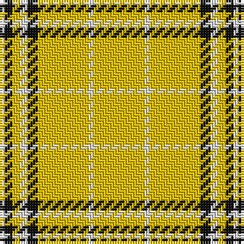

In pattern [WKYWKYWY](/patterns/wkywkywy/).

This was sourced from tartans-authority.  It is a [8 stripes tartan](/stripes/stripes8/).

Original link http://www.tartansauthority.com/tartan-ferret/display/8036/

## Thread count
LN/2 K3 Y3 LN3 K4 Y20 LN2 Y/20

## Palette
Each colour and its ΔE from the base-6 reference it is a variant of.

| Colour | Shade | Base | ΔE (OKLab) |
|---|---|---|---|
| K | <code style="background-color:#101010;">#101010</code> `#101010` | K <code style="background-color:#000000;">#000000</code> | 0.17 |
| LN | <code style="background-color:#E0E0E0;">#E0E0E0</code> `#E0E0E0` | W <code style="background-color:#F7F7F7;">#F7F7F7</code> | 0.07 |
| Y | <code style="background-color:#E8C000;">#E8C000</code> `#E8C000` | Y <code style="background-color:#F2BF00;">#F2BF00</code> | 0.02 |

# Sample pattern

## Nearest tartans

The nearest existing variants by ΔTartan distance.

1. [Guzzo Check (Personal)](/setts/s8/y20w2y20k4w3y3k3w2~k101010-wffffff-yffe600/) — ΔT 0.97
1. [Virginia Quadricentennial](/setts/s13/w40r3w10r6w20k3w2k3w10ra4w2ra8w2~k101010-rbe7832-ra960032-wfafa96/) — ΔT 1.94
1. [Morris (Welsh Name)](/setts/s8/b6b3y3b2y3b4y48b4~b202060-ye8c000/) — ΔT 2.03
1. [Virginia Quadricentennial (District)](/setts/s13/y40ya3y10ya6y20k3y2k3y10r4y2r8y2~k101010-r901c38-yc4bc68-yaa08858~x2/) — ΔT 2.13
1. [Wilbers](/setts/s8/y5k9y2k7ya35r4ya35k4~k101010-rc80000-ye8c000-yab49440~x2/) — ΔT 2.19
1. [Port Moresby City Pipes and Drums](/setts/s5/g2w3k5y33r2~g309c18-k101010-rdc0000-we0e0e0-ye8c000~x2/) — ΔT 2.24
1. [Bro-Dreger](/setts/s7/w3k5y3r3y32k2y3~k101010-r880000-we0e0e0-yb0840c~x2/) — ΔT 2.24
1. [Monoch Airline](/setts/s6/y4k6y1k1y16k2~k101010-yd09800~x2/) — ΔT 2.27
1. [Burt's Highlanders (Fashion)](/setts/s5/y40g13y6b13y22~b2c2c80-g006818-yfcb464~x2/) — ΔT 2.27
1. [Perry Ancient (Personal)](/setts/s5/y75k26k3y4k6~k101010-ye8c000~x2/) — ΔT 2.27

## Neighbour map

Every grey dot is one of 15726 variants placed by the first two principal components of the ΔTartan feature space (44% of its variance). Red is this tartan; blue dots are its nearest — click one to open its page.

<svg viewBox="0 0 640 380" role="img" style="max-width:100%;height:auto;border:1px solid #e0e0e0;border-radius:4px;display:block" xmlns="http://www.w3.org/2000/svg"><image href="/nn/cloud.v1.png" width="640" height="380"/><a href="/setts/s8/y20w2y20k4w3y3k3w2~k101010-wffffff-yffe600/"><circle cx="413.9" cy="176.0" r="4" fill="#3465a4"><title>Guzzo Check (Personal)</title></circle></a><a href="/setts/s13/w40r3w10r6w20k3w2k3w10ra4w2ra8w2~k101010-rbe7832-ra960032-wfafa96/"><circle cx="428.1" cy="106.4" r="4" fill="#3465a4"><title>Virginia Quadricentennial</title></circle></a><a href="/setts/s8/b6b3y3b2y3b4y48b4~b202060-ye8c000/"><circle cx="473.0" cy="122.4" r="4" fill="#3465a4"><title>Morris (Welsh Name)</title></circle></a><a href="/setts/s13/y40ya3y10ya6y20k3y2k3y10r4y2r8y2~k101010-r901c38-yc4bc68-yaa08858~x2/"><circle cx="468.1" cy="127.4" r="4" fill="#3465a4"><title>Virginia Quadricentennial (District)</title></circle></a><a href="/setts/s8/y5k9y2k7ya35r4ya35k4~k101010-rc80000-ye8c000-yab49440~x2/"><circle cx="399.4" cy="156.2" r="4" fill="#3465a4"><title>Wilbers</title></circle></a><a href="/setts/s5/g2w3k5y33r2~g309c18-k101010-rdc0000-we0e0e0-ye8c000~x2/"><circle cx="422.3" cy="136.5" r="4" fill="#3465a4"><title>Port Moresby City Pipes and Drums</title></circle></a><a href="/setts/s7/w3k5y3r3y32k2y3~k101010-r880000-we0e0e0-yb0840c~x2/"><circle cx="469.3" cy="150.5" r="4" fill="#3465a4"><title>Bro-Dreger</title></circle></a><a href="/setts/s6/y4k6y1k1y16k2~k101010-yd09800~x2/"><circle cx="446.3" cy="200.3" r="4" fill="#3465a4"><title>Monoch Airline</title></circle></a><a href="/setts/s5/y40g13y6b13y22~b2c2c80-g006818-yfcb464~x2/"><circle cx="374.7" cy="253.7" r="4" fill="#3465a4"><title>Burt's Highlanders (Fashion)</title></circle></a><a href="/setts/s5/y75k26k3y4k6~k101010-ye8c000~x2/"><circle cx="428.6" cy="159.3" r="4" fill="#3465a4"><title>Perry Ancient (Personal)</title></circle></a><circle cx="430.6" cy="183.4" r="5" fill="#c00000"/></svg>

ID: /setts/s8/y20w2y20k4w3y3k3w2~k101010-we0e0e0-ye8c000/
