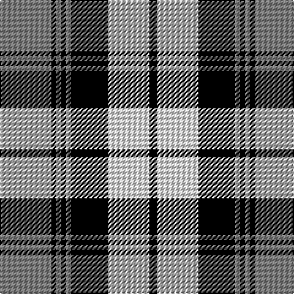

In pattern [GKGKGKWK](/stripes/gkgkgkwk/).

This was sourced from weddslist.  It is a [8 stripe tartan](/stripes/stripes8/).

Original link http://www.weddslist.com/cgi-bin/tartans/pg.pl?source=sts

## Thread count
N/42 K4 N4 K4 N4 K30 LN34 K/6

## Palette
Each colour and the base-6 reference it is a variant of.

| Colour | Shade | Base |
|---|---|---|
| K | <code style="background-color:#000000;">#000000</code> `oklch(0.0% 0.000 0.0)` <small>#000000</small> | K <code style="background-color:#000000;">#000000</code> |
| LN | <code style="background-color:#E0E0E0;">#E0E0E0</code> `oklch(90.7% 0.000 89.9)` <small>#E0E0E0</small> | W <code style="background-color:#F7F7F7;">#F7F7F7</code> |
| N | <code style="background-color:#808080;">#808080</code> `oklch(60.0% 0.000 89.9)` <small>#808080</small> | G <code style="background-color:#006100;">#006100</code> |

# Sample pattern

## Nearest tartans

The nearest existing variants by ΔTartan distance.

1. [Laksaa (Manx)](/setts/s8/n22k2n2k2n2k16w16k3~x2/) — ΔT 0.48
1. [Chieftain](/setts/s10/ly1k4db2k10w1db2w10db1w4ly1~x4/) — ΔT 1.04
1. [Alma College](/setts/s9/g24k3g2k3g4k4m20k3m6~x2/) — ΔT 1.08
1. [Napier](/setts/s11/k4w2k2w2k2w4k2w2k4db12w1~x4/) — ΔT 1.14
1. [Grey Watch Dress (Fashion)](/setts/s8/n12dt2n2dt2n2dt10w12dt3~x2/) — ΔT 1.16
1. [Clark (Clan)](/setts/s11/t2w2t15k15w2k15w2t3w2t7w2~x2/) — ΔT 1.21
1. [Bannockbane, Blue](/setts/s8/k4ly2k13ly1w8t13ly2t4~x2/) — ΔT 1.22
1. [Napier](/setts/s11/k4w2k2w2k2w4k2w2k4db12w1~x2/) — ΔT 1.23
1. [Sunderland](/setts/s7/db12w4db1w4r8w2r1~x4/) — ΔT 1.25
1. [Merric, Dark Camel..](/setts/s7/r2w8k14o25w2k2w2~x2/) — ΔT 1.27

## Neighbour map

Every grey dot is one of 14299 variants placed by the first two principal components of the ΔTartan feature space (44% of its variance). Red is this tartan; blue dots are its nearest — click one to open its page.

<svg viewBox="0 0 640 380" role="img" style="max-width:100%;height:auto;border:1px solid #e0e0e0;border-radius:4px;display:block" xmlns="http://www.w3.org/2000/svg"><image href="/nn/cloud.v1.png" width="640" height="380"/><a href="/setts/s8/n22k2n2k2n2k16w16k3~x2/"><circle cx="215.8" cy="182.5" r="4" fill="#3465a4"><title>Laksaa (Manx)</title></circle></a><a href="/setts/s10/ly1k4db2k10w1db2w10db1w4ly1~x4/"><circle cx="173.5" cy="154.8" r="4" fill="#3465a4"><title>Chieftain</title></circle></a><a href="/setts/s9/g24k3g2k3g4k4m20k3m6~x2/"><circle cx="249.1" cy="174.6" r="4" fill="#3465a4"><title>Alma College</title></circle></a><a href="/setts/s11/k4w2k2w2k2w4k2w2k4db12w1~x4/"><circle cx="188.8" cy="174.3" r="4" fill="#3465a4"><title>Napier</title></circle></a><a href="/setts/s8/n12dt2n2dt2n2dt10w12dt3~x2/"><circle cx="172.9" cy="217.2" r="4" fill="#3465a4"><title>Grey Watch Dress (Fashion)</title></circle></a><a href="/setts/s11/t2w2t15k15w2k15w2t3w2t7w2~x2/"><circle cx="214.8" cy="187.5" r="4" fill="#3465a4"><title>Clark (Clan)</title></circle></a><a href="/setts/s8/k4ly2k13ly1w8t13ly2t4~x2/"><circle cx="146.5" cy="171.4" r="4" fill="#3465a4"><title>Bannockbane, Blue</title></circle></a><a href="/setts/s11/k4w2k2w2k2w4k2w2k4db12w1~x2/"><circle cx="182.5" cy="173.3" r="4" fill="#3465a4"><title>Napier</title></circle></a><a href="/setts/s7/db12w4db1w4r8w2r1~x4/"><circle cx="212.3" cy="187.2" r="4" fill="#3465a4"><title>Sunderland</title></circle></a><a href="/setts/s7/r2w8k14o25w2k2w2~x2/"><circle cx="221.6" cy="156.4" r="4" fill="#3465a4"><title>Merric, Dark Camel..</title></circle></a><circle cx="195.1" cy="178.1" r="5" fill="#c00000"/></svg>

ID: /setts/s8/y21k2y2k2y2k15w17k3~x2/
