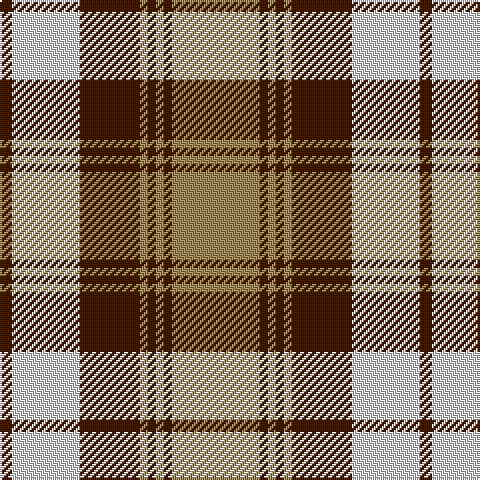

In pattern [BWBYBYBY](/patterns/bwbybyby/).

This was sourced from house-of-tartan.  It is a [8 stripes tartan](/stripes/stripes8/).

Original link http://www.house-of-tartan.scotland.net/house/TartanViewjs.asp?colr=Def&tnam=1749

## Thread count
DR/6 LN34 DR30 LT4 DR4 LT4 DR4 LT/44

## Palette
Each colour and its ΔE from the base-6 reference it is a variant of.

| Colour | Shade | Base | ΔE (OKLab) |
|---|---|---|---|
| DR | <code style="background-color:#441800;">#441800</code> `#441800` | B <code style="background-color:#2A418A;">#2A418A</code> | 0.23 |
| LN | <code style="background-color:#E0E0E0;">#E0E0E0</code> `#E0E0E0` | W <code style="background-color:#F7F7F7;">#F7F7F7</code> | 0.07 |
| LT | <code style="background-color:#A08858;">#A08858</code> `#A08858` | Y <code style="background-color:#F2BF00;">#F2BF00</code> | 0.21 |

# Sample pattern

## Nearest tartans

The nearest existing variants by ΔTartan distance.

1. [Turnberry, Manx Snaefell](/setts/s8/r22b2r2b2r2b15w17b3x2~b401000-r906030-we0e0e0/) — ΔT 0.54
1. [Lindsay Dress Red](/setts/s9/g26r3g3r3g3r11w27r3w5x2~g005020-rdc0000-we0e0e0/) — ΔT 0.59
1. [Kildonan Brown (Fashion)](/setts/s9/g22b3g3b3g3b9w28b3w6x2~b441800-g604000-wc0c0c0/) — ΔT 0.60
1. [Snaefell (District)](/setts/s8/g22ga2g2ga2g2ga14w16ga3x2~g685838-ga604000-we8e4d0/) — ΔT 0.89
1. [Baillie Dress](/setts/s8/y24g3y3g3y3g20w22g4x2~g604000-we0e0e0-ya08858/) — ΔT 1.05
1. [Karibu](/setts/s9/g12w1r1w4r1w1r8y2r1x4~g3c773c-rb3003c-wffffff-yffcc00/) — ΔT 1.07
1. [Gleneagles USA (Dalgleish)](/setts/s6/g4w31g7r14g11r3x2~g006818-r880000-wc0c0c0/) — ΔT 1.08
1. [Orange Fanaticos (Corporate)](/setts/s7/b12y75k22w12k22w16b8~b5c788c-k101010-we0e0e0-yd87c00/) — ΔT 1.11
1. [Lindsay, dress Red](/setts/s9/g26r3g3r3g3r11w27r3w5x2~g008000-rc00000-we0e0e0/) — ΔT 1.12
1. [Lindsay](/setts/s9/g20b2g2b2g2b8r24b2r3x2~b000080-g006818-rff0000/) — ΔT 1.15

## Neighbour map

Every grey dot is one of 15726 variants placed by the first two principal components of the ΔTartan feature space (44% of its variance). Red is this tartan; blue dots are its nearest — click one to open its page.

<svg viewBox="0 0 640 380" role="img" style="max-width:100%;height:auto;border:1px solid #e0e0e0;border-radius:4px;display:block" xmlns="http://www.w3.org/2000/svg"><image href="/nn/cloud.v1.png" width="640" height="380"/><a href="/setts/s8/r22b2r2b2r2b15w17b3x2~b401000-r906030-we0e0e0/"><circle cx="223.9" cy="179.8" r="4" fill="#3465a4"><title>Turnberry, Manx Snaefell</title></circle></a><a href="/setts/s9/g26r3g3r3g3r11w27r3w5x2~g005020-rdc0000-we0e0e0/"><circle cx="202.4" cy="174.0" r="4" fill="#3465a4"><title>Lindsay Dress Red</title></circle></a><a href="/setts/s9/g22b3g3b3g3b9w28b3w6x2~b441800-g604000-wc0c0c0/"><circle cx="234.0" cy="182.7" r="4" fill="#3465a4"><title>Kildonan Brown (Fashion)</title></circle></a><a href="/setts/s8/g22ga2g2ga2g2ga14w16ga3x2~g685838-ga604000-we8e4d0/"><circle cx="246.1" cy="190.8" r="4" fill="#3465a4"><title>Snaefell (District)</title></circle></a><a href="/setts/s8/y24g3y3g3y3g20w22g4x2~g604000-we0e0e0-ya08858/"><circle cx="210.2" cy="202.7" r="4" fill="#3465a4"><title>Baillie Dress</title></circle></a><a href="/setts/s9/g12w1r1w4r1w1r8y2r1x4~g3c773c-rb3003c-wffffff-yffcc00/"><circle cx="202.3" cy="143.1" r="4" fill="#3465a4"><title>Karibu</title></circle></a><a href="/setts/s6/g4w31g7r14g11r3x2~g006818-r880000-wc0c0c0/"><circle cx="238.4" cy="213.2" r="4" fill="#3465a4"><title>Gleneagles USA (Dalgleish)</title></circle></a><a href="/setts/s7/b12y75k22w12k22w16b8~b5c788c-k101010-we0e0e0-yd87c00/"><circle cx="197.1" cy="176.4" r="4" fill="#3465a4"><title>Orange Fanaticos (Corporate)</title></circle></a><a href="/setts/s9/g26r3g3r3g3r11w27r3w5x2~g008000-rc00000-we0e0e0/"><circle cx="208.1" cy="177.3" r="4" fill="#3465a4"><title>Lindsay, dress Red</title></circle></a><a href="/setts/s9/g20b2g2b2g2b8r24b2r3x2~b000080-g006818-rff0000/"><circle cx="252.3" cy="165.0" r="4" fill="#3465a4"><title>Lindsay</title></circle></a><circle cx="220.9" cy="179.0" r="5" fill="#c00000"/></svg>

ID: /setts/s8/y22b2y2b2y2b15w17b3x2~b441800-we0e0e0-ya08858/
