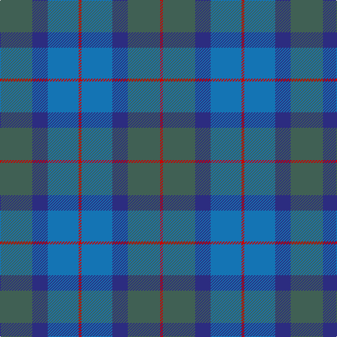

**Bands:** [RGBBRBBG](/stripes/rgbbrbbg/) · **Stripes:** [R Y DB B R B DB Y](/stripes/stripes8/) R Y DB B R B DB Y

This was sourced from register-of-tartans.  It is a [8 band tartan](/bands/bands8/).

Original link https://www.tartanregister.gov.uk/tartanDetails.aspx?ref=3809

## Register references

External register numbers recorded for this tartan.

- Scottish Register of Tartans: [3809](https://www.tartanregister.gov.uk/tartanDetails.aspx?ref=3809)
- Scottish Tartans Authority (ITI): 2550
- Scottish Tartans World Register: 2550

## Thread count
N/46 DB22 B44 R4 B44 DB22 N46 R/4

## Palette
Each colour and its ΔE from the base-6 reference it is a variant of.

| Colour | Shade | Base | ΔE (OKLab) |
|---|---|---|---|
| B | <code style="background-color:#1474B4;">#1474B4</code> `#1474B4` | B <code style="background-color:#2A418A;">#2A418A</code> | 0.15 |
| DB | <code style="background-color:#2C2C80;">#2C2C80</code> `#2C2C80` | B <code style="background-color:#2A418A;">#2A418A</code> | 0.06 |
| DBa | <code style="background-color:#202060;">#202060</code> `#202060` | B <code style="background-color:#2A418A;">#2A418A</code> | 0.11 |
| N | <code style="background-color:#406054;">#406054</code> `#406054` | G <code style="background-color:#006100;">#006100</code> | 0.11 |
| R | <code style="background-color:#C80000;">#C80000</code> `#C80000` | R <code style="background-color:#CC0000;">#CC0000</code> | 0.01 |

# Sample pattern

## Nearest tartans

The nearest existing variants by ΔTartan distance.

1. [Skibo (Corporate)](/setts/s5/r2y23db11b22r2~x2/) — ΔT 1.31
1. [Unidentified No 17](/setts/s7/dg10db2dg2db6t5db1t2~x2/) — ΔT 1.69
1. [Baron of Crawfordjohn (Personal)](/setts/s7/dt8db10dt22dg7g10dg22dp3~x2/) — ΔT 1.77
1. [United Colours of Scotland (Corporat](/setts/s7/dg7db3dg7dt22db22w3db5~x2/) — ΔT 1.82
1. [Dunans Rising](/setts/s5/g35y25m15t2t21~x2/) — ΔT 1.83
1. [Sugiyama](/setts/s6/db7db2db25db10g21db2~x2/) — ΔT 1.94
1. [Sutherland #3](/setts/s13/t11db1t1db1t1db8dg8db1dg8db8t8db1t1~x2/) — ΔT 1.94
1. [Paul Henry (Personal)](/setts/s11/n4dt3n7db9n13r2n13dt9n7db3n4~x2/) — ΔT 1.95
1. [Scottish Gas](/setts/s15/t11dt2t4dt2t4dt11b11dt2t4dt2b11dt11t11dt2t4~x2/) — ΔT 1.98
1. [Poulter, Blue (Corprate)](/setts/s13/b25db4b4db4b4db23t23lr4t23db23b23db4b4~x2/) — ΔT 1.99

## Neighbour map

Every grey dot is one of 14299 variants placed by the first two principal components of the ΔTartan feature space (44% of its variance). Red is this tartan; blue dots are its nearest — click one to open its page.

<svg viewBox="0 0 640 380" role="img" style="max-width:100%;height:auto;border:1px solid #e0e0e0;border-radius:4px;display:block" xmlns="http://www.w3.org/2000/svg"><image href="/nn/cloud.v1.png" width="640" height="380"/><a href="/setts/s5/r2y23db11b22r2~x2/"><circle cx="291.0" cy="268.0" r="4" fill="#3465a4"><title>Skibo (Corporate)</title></circle></a><a href="/setts/s7/dg10db2dg2db6t5db1t2~x2/"><circle cx="309.3" cy="277.2" r="4" fill="#3465a4"><title>Unidentified No 17</title></circle></a><a href="/setts/s7/dt8db10dt22dg7g10dg22dp3~x2/"><circle cx="242.0" cy="294.3" r="4" fill="#3465a4"><title>Baron of Crawfordjohn (Personal)</title></circle></a><a href="/setts/s7/dg7db3dg7dt22db22w3db5~x2/"><circle cx="289.1" cy="275.3" r="4" fill="#3465a4"><title>United Colours of Scotland (Corporat</title></circle></a><a href="/setts/s5/g35y25m15t2t21~x2/"><circle cx="263.2" cy="271.6" r="4" fill="#3465a4"><title>Dunans Rising</title></circle></a><a href="/setts/s6/db7db2db25db10g21db2~x2/"><circle cx="345.6" cy="267.2" r="4" fill="#3465a4"><title>Sugiyama</title></circle></a><a href="/setts/s13/t11db1t1db1t1db8dg8db1dg8db8t8db1t1~x2/"><circle cx="288.6" cy="236.0" r="4" fill="#3465a4"><title>Sutherland #3</title></circle></a><a href="/setts/s11/n4dt3n7db9n13r2n13dt9n7db3n4~x2/"><circle cx="231.4" cy="270.4" r="4" fill="#3465a4"><title>Paul Henry (Personal)</title></circle></a><a href="/setts/s15/t11dt2t4dt2t4dt11b11dt2t4dt2b11dt11t11dt2t4~x2/"><circle cx="231.0" cy="268.9" r="4" fill="#3465a4"><title>Scottish Gas</title></circle></a><a href="/setts/s13/b25db4b4db4b4db23t23lr4t23db23b23db4b4~x2/"><circle cx="226.7" cy="244.0" r="4" fill="#3465a4"><title>Poulter, Blue (Corprate)</title></circle></a><circle cx="289.0" cy="275.1" r="5" fill="#c00000"/></svg>

ID: /setts/s8/y23db11b22r2b22db11y23r2~x2/
