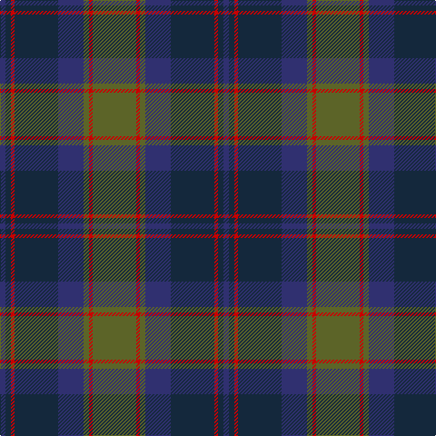

**Bands:** [BBRBBGRG](/stripes/bbrbbgrg/) · **Stripes:** [DB DT R DT DB Y R Y](/stripes/stripes8/) DB DT R DT DB Y R Y

This was sourced from tartans-authority.  It is a [8 band tartan](/bands/bands8/).

Original link http://www.tartansauthority.com/tartan-ferret/display/2151/

## Thread count
DB/6 DN6 R4 DN48 DB28 G6 R4 G/48

## Palette
Each colour and its ΔE from the base-6 reference it is a variant of.

| Colour | Shade | Base | ΔE (OKLab) |
|---|---|---|---|
| DB | <code style="background-color:#303070;">#303070</code> `#303070` | B <code style="background-color:#2A418A;">#2A418A</code> | 0.06 |
| DN | <code style="background-color:#14283C;">#14283C</code> `#14283C` | B <code style="background-color:#2A418A;">#2A418A</code> | 0.15 |
| G | <code style="background-color:#5C6428;">#5C6428</code> `#5C6428` | G <code style="background-color:#006100;">#006100</code> | 0.10 |
| R | <code style="background-color:#C80000;">#C80000</code> `#C80000` | R <code style="background-color:#CC0000;">#CC0000</code> | 0.01 |

# Sample pattern

## Nearest tartans

The nearest existing variants by ΔTartan distance.

1. [Caledonian Hotel (Corporate)](/setts/s8/n9db1n1db1n1db7dg7r2~x4/) — ΔT 0.92
1. [Baird](/setts/s8/r7dg3r2dg33k31db31k3db3/) — ΔT 0.93
1. [Dewar, Christian (Personal)](/setts/s9/db16r2db2r2db2r6dg13lo2dg3~x2/) — ΔT 1.05
1. [Eastern Western Motor Group, Dalbraith](/setts/s8/dy28g2dy4db18g23db2g3lo4~x2/) — ΔT 1.07
1. [Dunedin Chapter](/setts/s10/db32dg2db2dg14k2dg14k2dg2k15r2~x2/) — ΔT 1.08
1. [Aitchison Family (Kinghorn) (Personal)](/setts/s9/k2db3k2db18k11db2k11g25p2~x2/) — ΔT 1.16
1. [Gammell Family Tartan Tartan Number: 597. Earliest known date: 1965 Designed (probably by David Thomas and Arthur Mackie of Strathmore Woollen Co) for the Hill family of Angus as a personal tartan. Tommy Gemmell (6.3.05) said "The tartan was designed using the largest Government sett by Mrs Hill's mother - a Mrs Gammell - who was a handweaver." See products available Copyright © Blair Urquhart, Comrie, 2015](/setts/s8/db32do3db3do3db3do10g24r3~x2/) — ΔT 1.17
1. [Markson (Personal)](/setts/s11/r16dg1g2dg1r4dg5t1dg5g14dg1t2~x2/) — ΔT 1.20
1. [Ben Lomond Fashion Tartan Tartan Number: 6500. Earliest known date: pre 2005 See products available Copyright © Blair Urquhart, Comrie, 2015](/setts/s8/w6dg5k6dg42n42k5n5k5/) — ΔT 1.21
1. [Bailies of Bennachie Corporate Tartan Tartan Number: 3628. Earliest known date: 2002 The Bailes of Bennachie were founded in 1973 as caretakers of the mountain in Aberdeenshire, with the aim of 'preserving the amenity of the hill'. The tartan was produced on the occasion of the 25th anniversary to help create funds to continue their task. The colours reflect the autumn shades on the hill. See products available Copyright © Blair Urquhart, Comrie, 2015](/setts/s7/y27dr2y4o15db26k2db6~x2/) — ΔT 1.24

## Neighbour map

Every grey dot is one of 14313 variants placed by the first two principal components of the ΔTartan feature space (44% of its variance). Red is this tartan; blue dots are its nearest — click one to open its page.

<svg viewBox="0 0 640 380" role="img" style="max-width:100%;height:auto;border:1px solid #e0e0e0;border-radius:4px;display:block" xmlns="http://www.w3.org/2000/svg"><image href="/nn/cloud.v1.png" width="640" height="380"/><a href="/setts/s8/n9db1n1db1n1db7dg7r2~x4/"><circle cx="256.1" cy="235.1" r="4" fill="#3465a4"><title>Caledonian Hotel (Corporate)</title></circle></a><a href="/setts/s8/r7dg3r2dg33k31db31k3db3/"><circle cx="255.9" cy="208.4" r="4" fill="#3465a4"><title>Baird</title></circle></a><a href="/setts/s9/db16r2db2r2db2r6dg13lo2dg3~x2/"><circle cx="282.2" cy="230.6" r="4" fill="#3465a4"><title>Dewar, Christian (Personal)</title></circle></a><a href="/setts/s8/dy28g2dy4db18g23db2g3lo4~x2/"><circle cx="289.5" cy="218.8" r="4" fill="#3465a4"><title>Eastern Western Motor Group, Dalbraith</title></circle></a><a href="/setts/s10/db32dg2db2dg14k2dg14k2dg2k15r2~x2/"><circle cx="302.8" cy="197.0" r="4" fill="#3465a4"><title>Dunedin Chapter</title></circle></a><a href="/setts/s9/k2db3k2db18k11db2k11g25p2~x2/"><circle cx="247.4" cy="212.3" r="4" fill="#3465a4"><title>Aitchison Family (Kinghorn) (Personal)</title></circle></a><a href="/setts/s8/db32do3db3do3db3do10g24r3~x2/"><circle cx="315.5" cy="216.8" r="4" fill="#3465a4"><title>Gammell Family Tartan Tartan Number: 597. Earliest known date: 1965 Designed (probably by David Thomas and Arthur Mackie of Strathmore Woollen Co) for the Hill family of Angus as a personal tartan. Tommy Gemmell (6.3.05) said &quot;The tartan was designed using the largest Government sett by Mrs Hill's mother - a Mrs Gammell - who was a handweaver.&quot; See products available Copyright © Blair Urquhart, Comrie, 2015</title></circle></a><a href="/setts/s11/r16dg1g2dg1r4dg5t1dg5g14dg1t2~x2/"><circle cx="277.4" cy="176.3" r="4" fill="#3465a4"><title>Markson (Personal)</title></circle></a><a href="/setts/s8/w6dg5k6dg42n42k5n5k5/"><circle cx="294.4" cy="228.9" r="4" fill="#3465a4"><title>Ben Lomond Fashion Tartan Tartan Number: 6500. Earliest known date: pre 2005 See products available Copyright © Blair Urquhart, Comrie, 2015</title></circle></a><a href="/setts/s7/y27dr2y4o15db26k2db6~x2/"><circle cx="261.3" cy="206.9" r="4" fill="#3465a4"><title>Bailies of Bennachie Corporate Tartan Tartan Number: 3628. Earliest known date: 2002 The Bailes of Bennachie were founded in 1973 as caretakers of the mountain in Aberdeenshire, with the aim of 'preserving the amenity of the hill'. The tartan was produced on the occasion of the 25th anniversary to help create funds to continue their task. The colours reflect the autumn shades on the hill. See products available Copyright © Blair Urquhart, Comrie, 2015</title></circle></a><circle cx="277.8" cy="220.3" r="5" fill="#c00000"/></svg>

ID: /setts/s8/y24r2y3db14dt24r2dt3db3~x2/
