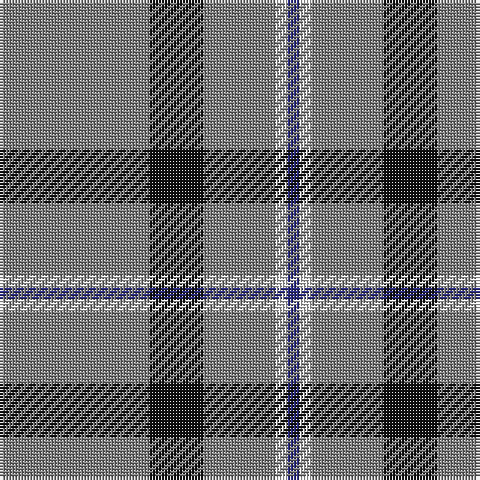

In pattern [BWGGGKGG](/stripes/bwgggkgg/).

This was sourced from register-of-tartans.  It is a [8 stripe tartan](/stripes/stripes8/).

Original link https://www.tartanregister.gov.uk/tartanDetails.aspx?ref=5102

## Register references

External register numbers recorded for this tartan.

- Scottish Register of Tartans: [5102](https://www.tartanregister.gov.uk/tartanDetails.aspx?ref=5102)
- Scottish Tartans Authority (ITI): 3852

## Thread count
N/48 N2 K18 N2 N18 N4 LN4 DB/4

## Palette
Each colour and its ΔE from the base-6 reference it is a variant of.

| Colour | Shade | Base | ΔE (OKLab) |
|---|---|---|---|
| DB | <code style="background-color:#2C2C80;">#2C2C80</code> `#2C2C80` | B <code style="background-color:#2A418A;">#2A418A</code> | 0.06 |
| K | <code style="background-color:#101010;">#101010</code> `#101010` | K <code style="background-color:#000000;">#000000</code> | 0.17 |
| LN | <code style="background-color:#E0E0E0;">#E0E0E0</code> `#E0E0E0` | W <code style="background-color:#F7F7F7;">#F7F7F7</code> | 0.07 |
| N | <code style="background-color:#808080;">#808080</code> `#808080` | G <code style="background-color:#006100;">#006100</code> | 0.23 |

# Sample pattern

## Nearest tartans

The nearest existing variants by ΔTartan distance.

1. [Turnberry Scotland](/setts/s9/n14b3n2lb8n5lb2k2n25w2~x2/) — ΔT 1.39
1. [Glenlivet Dress Reproduction (Corp)](/setts/s8/dy6r2dy42db2dy5w16dy5db2~x2/) — ΔT 1.44
1. [Historic Caledonian Railway Enthusiasts', The](/setts/s11/n6k1lo6k1n28w1k2w1n16w1r5~x2/) — ΔT 1.46
1. [President High School](/setts/s8/n83k7w6n10r7k3r20w3~x2/) — ΔT 1.58
1. [Stuart/Stewart Authentic Grey](/setts/s12/r1y20r1y3w1k1w1k4y3k1y2ly1~x2/) — ΔT 1.58
1. [Crail](/setts/s7/n140k3w16k3do16k3do16/) — ΔT 1.58
1. [Glenfeshie (Personal)](/setts/s9/r4g3dp3g44dp16g10w2g2dp2~x2/) — ΔT 1.59
1. [RAAF #5](/setts/s9/t66w2t10w2t10w2t12r3db24~x2/) — ΔT 1.60
1. [Stewart Grey Fancy Tartan Tartan Number: 1632. Earliest known date: pre 2003 Plain weave. See products available Copyright © Blair Urquhart, Comrie, 2015](/setts/s12/r1o20r1o3w1k1w1k4o3k1o2ly1~x2/) — ΔT 1.60
1. [St. Giles Check (Corporate)](/setts/s7/db3o1w1o25w1o1dp3~x4/) — ΔT 1.61

## Neighbour map

Every grey dot is one of 14299 variants placed by the first two principal components of the ΔTartan feature space (44% of its variance). Red is this tartan; blue dots are its nearest — click one to open its page.

<svg viewBox="0 0 640 380" role="img" style="max-width:100%;height:auto;border:1px solid #e0e0e0;border-radius:4px;display:block" xmlns="http://www.w3.org/2000/svg"><image href="/nn/cloud.v1.png" width="640" height="380"/><a href="/setts/s9/n14b3n2lb8n5lb2k2n25w2~x2/"><circle cx="415.0" cy="161.3" r="4" fill="#3465a4"><title>Turnberry Scotland</title></circle></a><a href="/setts/s8/dy6r2dy42db2dy5w16dy5db2~x2/"><circle cx="452.7" cy="136.2" r="4" fill="#3465a4"><title>Glenlivet Dress Reproduction (Corp)</title></circle></a><a href="/setts/s11/n6k1lo6k1n28w1k2w1n16w1r5~x2/"><circle cx="476.0" cy="117.4" r="4" fill="#3465a4"><title>Historic Caledonian Railway Enthusiasts', The</title></circle></a><a href="/setts/s8/n83k7w6n10r7k3r20w3~x2/"><circle cx="454.6" cy="130.2" r="4" fill="#3465a4"><title>President High School</title></circle></a><a href="/setts/s12/r1y20r1y3w1k1w1k4y3k1y2ly1~x2/"><circle cx="437.7" cy="96.6" r="4" fill="#3465a4"><title>Stuart/Stewart Authentic Grey</title></circle></a><a href="/setts/s7/n140k3w16k3do16k3do16/"><circle cx="502.6" cy="111.6" r="4" fill="#3465a4"><title>Crail</title></circle></a><a href="/setts/s9/r4g3dp3g44dp16g10w2g2dp2~x2/"><circle cx="449.9" cy="147.7" r="4" fill="#3465a4"><title>Glenfeshie (Personal)</title></circle></a><a href="/setts/s9/t66w2t10w2t10w2t12r3db24~x2/"><circle cx="501.0" cy="131.2" r="4" fill="#3465a4"><title>RAAF #5</title></circle></a><a href="/setts/s12/r1o20r1o3w1k1w1k4o3k1o2ly1~x2/"><circle cx="434.2" cy="94.3" r="4" fill="#3465a4"><title>Stewart Grey Fancy Tartan Tartan Number: 1632. Earliest known date: pre 2003 Plain weave. See products available Copyright © Blair Urquhart, Comrie, 2015</title></circle></a><a href="/setts/s7/db3o1w1o25w1o1dp3~x4/"><circle cx="545.2" cy="137.6" r="4" fill="#3465a4"><title>St. Giles Check (Corporate)</title></circle></a><circle cx="471.5" cy="147.0" r="5" fill="#c00000"/></svg>

ID: /setts/s8/y24y1k9y1y9y2w2db2~x2/
