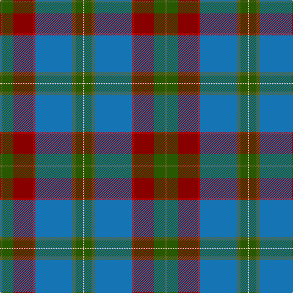

This page is one **sett** — a single exact thread-count. It belongs to the [tartan](/tartans/y2dg9ri16r2b30y3dg6lb1/)
(the same proportion at any scale), whose colour order is pattern [GGRRBGGW](/stripes/ggrrbggw/).

Sourced from tartans-authority.  It is a [8 stripe tartan](/stripes/stripes8/).

Original link http://www.tartansauthority.com/tartan-ferret/display/10807/

## Register references

External register numbers recorded for this tartan.

- Scottish Register of Tartans: [10807](https://www.tartanregister.gov.uk/tartanDetails?ref=10807)
- Scottish Tartans Authority (ITI): 10807

## Thread count
G/4 Ga18 DR32 R4 B60 G6 Ga12 LR/2

## Palette

Palette: <strong>Tartan Register</strong>
<table><thead><tr><th>Colour</th><th>Threads</th><th>Shade</th><th>Base</th><th>OKLCh</th></tr></thead><tbody><tr><td>G/</td><td style="text-align:right;font-variant-numeric:tabular-nums">4</td><td><code style="background-color:#5C6428;">#5C6428</code> <small style="color:#888">#5C6428</small></td><td>G <code style="background-color:#006100;">#006100</code></td><td><small style="color:#888">oklch(48.3% 0.084 116.0)</small></td></tr><tr><td>Ga</td><td style="text-align:right;font-variant-numeric:tabular-nums">18</td><td><code style="background-color:#285800;">#285800</code> <small style="color:#888">#285800</small></td><td>G <code style="background-color:#006100;">#006100</code></td><td><small style="color:#888">oklch(41.0% 0.122 135.8)</small></td></tr><tr><td>DR</td><td style="text-align:right;font-variant-numeric:tabular-nums">32</td><td><code style="background-color:#880000;">#880000</code> <small style="color:#888">#880000</small></td><td>R <code style="background-color:#CC0000;">#CC0000</code></td><td><small style="color:#888">oklch(39.4% 0.162 29.2)</small></td></tr><tr><td>R</td><td style="text-align:right;font-variant-numeric:tabular-nums">4</td><td><code style="background-color:#C80000;">#C80000</code> <small style="color:#888">#C80000</small></td><td>R <code style="background-color:#CC0000;">#CC0000</code></td><td><small style="color:#888">oklch(52.3% 0.215 29.2)</small></td></tr><tr><td>B</td><td style="text-align:right;font-variant-numeric:tabular-nums">60</td><td><code style="background-color:#1474B4;">#1474B4</code> <small style="color:#888">#1474B4</small></td><td>B <code style="background-color:#2A418A;">#2A418A</code></td><td><small style="color:#888">oklch(54.0% 0.129 245.1)</small></td></tr><tr><td>G</td><td style="text-align:right;font-variant-numeric:tabular-nums">6</td><td><code style="background-color:#5C6428;">#5C6428</code> <small style="color:#888">#5C6428</small></td><td>G <code style="background-color:#006100;">#006100</code></td><td><small style="color:#888">oklch(48.3% 0.084 116.0)</small></td></tr><tr><td>Ga</td><td style="text-align:right;font-variant-numeric:tabular-nums">12</td><td><code style="background-color:#285800;">#285800</code> <small style="color:#888">#285800</small></td><td>G <code style="background-color:#006100;">#006100</code></td><td><small style="color:#888">oklch(41.0% 0.122 135.8)</small></td></tr><tr><td>LR/</td><td style="text-align:right;font-variant-numeric:tabular-nums">2</td><td><code style="background-color:#E8CCB8;">#E8CCB8</code> <small style="color:#888">#E8CCB8</small></td><td>W <code style="background-color:#F7F7F7;">#F7F7F7</code></td><td><small style="color:#888">oklch(86.3% 0.042 57.7)</small></td></tr></tbody></table>

# Sample pattern

## Nearest tartans

The nearest existing variants by ΔTartan distance, with this tartan at the top so the swatches line up against it.

ΔTartan

Tartan

Sett

—

<a href="/ttd/edit/#slug=y2dg9ri16r2b30y3dg6lb1~x2">The Climb (Fashion)</a> <a class="nn-out" href="/setts/s8/y2dg9ri16r2b30y3dg6lb1~x2/" title="open its dictionary page">↗</a>

0.85

<a href="/ttd/edit/#slug=db30r2db4w1o11g4ly2g22~x2">Yorkland</a> <a class="nn-out" href="/setts/s8/db30r2db4w1o11g4ly2g22~x2/" title="open its dictionary page">↗</a>

1.06

<a href="/ttd/edit/#slug=db20y2w1y5dg8ly1dg2r1dg8y16~x4">Connecticut</a> <a class="nn-out" href="/setts/s10/db20y2w1y5dg8ly1dg2r1dg8y16~x4/" title="open its dictionary page">↗</a>

1.07

<a href="/ttd/edit/#slug=dp3n3dp3n27w1t15k22r3~x2">Beauly Firth and Glens</a> <a class="nn-out" href="/setts/s8/dp3n3dp3n27w1t15k22r3~x2/" title="open its dictionary page">↗</a>

1.17

<a href="/ttd/edit/#slug=dbi3db3dbi1g26dbi10n1dbi3dp5db4lo2~x2">Rikaco Heirloom (Fashion)</a> <a class="nn-out" href="/setts/s10/dbi3db3dbi1g26dbi10n1dbi3dp5db4lo2~x2/" title="open its dictionary page">↗</a>

1.18

<a href="/ttd/edit/#slug=r26t1t10t1g32r11t8w3t1~x2">Spens/Spence (Clan)</a> <a class="nn-out" href="/setts/s9/r26t1t10t1g32r11t8w3t1~x2/" title="open its dictionary page">↗</a>

1.19

<a href="/ttd/edit/#slug=do4yi26lyi1yi2lyi2do4lg26do4y3ly3~x2">Carter (Savannah)</a> <a class="nn-out" href="/setts/s10/do4yi26lyi1yi2lyi2do4lg26do4y3ly3~x2/" title="open its dictionary page">↗</a>

1.22

<a href="/ttd/edit/#slug=t13g2t12k8r1dt35lo1~x2">Spirit of South Lanarkshire (Distric</a> <a class="nn-out" href="/setts/s7/t13g2t12k8r1dt35lo1~x2/" title="open its dictionary page">↗</a>

1.23

<a href="/ttd/edit/#slug=y5lo1r2y25k14db19w2y4~x2">Tooth (Personal)</a> <a class="nn-out" href="/setts/s8/y5lo1r2y25k14db19w2y4~x2/" title="open its dictionary page">↗</a>

1.23

<a href="/ttd/edit/#slug=r3db6ly2db15dg12g39w3~x2">Wagland</a> <a class="nn-out" href="/setts/s7/r3db6ly2db15dg12g39w3~x2/" title="open its dictionary page">↗</a>

1.27

<a href="/ttd/edit/#slug=dgi28r4k3y2k1dg2r3db20ly2~x2">Stirling University</a> <a class="nn-out" href="/setts/s9/dgi28r4k3y2k1dg2r3db20ly2~x2/" title="open its dictionary page">↗</a>

## Neighbour map

Every grey dot is one of 14359 variants placed by the first two principal components of the ΔTartan feature space (44% of its variance). Red is this tartan; blue dots are its nearest — click one to open its page.

<svg viewBox="0 0 640 380" role="img" style="max-width:100%;height:auto;border:1px solid #e0e0e0;border-radius:4px;display:block" xmlns="http://www.w3.org/2000/svg"><image href="/nn/cloud.v1.png" width="640" height="380"/><a href="/setts/s8/db30r2db4w1o11g4ly2g22~x2/"><circle cx="276.1" cy="130.8" r="4" fill="#3465a4"><title>Yorkland</title></circle></a><a href="/setts/s10/db20y2w1y5dg8ly1dg2r1dg8y16~x4/"><circle cx="217.7" cy="140.3" r="4" fill="#3465a4"><title>Connecticut</title></circle></a><a href="/setts/s8/dp3n3dp3n27w1t15k22r3~x2/"><circle cx="233.7" cy="139.1" r="4" fill="#3465a4"><title>Beauly Firth and Glens</title></circle></a><a href="/setts/s10/dbi3db3dbi1g26dbi10n1dbi3dp5db4lo2~x2/"><circle cx="276.0" cy="124.3" r="4" fill="#3465a4"><title>Rikaco Heirloom (Fashion)</title></circle></a><a href="/setts/s9/r26t1t10t1g32r11t8w3t1~x2/"><circle cx="274.5" cy="132.0" r="4" fill="#3465a4"><title>Spens/Spence (Clan)</title></circle></a><a href="/setts/s10/do4yi26lyi1yi2lyi2do4lg26do4y3ly3~x2/"><circle cx="235.8" cy="110.1" r="4" fill="#3465a4"><title>Carter (Savannah)</title></circle></a><a href="/setts/s7/t13g2t12k8r1dt35lo1~x2/"><circle cx="326.9" cy="140.3" r="4" fill="#3465a4"><title>Spirit of South Lanarkshire (Distric</title></circle></a><a href="/setts/s8/y5lo1r2y25k14db19w2y4~x2/"><circle cx="257.3" cy="138.0" r="4" fill="#3465a4"><title>Tooth (Personal)</title></circle></a><a href="/setts/s7/r3db6ly2db15dg12g39w3~x2/"><circle cx="281.3" cy="156.9" r="4" fill="#3465a4"><title>Wagland</title></circle></a><a href="/setts/s9/dgi28r4k3y2k1dg2r3db20ly2~x2/"><circle cx="247.3" cy="99.9" r="4" fill="#3465a4"><title>Stirling University</title></circle></a><circle cx="266.5" cy="128.0" r="5" fill="#c00000"/></svg>

ID: /setts/s8/y2dg9ri16r2b30y3dg6lb1~x2/
