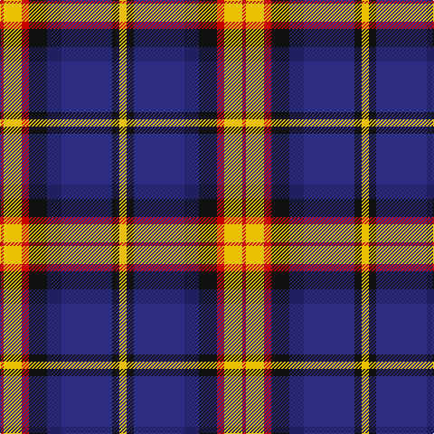

In pattern [RYRKBBKY](/patterns/ryrkbbky/).

This was sourced from tartans-authority.  It is a [8 stripes tartan](/stripes/stripes8/).

Original link http://www.tartansauthority.com/tartan-ferret/display/11036/

## Thread count
R/4 Y20 R8 K20 DBa16 DB56 K8 Y/8

## Palette
Each colour and its ΔE from the base-6 reference it is a variant of.

| Colour | Shade | Base | ΔE (OKLab) |
|---|---|---|---|
| DB | <code style="background-color:#2C2C80;">#2C2C80</code> `#2C2C80` | B <code style="background-color:#2A418A;">#2A418A</code> | 0.06 |
| DBa | <code style="background-color:#202060;">#202060</code> `#202060` | B <code style="background-color:#2A418A;">#2A418A</code> | 0.11 |
| K | <code style="background-color:#101010;">#101010</code> `#101010` | K <code style="background-color:#000000;">#000000</code> | 0.17 |
| R | <code style="background-color:#C80000;">#C80000</code> `#C80000` | R <code style="background-color:#CC0000;">#CC0000</code> | 0.01 |
| Y | <code style="background-color:#E8C000;">#E8C000</code> `#E8C000` | Y <code style="background-color:#F2BF00;">#F2BF00</code> | 0.02 |

# Sample pattern

## Nearest tartans

The nearest existing variants by ΔTartan distance.

1. [Lovell (2014)](/setts/s8/y2k2b14ba4k5r2y5r1x4~b00008c-ba202060-k101010-rc82828-ye0a126/) — ΔT 0.73
1. [Collister (Personal)](/setts/s10/k26b2k2b2k2b10w10b6ba10y5x2~b5c5c5c-ba003c64-k101010-wf8f8f8-yec8048/) — ΔT 0.81
1. [de Franck, Matt (Personal)](/setts/s9/b12k2b2k2b2k12w12ba3wa1x2~b5c5c5c-ba2888c4-k101010-wc49cd8-wae0e0e0/) — ΔT 0.82
1. [Kuznetsov (2014)](/setts/s7/b49y12r12y12g32w8b3~b202060-g003820-rc80000-wfcfcfc-ye8c000/) — ΔT 0.92
1. [Ballantyne (Personal) STWR](/setts/s8/b34g9y3g9ga30r3ga11r5~b000064-g503c14-ga808080-r960028-yfadc00/) — ΔT 0.92
1. [Kuznetsov (2014)](/setts/s7/b49y12r12y12g32w8b3~b000064-g003820-rdc0000-wffffff-yfccc00/) — ΔT 0.96
1. [Scotch House 2000, antique](/setts/s8/b22r3b2r3b2k17ra18g4x2~b304080-g004010-k000000-rc00000-ra806050/) — ΔT 0.97
1. [NEWYORKER](/setts/s9/r3k1w12k2b2k2ka14w2ka2x2~b0000cd-k101010-ka000033-r9e0508-we8ccb8/) — ΔT 0.99
1. [Regent](/setts/s7/b18k7g5r4g7k1y2x2~b800080-g008000-k000000-rc00000-yf0c000/) — ΔT 1.01
1. [MacRae, hunting](/setts/s9/g14k2g4r2g4k14b15k1w3x2~b800080-g006030-k000000-r900030-we0e0e0/) — ΔT 1.02

## Neighbour map

Every grey dot is one of 15726 variants placed by the first two principal components of the ΔTartan feature space (44% of its variance). Red is this tartan; blue dots are its nearest — click one to open its page.

<svg viewBox="0 0 640 380" role="img" style="max-width:100%;height:auto;border:1px solid #e0e0e0;border-radius:4px;display:block" xmlns="http://www.w3.org/2000/svg"><image href="/nn/cloud.v1.png" width="640" height="380"/><a href="/setts/s8/y2k2b14ba4k5r2y5r1x4~b00008c-ba202060-k101010-rc82828-ye0a126/"><circle cx="163.3" cy="157.0" r="4" fill="#3465a4"><title>Lovell (2014)</title></circle></a><a href="/setts/s10/k26b2k2b2k2b10w10b6ba10y5x2~b5c5c5c-ba003c64-k101010-wf8f8f8-yec8048/"><circle cx="155.0" cy="142.1" r="4" fill="#3465a4"><title>Collister (Personal)</title></circle></a><a href="/setts/s9/b12k2b2k2b2k12w12ba3wa1x2~b5c5c5c-ba2888c4-k101010-wc49cd8-wae0e0e0/"><circle cx="147.2" cy="155.0" r="4" fill="#3465a4"><title>de Franck, Matt (Personal)</title></circle></a><a href="/setts/s7/b49y12r12y12g32w8b3~b202060-g003820-rc80000-wfcfcfc-ye8c000/"><circle cx="164.2" cy="155.5" r="4" fill="#3465a4"><title>Kuznetsov (2014)</title></circle></a><a href="/setts/s8/b34g9y3g9ga30r3ga11r5~b000064-g503c14-ga808080-r960028-yfadc00/"><circle cx="184.2" cy="172.0" r="4" fill="#3465a4"><title>Ballantyne (Personal) STWR</title></circle></a><a href="/setts/s7/b49y12r12y12g32w8b3~b000064-g003820-rdc0000-wffffff-yfccc00/"><circle cx="153.7" cy="154.1" r="4" fill="#3465a4"><title>Kuznetsov (2014)</title></circle></a><a href="/setts/s8/b22r3b2r3b2k17ra18g4x2~b304080-g004010-k000000-rc00000-ra806050/"><circle cx="164.7" cy="171.9" r="4" fill="#3465a4"><title>Scotch House 2000, antique</title></circle></a><a href="/setts/s9/r3k1w12k2b2k2ka14w2ka2x2~b0000cd-k101010-ka000033-r9e0508-we8ccb8/"><circle cx="167.2" cy="131.5" r="4" fill="#3465a4"><title>NEWYORKER</title></circle></a><a href="/setts/s7/b18k7g5r4g7k1y2x2~b800080-g008000-k000000-rc00000-yf0c000/"><circle cx="183.9" cy="151.9" r="4" fill="#3465a4"><title>Regent</title></circle></a><a href="/setts/s9/g14k2g4r2g4k14b15k1w3x2~b800080-g006030-k000000-r900030-we0e0e0/"><circle cx="161.7" cy="154.1" r="4" fill="#3465a4"><title>MacRae, hunting</title></circle></a><circle cx="163.2" cy="152.9" r="5" fill="#c00000"/></svg>

ID: /setts/s8/y2k2b14ba4k5r2y5r1x4~b2c2c80-ba202060-k101010-rc80000-ye8c000/
