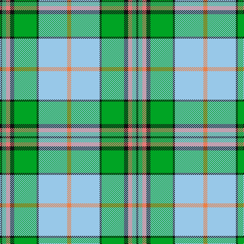

In pattern [KGRKGKWY](/patterns/kgrkgkwy/).

This was sourced from tartans-authority.  It is a [8 stripes tartan](/stripes/stripes8/).

Original link http://www.tartansauthority.com/tartan-ferret/display/2669/

## Thread count
K/4 LG8 LR8 K8 G44 K4 LB56 O/8

## Palette
Each colour and its ΔE from the base-6 reference it is a variant of.

| Colour | Shade | Base | ΔE (OKLab) |
|---|---|---|---|
| G | <code style="background-color:#00A424;">#00A424</code> `#00A424` | G <code style="background-color:#006100;">#006100</code> | 0.20 |
| K | <code style="background-color:#101010;">#101010</code> `#101010` | K <code style="background-color:#000000;">#000000</code> | 0.17 |
| LB | <code style="background-color:#98C8E8;">#98C8E8</code> `#98C8E8` | W <code style="background-color:#F7F7F7;">#F7F7F7</code> | 0.18 |
| LG | <code style="background-color:#50A47C;">#50A47C</code> `#50A47C` | G <code style="background-color:#006100;">#006100</code> | 0.24 |
| LR | <code style="background-color:#E87878;">#E87878</code> `#E87878` | R <code style="background-color:#CC0000;">#CC0000</code> | 0.19 |
| O | <code style="background-color:#EC8048;">#EC8048</code> `#EC8048` | Y <code style="background-color:#F2BF00;">#F2BF00</code> | 0.17 |

# Sample pattern

## Nearest tartans

The nearest existing variants by ΔTartan distance.

1. [Currie of Arran (Clan/family)](/setts/s11/b16w3b2y4g24r2g4r5g4r2wa8~b3048b4-g009020-rc80000-wf8f8f8-waa4b4cc-ye8c000~x2/) — ΔT 1.06
1. [Mission](/setts/s8/y2b14k1g11k2w2ga2k1~b5c8ca8-g006818-ga408060-k101010-wffe1ff-yffa500~x4/) — ΔT 1.13
1. [Taylor Dress Family Tartan Tartan Number: 823. Earliest known date: 1992 A dress tartan for dancers See products available Copyright © Blair Urquhart, Comrie, 2015](/setts/s9/g9k2r4g14w3wa3w23g5y3~g006818-k101010-rd05054-we0e0e0-wac49cd8-ye8c000~x2/) — ΔT 1.16
1. [State Seal of Delaware (Fashion)](/setts/s10/w38b18w4y3g10ya3g4w3ya17r4~b003c64-g006818-rc80000-wc0c0c0-yfccc00-yaa08858~x2/) — ΔT 1.19
1. [Taylor, dress](/setts/s9/g9k2r4g14w3wa3w23g5y3~g008000-k000000-rd03030-we0e0e0-wac0a0e0-yf0c000~x2/) — ΔT 1.22
1. [Chambers, Christopher J (Personal)](/setts/s7/b16r1g16w1ga1w8ra3~b5f749c-g649848-ga5d321f-rca2625-ra86264d-wf9f5ef~x2/) — ΔT 1.23
1. [Downie Dress](/setts/s11/g3b3g5r4g28ba8w3ba3w24r2k2~b5c8ca8-ba202060-g006818-k101010-rc80000-we0e0e0~x2/) — ΔT 1.24
1. [Nova Scotia, dress](/setts/s9/g3w29g3b3g3b6g13y3r2~b304080-g008000-rc00000-we0e0e0-yf0c000~x2/) — ΔT 1.24
1. [Cossar (Personal)](/setts/s11/w4b5y3b22ya4k3g16y7k2y7ya2~b2888c4-g289c18-k101010-we0e0e0-yd87c00-yae8c000~x2/) — ΔT 1.26
1. [Chambers, Christopher J (Personal)](/setts/s7/b13r1g13w1k1w7k3~b5c8ca8-g288028-k101010-r880000-wfcfcfc~x2/) — ΔT 1.28

## Neighbour map

Every grey dot is one of 15726 variants placed by the first two principal components of the ΔTartan feature space (44% of its variance). Red is this tartan; blue dots are its nearest — click one to open its page.

<svg viewBox="0 0 640 380" role="img" style="max-width:100%;height:auto;border:1px solid #e0e0e0;border-radius:4px;display:block" xmlns="http://www.w3.org/2000/svg"><image href="/nn/cloud.v1.png" width="640" height="380"/><a href="/setts/s11/b16w3b2y4g24r2g4r5g4r2wa8~b3048b4-g009020-rc80000-wf8f8f8-waa4b4cc-ye8c000~x2/"><circle cx="160.7" cy="123.9" r="4" fill="#3465a4"><title>Currie of Arran (Clan/family)</title></circle></a><a href="/setts/s8/y2b14k1g11k2w2ga2k1~b5c8ca8-g006818-ga408060-k101010-wffe1ff-yffa500~x4/"><circle cx="178.5" cy="133.0" r="4" fill="#3465a4"><title>Mission</title></circle></a><a href="/setts/s9/g9k2r4g14w3wa3w23g5y3~g006818-k101010-rd05054-we0e0e0-wac49cd8-ye8c000~x2/"><circle cx="161.9" cy="131.9" r="4" fill="#3465a4"><title>Taylor Dress Family Tartan Tartan Number: 823. Earliest known date: 1992 A dress tartan for dancers See products available Copyright © Blair Urquhart, Comrie, 2015</title></circle></a><a href="/setts/s10/w38b18w4y3g10ya3g4w3ya17r4~b003c64-g006818-rc80000-wc0c0c0-yfccc00-yaa08858~x2/"><circle cx="174.6" cy="120.0" r="4" fill="#3465a4"><title>State Seal of Delaware (Fashion)</title></circle></a><a href="/setts/s9/g9k2r4g14w3wa3w23g5y3~g008000-k000000-rd03030-we0e0e0-wac0a0e0-yf0c000~x2/"><circle cx="161.0" cy="131.5" r="4" fill="#3465a4"><title>Taylor, dress</title></circle></a><a href="/setts/s7/b16r1g16w1ga1w8ra3~b5f749c-g649848-ga5d321f-rca2625-ra86264d-wf9f5ef~x2/"><circle cx="168.6" cy="134.4" r="4" fill="#3465a4"><title>Chambers, Christopher J (Personal)</title></circle></a><a href="/setts/s11/g3b3g5r4g28ba8w3ba3w24r2k2~b5c8ca8-ba202060-g006818-k101010-rc80000-we0e0e0~x2/"><circle cx="163.9" cy="101.5" r="4" fill="#3465a4"><title>Downie Dress</title></circle></a><a href="/setts/s9/g3w29g3b3g3b6g13y3r2~b304080-g008000-rc00000-we0e0e0-yf0c000~x2/"><circle cx="208.2" cy="121.9" r="4" fill="#3465a4"><title>Nova Scotia, dress</title></circle></a><a href="/setts/s11/w4b5y3b22ya4k3g16y7k2y7ya2~b2888c4-g289c18-k101010-we0e0e0-yd87c00-yae8c000~x2/"><circle cx="120.3" cy="132.6" r="4" fill="#3465a4"><title>Cossar (Personal)</title></circle></a><a href="/setts/s7/b13r1g13w1k1w7k3~b5c8ca8-g288028-k101010-r880000-wfcfcfc~x2/"><circle cx="135.7" cy="155.6" r="4" fill="#3465a4"><title>Chambers, Christopher J (Personal)</title></circle></a><circle cx="160.7" cy="121.3" r="5" fill="#c00000"/></svg>

ID: /setts/s8/y2w14k1g11k2r2ga2k1~g00a424-ga50a47c-k101010-re87878-w98c8e8-yec8048~x4/
