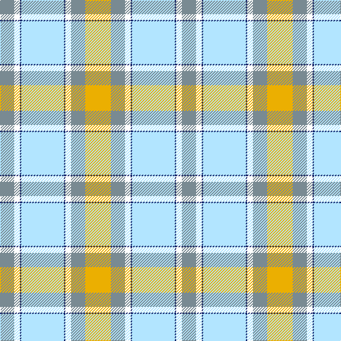

In pattern [GWBWBWGY](/patterns/gwbwbwgy/).

This was sourced from register-of-tartans.  It is a [8 stripes tartan](/stripes/stripes8/).

Original link https://www.tartanregister.gov.uk/tartanDetails.aspx?ref=10101

## Thread count
LG/20 W8 DB2 LB60 DB2 W8 LG20 Y/36

## Palette
Each colour and its ΔE from the base-6 reference it is a variant of.

| Colour | Shade | Base | ΔE (OKLab) |
|---|---|---|---|
| DB | <code style="background-color:#14256B;">#14256B</code> `#14256B` | B <code style="background-color:#2C4084;">#2C4084</code> | 0.09 |
| LB | <code style="background-color:#B2E5FF;">#B2E5FF</code> `#B2E5FF` | W <code style="background-color:#F4F4F0;">#F4F4F0</code> | 0.10 |
| LG | <code style="background-color:#798A92;">#798A92</code> `#798A92` | G <code style="background-color:#006400;">#006400</code> | 0.24 |
| W | <code style="background-color:#FFFFFF;">#FFFFFF</code> `#FFFFFF` | W <code style="background-color:#F4F4F0;">#F4F4F0</code> | 0.03 |
| Y | <code style="background-color:#EBAF01;">#EBAF01</code> `#EBAF01` | Y <code style="background-color:#E8C000;">#E8C000</code> | 0.04 |

# Sample pattern

## Nearest tartans

The nearest existing variants by ΔTartan distance.

1. [Alloway Primary (Corporate)](/setts/s8/y36r20w8b2wa60b2w8r20-b2c2c80-r888888-we0e0e0-wa98c8e8-yd8d458/) — ΔT 1.24
1. [Rutlin (Personal)](/setts/s9/g12b4g2w34g2b4g32y54ga4-b2c4084-g808080-ga005020-we0e0e0-ybe9650/) — ΔT 1.33
1. [Delta Dental Association](/setts/s13/w8b2y58b12wa26b26wa12b26wa26b12y58b2ya8-b666666-wd3e1ff-waffffff-yd9bc9a-ya9ee07c/) — ΔT 1.35
1. [MacNappy](/setts/s6/w72wa24w2r24g32y4-g289c18-rc80000-we0e0e0-wa5cacdc-ye8c000/) — ΔT 1.39
1. [Ainslie, Lake (District)](/setts/s7/w16wa32g36r4y8r2w8-g289c18-rc80000-w98c8e8-wae0e0e0-ye8c000/) — ΔT 1.47
1. [Delta Dental Association (Corporate)](/setts/s13/b8r2y58r12w26r26w12r26w26r12y58r2g8-b2888c4-g289c18-r888888-wfcfcfc-ya08858/) — ΔT 1.55
1. [Lake Ainslie Heritage](/setts/s7/w16wa32g36r4y8r2w8-g289c18-rc80000-w98c8e8-wafcfcfc-ye8c000/) — ΔT 1.64
1. [Pille Family (Personal)](/setts/s13/r8g2w10g2r4g2w10wa8y40wa16ya4wa16ya8-g006818-rc80000-wfcfcfc-wa98c8e8-y48a4c0-yafccc00/) — ΔT 1.70
1. [Morgan in Maryland (USA)](/setts/s9/b8k2y36g4y22g22w36k2r8-b41418c-g645541-k000000-raa3746-wb4bee6-ya5cdb4/) — ΔT 1.78
1. [Bird Family (Australia) (Name)](/setts/s9/w6b38w2wa34y22g20w2b6w2-b1474b4-g006818-wfcfcfc-wa98c8e8-yfccc00/) — ΔT 1.81

## Neighbour map

Every grey dot is one of 15726 variants placed by the first two principal components of the ΔTartan feature space (44% of its variance). Red is this tartan; blue dots are its nearest — click one to open its page.

<svg viewBox="0 0 640 380" role="img" style="max-width:100%;height:auto;border:1px solid #e0e0e0;border-radius:4px;display:block" xmlns="http://www.w3.org/2000/svg"><image href="/nn/cloud.v1.png" width="640" height="380"/><a href="/setts/s8/y36r20w8b2wa60b2w8r20-b2c2c80-r888888-we0e0e0-wa98c8e8-yd8d458/"><circle cx="254.5" cy="140.1" r="4" fill="#3465a4"><title>Alloway Primary (Corporate)</title></circle></a><a href="/setts/s9/g12b4g2w34g2b4g32y54ga4-b2c4084-g808080-ga005020-we0e0e0-ybe9650/"><circle cx="248.3" cy="124.1" r="4" fill="#3465a4"><title>Rutlin (Personal)</title></circle></a><a href="/setts/s13/w8b2y58b12wa26b26wa12b26wa26b12y58b2ya8-b666666-wd3e1ff-waffffff-yd9bc9a-ya9ee07c/"><circle cx="221.0" cy="107.2" r="4" fill="#3465a4"><title>Delta Dental Association</title></circle></a><a href="/setts/s6/w72wa24w2r24g32y4-g289c18-rc80000-we0e0e0-wa5cacdc-ye8c000/"><circle cx="248.8" cy="126.1" r="4" fill="#3465a4"><title>MacNappy</title></circle></a><a href="/setts/s7/w16wa32g36r4y8r2w8-g289c18-rc80000-w98c8e8-wae0e0e0-ye8c000/"><circle cx="171.1" cy="157.6" r="4" fill="#3465a4"><title>Ainslie, Lake (District)</title></circle></a><a href="/setts/s13/b8r2y58r12w26r26w12r26w26r12y58r2g8-b2888c4-g289c18-r888888-wfcfcfc-ya08858/"><circle cx="248.7" cy="124.3" r="4" fill="#3465a4"><title>Delta Dental Association (Corporate)</title></circle></a><a href="/setts/s7/w16wa32g36r4y8r2w8-g289c18-rc80000-w98c8e8-wafcfcfc-ye8c000/"><circle cx="152.6" cy="148.0" r="4" fill="#3465a4"><title>Lake Ainslie Heritage</title></circle></a><a href="/setts/s13/r8g2w10g2r4g2w10wa8y40wa16ya4wa16ya8-g006818-rc80000-wfcfcfc-wa98c8e8-y48a4c0-yafccc00/"><circle cx="132.4" cy="97.9" r="4" fill="#3465a4"><title>Pille Family (Personal)</title></circle></a><a href="/setts/s9/b8k2y36g4y22g22w36k2r8-b41418c-g645541-k000000-raa3746-wb4bee6-ya5cdb4/"><circle cx="167.7" cy="126.0" r="4" fill="#3465a4"><title>Morgan in Maryland (USA)</title></circle></a><a href="/setts/s9/w6b38w2wa34y22g20w2b6w2-b1474b4-g006818-wfcfcfc-wa98c8e8-yfccc00/"><circle cx="138.2" cy="131.6" r="4" fill="#3465a4"><title>Bird Family (Australia) (Name)</title></circle></a><circle cx="222.3" cy="122.2" r="5" fill="#c00000"/></svg>

ID: /setts/s8/y36g20w8b2wa60b2w8g20-b14256b-g798a92-wffffff-wab2e5ff-yebaf01/
