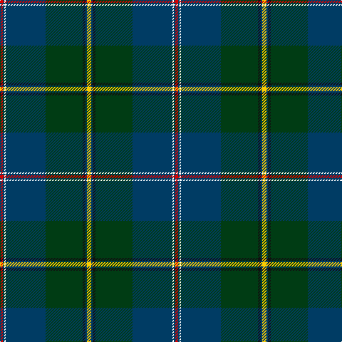

In pattern [RBWBGKBY](/patterns/rbwbgkby/).

This was sourced from register-of-tartans.  It is a [8 stripes tartan](/stripes/stripes8/).

Original link https://www.tartanregister.gov.uk/tartanDetails.aspx?ref=11179

## Thread count
R/4 DB2 W2 DB56 DG52 K4 DB2 Y/6

## Palette
Each colour and its ΔE from the base-6 reference it is a variant of.

| Colour | Shade | Base | ΔE (OKLab) |
|---|---|---|---|
| DB | <code style="background-color:#003C64;">#003C64</code> `#003C64` | B <code style="background-color:#2A418A;">#2A418A</code> | 0.08 |
| DG | <code style="background-color:#003C14;">#003C14</code> `#003C14` | G <code style="background-color:#006100;">#006100</code> | 0.13 |
| K | <code style="background-color:#101010;">#101010</code> `#101010` | K <code style="background-color:#000000;">#000000</code> | 0.17 |
| R | <code style="background-color:#DC0000;">#DC0000</code> `#DC0000` | R <code style="background-color:#CC0000;">#CC0000</code> | 0.03 |
| W | <code style="background-color:#FFFFFF;">#FFFFFF</code> `#FFFFFF` | W <code style="background-color:#F7F7F7;">#F7F7F7</code> | 0.02 |
| Y | <code style="background-color:#FCCC00;">#FCCC00</code> `#FCCC00` | Y <code style="background-color:#F2BF00;">#F2BF00</code> | 0.04 |

# Sample pattern

## Nearest tartans

The nearest existing variants by ΔTartan distance.

1. [Lusk (Personal)](/setts/s9/k2g30k3b4k2ba18bb1k3r2~b2c2c80-ba1c1c50-bb2888c4-g006818-k101010-rc80000~x2/) — ΔT 0.86
1. [MacAvoy Clan Tartan Tartan Number: 6687. Earliest known date: 1975 The pattern was based on an existing weave about 30 year old which had been abandoned by the Macavoy clan. James Macavoy being the only member to wear a kilt of this design in the present day (2005). The origin and design of the original is obscure. See products available Copyright © Blair Urquhart, Comrie, 2015](/setts/s10/y3g5k2g5w1g17b4r1b22w2~b003c64-g003820-k101010-rc80000-we0e0e0-ye8c000~x2/) — ΔT 0.93
1. [Rikaco Heirloom (Fashion)](/setts/s10/b3ba3b1g26b10bb1b3bc5ba4y2~b1c1c50-ba2c2c80-bb586c8c-bc780078-g006818-ya08858~x2/) — ΔT 1.05
1. [Young](/setts/s8/b3ba3g30b25bb4r3y2bb1~b1c1c50-ba2888c4-bb6c0070-g006818-rc8002c-ye8c000~x2/) — ΔT 1.06
1. [Inkster (Name)](/setts/s8/b31y4g68w4b31r2k6r2~b2c2c80-g006818-k101010-rc80000-we0e0e0-ye8c000~x2/) — ΔT 1.12
1. [Rikaco Heirloom](/setts/s10/k3b3k1g26k10ga1k3ba5b4gb2~b39586c-ba241029-g015313-ga6c7467-gb877047-k07042f~x2/) — ΔT 1.18
1. [Pictou County](/setts/s8/b23w1r3w1b12y9g40b3~b181034-g003c28-r700014-wfcf8ec-yb0840c~x2/) — ΔT 1.19
1. [Zorra Caledonian Society (Corporate](/setts/s10/g3w2g39k3b3k3g3k20ga10r2~b5c8ca8-g003820-ga00643c-k101010-rc80000-wfcfcfc~x2/) — ΔT 1.20
1. [Sidey Family Tartan (Name)](/setts/s10/b4w1k2b25k12ba1k2g16k2r1~b202060-ba1474b4-g006818-k101010-rc80000-we0e0e0~x2/) — ΔT 1.21
1. [Johnston, Diana Hunting (Personal)](/setts/s8/y3b1k2g26b28w1b1r2~b2c2c80-g006818-k101010-rc80000-wfcfcfc-yfccc00~x2/) — ΔT 1.22

## Neighbour map

Every grey dot is one of 15726 variants placed by the first two principal components of the ΔTartan feature space (44% of its variance). Red is this tartan; blue dots are its nearest — click one to open its page.

<svg viewBox="0 0 640 380" role="img" style="max-width:100%;height:auto;border:1px solid #e0e0e0;border-radius:4px;display:block" xmlns="http://www.w3.org/2000/svg"><image href="/nn/cloud.v1.png" width="640" height="380"/><a href="/setts/s9/k2g30k3b4k2ba18bb1k3r2~b2c2c80-ba1c1c50-bb2888c4-g006818-k101010-rc80000~x2/"><circle cx="287.9" cy="112.9" r="4" fill="#3465a4"><title>Lusk (Personal)</title></circle></a><a href="/setts/s10/y3g5k2g5w1g17b4r1b22w2~b003c64-g003820-k101010-rc80000-we0e0e0-ye8c000~x2/"><circle cx="263.4" cy="128.8" r="4" fill="#3465a4"><title>MacAvoy Clan Tartan Tartan Number: 6687. Earliest known date: 1975 The pattern was based on an existing weave about 30 year old which had been abandoned by the Macavoy clan. James Macavoy being the only member to wear a kilt of this design in the present day (2005). The origin and design of the original is obscure. See products available Copyright © Blair Urquhart, Comrie, 2015</title></circle></a><a href="/setts/s10/b3ba3b1g26b10bb1b3bc5ba4y2~b1c1c50-ba2c2c80-bb586c8c-bc780078-g006818-ya08858~x2/"><circle cx="273.2" cy="115.9" r="4" fill="#3465a4"><title>Rikaco Heirloom (Fashion)</title></circle></a><a href="/setts/s8/b3ba3g30b25bb4r3y2bb1~b1c1c50-ba2888c4-bb6c0070-g006818-rc8002c-ye8c000~x2/"><circle cx="265.7" cy="112.5" r="4" fill="#3465a4"><title>Young</title></circle></a><a href="/setts/s8/b31y4g68w4b31r2k6r2~b2c2c80-g006818-k101010-rc80000-we0e0e0-ye8c000~x2/"><circle cx="292.0" cy="110.9" r="4" fill="#3465a4"><title>Inkster (Name)</title></circle></a><a href="/setts/s10/k3b3k1g26k10ga1k3ba5b4gb2~b39586c-ba241029-g015313-ga6c7467-gb877047-k07042f~x2/"><circle cx="283.7" cy="124.1" r="4" fill="#3465a4"><title>Rikaco Heirloom</title></circle></a><a href="/setts/s8/b23w1r3w1b12y9g40b3~b181034-g003c28-r700014-wfcf8ec-yb0840c~x2/"><circle cx="291.6" cy="117.8" r="4" fill="#3465a4"><title>Pictou County</title></circle></a><a href="/setts/s10/g3w2g39k3b3k3g3k20ga10r2~b5c8ca8-g003820-ga00643c-k101010-rc80000-wfcfcfc~x2/"><circle cx="314.5" cy="133.4" r="4" fill="#3465a4"><title>Zorra Caledonian Society (Corporate</title></circle></a><a href="/setts/s10/b4w1k2b25k12ba1k2g16k2r1~b202060-ba1474b4-g006818-k101010-rc80000-we0e0e0~x2/"><circle cx="272.0" cy="122.0" r="4" fill="#3465a4"><title>Sidey Family Tartan (Name)</title></circle></a><a href="/setts/s8/y3b1k2g26b28w1b1r2~b2c2c80-g006818-k101010-rc80000-wfcfcfc-yfccc00~x2/"><circle cx="290.3" cy="104.0" r="4" fill="#3465a4"><title>Johnston, Diana Hunting (Personal)</title></circle></a><circle cx="316.1" cy="119.1" r="5" fill="#c00000"/></svg>

ID: /setts/s8/y3b1k2g26b28w1b1r2~b003c64-g003c14-k101010-rdc0000-wffffff-yfccc00~x2/
