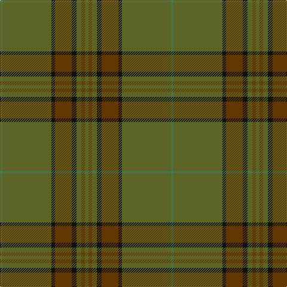

This page is one **sett** — a single exact thread-count. It belongs to the [tartan](/tartans/ga3ta3ga4k4t14k3ga41g2/)
(the same proportion at any scale), whose colour order is pattern [GGGKGKGG](/stripes/gggkgkgg/).

Sourced from tartans-authority.  It is a [8 stripe tartan](/stripes/stripes8/).

Original link http://www.tartansauthority.com/tartan-ferret/display/8561/

## Thread count
Ga/6 Ta6 Ga8 K8 T28 K6 Ga82 G/4

## Palette
Each colour and the base-6 reference it is a variant of.

| Colour | Shade | Base |
|---|---|---|
| G | <code style="background-color:#408060;">#408060</code> `oklch(54.8% 0.084 160.1)` <small>#408060</small> | G <code style="background-color:#006100;">#006100</code> |
| Ga | <code style="background-color:#5C6428;">#5C6428</code> `oklch(48.3% 0.084 116.0)` <small>#5C6428</small> | G <code style="background-color:#006100;">#006100</code> |
| K | <code style="background-color:#101010;">#101010</code> `oklch(17.3% 0.000 89.9)` <small>#101010</small> | K <code style="background-color:#000000;">#000000</code> |
| T | <code style="background-color:#603800;">#603800</code> `oklch(38.1% 0.084 66.7)` <small>#603800</small> | G <code style="background-color:#006100;">#006100</code> |
| Ta | <code style="background-color:#604000;">#604000</code> `oklch(39.8% 0.083 76.8)` <small>#604000</small> | G <code style="background-color:#006100;">#006100</code> |

# Sample pattern

## Nearest tartans

The nearest existing variants by ΔTartan distance, with this tartan at the top so the swatches line up against it.

ΔTartan

Tartan

Sett

—

<a href="/ttd/edit/#slug=y3dy3y4k4dy14k3y41g2~x2">Huntsman</a> <a class="nn-out" href="/setts/s8/y3dy3y4k4dy14k3y41g2~x2/" title="open its dictionary page">↗</a>

1.48

<a href="/ttd/edit/#slug=dy10k2y5k2dg46ly2k2~x2">Green Rover, The</a> <a class="nn-out" href="/setts/s7/dy10k2y5k2dg46ly2k2~x2/" title="open its dictionary page">↗</a>

1.59

<a href="/ttd/edit/#slug=dy50do6o3do3y3do3dt10dy8do3dy6y3~x2">Williams (Fashion)</a> <a class="nn-out" href="/setts/s11/dy50do6o3do3y3do3dt10dy8do3dy6y3~x2/" title="open its dictionary page">↗</a>

1.63

<a href="/ttd/edit/#slug=r4y40dt12y2dt12y30k2y4k2y4y2y3k3~x2">Bartlett, Chris (Personal)</a> <a class="nn-out" href="/setts/s13/r4y40dt12y2dt12y30k2y4k2y4y2y3k3~x2/" title="open its dictionary page">↗</a>

1.66

<a href="/ttd/edit/#slug=k2y7k1y9dy21o2dy1o1dy2~x2">Historic Scotland Corporate Tartan Tartan Number: 2122. Earliest known date: 1988 Custodians at Historic Scotland properties throughout Scotland, including Edinburgh Castle, wear this distinctive tartan. See products available Copyright © Blair Urquhart, Comrie, 2015</a> <a class="nn-out" href="/setts/s9/k2y7k1y9dy21o2dy1o1dy2~x2/" title="open its dictionary page">↗</a>

1.67

<a href="/ttd/edit/#slug=y23o4dy6g6y4lb1y4~x4">Tricor (Corporate)</a> <a class="nn-out" href="/setts/s7/y23o4dy6g6y4lb1y4~x4/" title="open its dictionary page">↗</a>

1.69

<a href="/ttd/edit/#slug=g38n8b3db4n12lo1g4n1~x2">Del Forno Wolf (Personal)</a> <a class="nn-out" href="/setts/s8/g38n8b3db4n12lo1g4n1~x2/" title="open its dictionary page">↗</a>

1.73

<a href="/ttd/edit/#slug=g6w1g12dy4r4dy2r4dy32g1dy2~x2">Seton Hunting Family Tartan Tartan Number: 938. Earliest known date: pre 1930 Based on Vestiarium Scoticum - D.C.S. James Cant was a noted authority on tartans around 1930. See products available Copyright © Blair Urquhart, Comrie, 2015</a> <a class="nn-out" href="/setts/s10/g6w1g12dy4r4dy2r4dy32g1dy2~x2/" title="open its dictionary page">↗</a>

1.77

<a href="/ttd/edit/#slug=y28k2y28k2y2k2dy29k2r2k2~x2">Ulster (Peat) (District</a> <a class="nn-out" href="/setts/s10/y28k2y28k2y2k2dy29k2r2k2~x2/" title="open its dictionary page">↗</a>

1.79

<a href="/ttd/edit/#slug=dy42do10t2do2lo2do2dy10lo6do2lo3dy2~x2">Yarrow</a> <a class="nn-out" href="/setts/s11/dy42do10t2do2lo2do2dy10lo6do2lo3dy2~x2/" title="open its dictionary page">↗</a>

1.89

<a href="/ttd/edit/#slug=r2b4y18n2y2n41w2~x2">Haddrell (2013)</a> <a class="nn-out" href="/setts/s7/r2b4y18n2y2n41w2~x2/" title="open its dictionary page">↗</a>

## Neighbour map

Every grey dot is one of 14299 variants placed by the first two principal components of the ΔTartan feature space (44% of its variance). Red is this tartan; blue dots are its nearest — click one to open its page.

<svg viewBox="0 0 640 380" role="img" style="max-width:100%;height:auto;border:1px solid #e0e0e0;border-radius:4px;display:block" xmlns="http://www.w3.org/2000/svg"><image href="/nn/cloud.v1.png" width="640" height="380"/><a href="/setts/s7/dy10k2y5k2dg46ly2k2~x2/"><circle cx="509.4" cy="187.4" r="4" fill="#3465a4"><title>Green Rover, The</title></circle></a><a href="/setts/s11/dy50do6o3do3y3do3dt10dy8do3dy6y3~x2/"><circle cx="527.7" cy="193.4" r="4" fill="#3465a4"><title>Williams (Fashion)</title></circle></a><a href="/setts/s13/r4y40dt12y2dt12y30k2y4k2y4y2y3k3~x2/"><circle cx="487.1" cy="166.2" r="4" fill="#3465a4"><title>Bartlett, Chris (Personal)</title></circle></a><a href="/setts/s9/k2y7k1y9dy21o2dy1o1dy2~x2/"><circle cx="457.3" cy="212.9" r="4" fill="#3465a4"><title>Historic Scotland Corporate Tartan Tartan Number: 2122. Earliest known date: 1988 Custodians at Historic Scotland properties throughout Scotland, including Edinburgh Castle, wear this distinctive tartan. See products available Copyright © Blair Urquhart, Comrie, 2015</title></circle></a><a href="/setts/s7/y23o4dy6g6y4lb1y4~x4/"><circle cx="506.5" cy="221.6" r="4" fill="#3465a4"><title>Tricor (Corporate)</title></circle></a><a href="/setts/s8/g38n8b3db4n12lo1g4n1~x2/"><circle cx="488.8" cy="180.8" r="4" fill="#3465a4"><title>Del Forno Wolf (Personal)</title></circle></a><a href="/setts/s10/g6w1g12dy4r4dy2r4dy32g1dy2~x2/"><circle cx="473.1" cy="165.9" r="4" fill="#3465a4"><title>Seton Hunting Family Tartan Tartan Number: 938. Earliest known date: pre 1930 Based on Vestiarium Scoticum - D.C.S. James Cant was a noted authority on tartans around 1930. See products available Copyright © Blair Urquhart, Comrie, 2015</title></circle></a><a href="/setts/s10/y28k2y28k2y2k2dy29k2r2k2~x2/"><circle cx="480.9" cy="219.9" r="4" fill="#3465a4"><title>Ulster (Peat) (District</title></circle></a><a href="/setts/s11/dy42do10t2do2lo2do2dy10lo6do2lo3dy2~x2/"><circle cx="505.9" cy="169.0" r="4" fill="#3465a4"><title>Yarrow</title></circle></a><a href="/setts/s7/r2b4y18n2y2n41w2~x2/"><circle cx="459.9" cy="181.1" r="4" fill="#3465a4"><title>Haddrell (2013)</title></circle></a><circle cx="499.9" cy="192.6" r="5" fill="#c00000"/></svg>

ID: /setts/s8/y3dy3y4k4dy14k3y41g2~x2/
