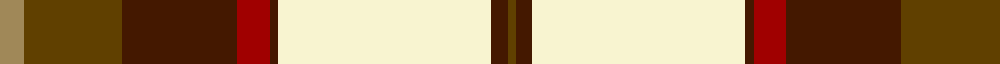

In pattern [GBWBRBGY](/patterns/gbwbrbgy/).

This was sourced from register-of-tartans.  It is a [8 stripes tartan](/stripes/stripes8/).

Original link https://www.tartanregister.gov.uk/tartanDetails.aspx?ref=4159

## Attestations

This cloth appears in 2 source records; the oldest owns this page.

- 01/01/1978 — Turnberry (register-of-tartans, [record](https://www.tartanregister.gov.uk/tartanDetails.aspx?ref=4159))
- pre 1978 — Turnberry (Fashion) (tartans-authority, [record](http://www.tartansauthority.com/tartan-ferret/display/5088/))

## Thread count
LT/6 T24 DR28 DRa8 DR2 LY52 DR4 T/2

## Palette
Each colour and its ΔE from the base-6 reference it is a variant of.

| Colour | Shade | Base | ΔE (OKLab) |
|---|---|---|---|
| DR | <code style="background-color:#441800;">#441800</code> `#441800` | B <code style="background-color:#2A418A;">#2A418A</code> | 0.23 |
| DRa | <code style="background-color:#A00000;">#A00000</code> `#A00000` | R <code style="background-color:#CC0000;">#CC0000</code> | 0.09 |
| LT | <code style="background-color:#A08858;">#A08858</code> `#A08858` | Y <code style="background-color:#F2BF00;">#F2BF00</code> | 0.21 |
| LY | <code style="background-color:#F8F4D0;">#F8F4D0</code> `#F8F4D0` | W <code style="background-color:#F7F7F7;">#F7F7F7</code> | 0.05 |
| T | <code style="background-color:#604000;">#604000</code> `#604000` | G <code style="background-color:#006100;">#006100</code> | 0.14 |

# Sample pattern

## Nearest tartans

The nearest existing variants by ΔTartan distance.

1. [Dogwood Trade Tartan Tartan Number: 913. Earliest known date: 1968 The registered tartan of the Dinwiddie Clan. Dinwiddies are normally associated with the Maxwells, but Lord Lyon stated, in 1988, that Dinwiddies were a sept of no other clan. See products available Copyright © Blair Urquhart, Comrie, 2015](/setts/s8/g3r12g12y5r1w25g2r1x2~g006818-r880000-we0e0e0-ya08858/) — ΔT 1.16
1. [Rosevear](/setts/s9/r50y4w16b2w4b2w15g27ra4x2~b304080-g008000-r802040-rac00000-we0e0e0-yf0c000/) — ΔT 1.18
1. [Dogwood](/setts/s8/g3r12g12ra5r1w25g2r1x2~g008000-r800000-ra906030-we0e0e0/) — ΔT 1.21
1. [Rosevear](/setts/s9/r50y4w16b2w4b2w15g27ra4x2~b2c2c80-g006818-r901c38-rac80000-we0e0e0-ye8c000/) — ΔT 1.23
1. [Golden Wedding (Fashion)](/setts/s8/r8y44k32w2ra52k7ra7w3~k101010-rc80000-ra888888-we0e0e0-ybc8c00/) — ΔT 1.24
1. [Prince Edward Island, Dress](/setts/s9/g22r2g4r2g4r18w24r1y3x2~g006818-r880000-we0e0e0-yd09800/) — ΔT 1.25
1. [British Columbia #2](/setts/s8/g4b14g14r6b1w30g2b1x2~b541c0c-g004c00-r9c8000-wffffff/) — ΔT 1.25
1. [Bannockbane Green](/setts/s8/b3y2b30y1w18ya30yb2ya3x2~b1c1c1c-wececd8-ybc8c00-ya809850-ybd87c00/) — ΔT 1.26
1. [Dogwood](/setts/s8/g4b10g10r6b1w26g2b1x4~b381c0c-g004800-rb07430-wf8f4d0/) — ΔT 1.27
1. [Catalunya Escocia](/setts/s10/y6r6y6r6y6k1b18w2b1w4x2~b2c4084-k101010-rdc0000-wffffff-yffd700/) — ΔT 1.29

## Neighbour map

Every grey dot is one of 15726 variants placed by the first two principal components of the ΔTartan feature space (44% of its variance). Red is this tartan; blue dots are its nearest — click one to open its page.

<svg viewBox="0 0 640 380" role="img" style="max-width:100%;height:auto;border:1px solid #e0e0e0;border-radius:4px;display:block" xmlns="http://www.w3.org/2000/svg"><image href="/nn/cloud.v1.png" width="640" height="380"/><a href="/setts/s8/g3r12g12y5r1w25g2r1x2~g006818-r880000-we0e0e0-ya08858/"><circle cx="221.2" cy="127.4" r="4" fill="#3465a4"><title>Dogwood Trade Tartan Tartan Number: 913. Earliest known date: 1968 The registered tartan of the Dinwiddie Clan. Dinwiddies are normally associated with the Maxwells, but Lord Lyon stated, in 1988, that Dinwiddies were a sept of no other clan. See products available Copyright © Blair Urquhart, Comrie, 2015</title></circle></a><a href="/setts/s9/r50y4w16b2w4b2w15g27ra4x2~b304080-g008000-r802040-rac00000-we0e0e0-yf0c000/"><circle cx="190.5" cy="86.5" r="4" fill="#3465a4"><title>Rosevear</title></circle></a><a href="/setts/s8/g3r12g12ra5r1w25g2r1x2~g008000-r800000-ra906030-we0e0e0/"><circle cx="221.0" cy="127.6" r="4" fill="#3465a4"><title>Dogwood</title></circle></a><a href="/setts/s9/r50y4w16b2w4b2w15g27ra4x2~b2c2c80-g006818-r901c38-rac80000-we0e0e0-ye8c000/"><circle cx="193.3" cy="86.0" r="4" fill="#3465a4"><title>Rosevear</title></circle></a><a href="/setts/s8/r8y44k32w2ra52k7ra7w3~k101010-rc80000-ra888888-we0e0e0-ybc8c00/"><circle cx="206.4" cy="123.7" r="4" fill="#3465a4"><title>Golden Wedding (Fashion)</title></circle></a><a href="/setts/s9/g22r2g4r2g4r18w24r1y3x2~g006818-r880000-we0e0e0-yd09800/"><circle cx="212.2" cy="129.0" r="4" fill="#3465a4"><title>Prince Edward Island, Dress</title></circle></a><a href="/setts/s8/g4b14g14r6b1w30g2b1x2~b541c0c-g004c00-r9c8000-wffffff/"><circle cx="213.2" cy="115.1" r="4" fill="#3465a4"><title>British Columbia #2</title></circle></a><a href="/setts/s8/b3y2b30y1w18ya30yb2ya3x2~b1c1c1c-wececd8-ybc8c00-ya809850-ybd87c00/"><circle cx="200.3" cy="106.5" r="4" fill="#3465a4"><title>Bannockbane Green</title></circle></a><a href="/setts/s8/g4b10g10r6b1w26g2b1x4~b381c0c-g004800-rb07430-wf8f4d0/"><circle cx="215.4" cy="122.2" r="4" fill="#3465a4"><title>Dogwood</title></circle></a><a href="/setts/s10/y6r6y6r6y6k1b18w2b1w4x2~b2c4084-k101010-rdc0000-wffffff-yffd700/"><circle cx="133.9" cy="119.2" r="4" fill="#3465a4"><title>Catalunya Escocia</title></circle></a><circle cx="195.1" cy="101.4" r="5" fill="#c00000"/></svg>

ID: /setts/s8/y3g12b14r4b1w26b2g1x2~b441800-g604000-ra00000-wf8f4d0-ya08858/
