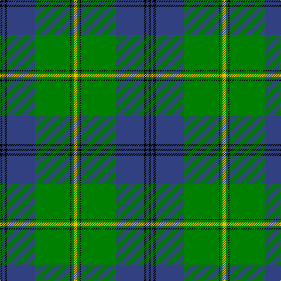

In pattern [KBKBGKGY](/patterns/kbkbgkgy/).

This was sourced from weddslist.  It is a [8 stripes tartan](/stripes/stripes8/).

Original link http://www.weddslist.com/cgi-bin/tartans/pg.pl?source=sts

## Thread count
K/4 B4 K4 B48 G60 K2 G4 Y/6

## Palette
Each colour and its ΔE from the base-6 reference it is a variant of.

| Colour | Shade | Base | ΔE (OKLab) |
|---|---|---|---|
| B | <code style="background-color:#304080;">#304080</code> `#304080` | B <code style="background-color:#2A418A;">#2A418A</code> | 0.02 |
| G | <code style="background-color:#008000;">#008000</code> `#008000` | G <code style="background-color:#006100;">#006100</code> | 0.10 |
| K | <code style="background-color:#000000;">#000000</code> `#000000` | K <code style="background-color:#000000;">#000000</code> | 0.00 |
| Y | <code style="background-color:#F0C000;">#F0C000</code> `#F0C000` | Y <code style="background-color:#F2BF00;">#F2BF00</code> | 0.00 |

# Sample pattern

## Nearest tartans

The nearest existing variants by ΔTartan distance.

1. [Johnston (Clan)](/setts/s8/y3g2k1g30b24k2b2k2~b1870a4-g007800-k000000-ye8c000~x2/) — ΔT 0.67
1. [Johnstone / Johnston](/setts/s8/k3b3k3b22g26k2b1y3~b304080-g008000-k000000-yf0c000~x2/) — ΔT 0.91
1. [MacAuliffe (Name)](/setts/s8/g37w2g6b23y6b2y3b2~b2c2c80-g006818-wf8f8f8-ye8c000~x2/) — ΔT 0.92
1. [Oliphant](/setts/s6/b4k4b24g32w1g2~b304080-g008000-k000000-we0e0e0~x2/) — ΔT 0.98
1. [Johnston Clan Tartan Tartan Number: 1063. Earliest known date: 1842 A powerful Border Clan who pursued a deadly feud with the Maxwells. Their stronghold was Lochwood Tower, near Beattock, which was burned down by the Maxwells in 1593. The tartan was first published in the Vestiarium Scoticum in 1842. Before that time Border tartans were generally un-named. More likely the tartan came from the Aberdeenshire Johnstons, whose family seat is at Caskieben, Blackburn. (Ref: The Setts.. No. 82. D.C.Stewart.) See products available Copyright © Blair Urquhart, Comrie, 2015](/setts/s8/y3g2k1g30b24k2b2k2~b2c2c80-g006818-k101010-ye8c000~x2/) — ΔT 1.02
1. [Williams, Jodi (Personal)](/setts/s7/r2b20ra2g3ra4g35ra1~b00004c-g006818-r888888-rac80000~x2/) — ΔT 1.04
1. [Gretna Green](/setts/s8/b2g2y1g30b20r2b2r2~b1c0070-g006818-rc80000-yd8b000~x2/) — ΔT 1.12
1. [Armstrong](/setts/s10/r3b12k1b1k1b2k12g30k1g2~b304080-g008000-k000000-rc00000~x2/) — ΔT 1.13
1. [New Mexico](/setts/s8/r1g16b2g10b22y4r2y1~b304080-g008000-rc00000-yf0c000~x2/) — ΔT 1.13
1. [Black Thistle](/setts/s9/b10k6g42k2g1k2r1k24r2~b3850c8-g408060-k101010-rc80000~x2/) — ΔT 1.13

## Neighbour map

Every grey dot is one of 15726 variants placed by the first two principal components of the ΔTartan feature space (44% of its variance). Red is this tartan; blue dots are its nearest — click one to open its page.

<svg viewBox="0 0 640 380" role="img" style="max-width:100%;height:auto;border:1px solid #e0e0e0;border-radius:4px;display:block" xmlns="http://www.w3.org/2000/svg"><image href="/nn/cloud.v1.png" width="640" height="380"/><a href="/setts/s8/y3g2k1g30b24k2b2k2~b1870a4-g007800-k000000-ye8c000~x2/"><circle cx="327.9" cy="138.9" r="4" fill="#3465a4"><title>Johnston (Clan)</title></circle></a><a href="/setts/s8/k3b3k3b22g26k2b1y3~b304080-g008000-k000000-yf0c000~x2/"><circle cx="263.3" cy="142.0" r="4" fill="#3465a4"><title>Johnstone / Johnston</title></circle></a><a href="/setts/s8/g37w2g6b23y6b2y3b2~b2c2c80-g006818-wf8f8f8-ye8c000~x2/"><circle cx="314.6" cy="156.8" r="4" fill="#3465a4"><title>MacAuliffe (Name)</title></circle></a><a href="/setts/s6/b4k4b24g32w1g2~b304080-g008000-k000000-we0e0e0~x2/"><circle cx="347.1" cy="164.8" r="4" fill="#3465a4"><title>Oliphant</title></circle></a><a href="/setts/s8/y3g2k1g30b24k2b2k2~b2c2c80-g006818-k101010-ye8c000~x2/"><circle cx="345.7" cy="144.2" r="4" fill="#3465a4"><title>Johnston Clan Tartan Tartan Number: 1063. Earliest known date: 1842 A powerful Border Clan who pursued a deadly feud with the Maxwells. Their stronghold was Lochwood Tower, near Beattock, which was burned down by the Maxwells in 1593. The tartan was first published in the Vestiarium Scoticum in 1842. Before that time Border tartans were generally un-named. More likely the tartan came from the Aberdeenshire Johnstons, whose family seat is at Caskieben, Blackburn. (Ref: The Setts.. No. 82. D.C.Stewart.) See products available Copyright © Blair Urquhart, Comrie, 2015</title></circle></a><a href="/setts/s7/r2b20ra2g3ra4g35ra1~b00004c-g006818-r888888-rac80000~x2/"><circle cx="373.8" cy="144.2" r="4" fill="#3465a4"><title>Williams, Jodi (Personal)</title></circle></a><a href="/setts/s8/b2g2y1g30b20r2b2r2~b1c0070-g006818-rc80000-yd8b000~x2/"><circle cx="364.5" cy="139.9" r="4" fill="#3465a4"><title>Gretna Green</title></circle></a><a href="/setts/s10/r3b12k1b1k1b2k12g30k1g2~b304080-g008000-k000000-rc00000~x2/"><circle cx="290.1" cy="117.3" r="4" fill="#3465a4"><title>Armstrong</title></circle></a><a href="/setts/s8/r1g16b2g10b22y4r2y1~b304080-g008000-rc00000-yf0c000~x2/"><circle cx="286.8" cy="162.3" r="4" fill="#3465a4"><title>New Mexico</title></circle></a><a href="/setts/s9/b10k6g42k2g1k2r1k24r2~b3850c8-g408060-k101010-rc80000~x2/"><circle cx="333.5" cy="117.6" r="4" fill="#3465a4"><title>Black Thistle</title></circle></a><circle cx="321.1" cy="134.5" r="5" fill="#c00000"/></svg>

ID: /setts/s8/y3g2k1g30b24k2b2k2~b304080-g008000-k000000-yf0c000~x2/
