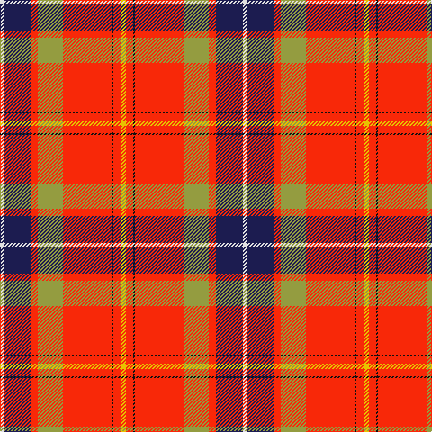

In pattern [WBRYRKRY](/patterns/wbryrkry/).

This was sourced from tartans-authority.  It is a [8 stripes tartan](/stripes/stripes8/).

Original link http://www.tartansauthority.com/tartan-ferret/display/7723/

## Attestations

This cloth appears in 2 source records; the oldest owns this page.

- pre 2008 — Dalmagarry (Corporate) (tartans-authority, [record](http://www.tartansauthority.com/tartan-ferret/display/7723/))
- undated — Dalmagarry (Personal) (register-of-tartans, [record](https://www.tartanregister.gov.uk/tartanDetails.aspx?ref=5709))

## Register references

External register numbers recorded for this tartan.

- Scottish Register of Tartans: [5709](https://www.tartanregister.gov.uk/tartanDetails.aspx?ref=5709)
- Scottish Tartans Authority (ITI): 7723

## Thread count
LN/4 DB30 R8 LT28 R54 K2 R8 Y/6

## Palette
Each colour and its ΔE from the base-6 reference it is a variant of.

| Colour | Shade | Base | ΔE (OKLab) |
|---|---|---|---|
| DB | <code style="background-color:#1C1C50;">#1C1C50</code> `#1C1C50` | B <code style="background-color:#2A418A;">#2A418A</code> | 0.14 |
| K | <code style="background-color:#101010;">#101010</code> `#101010` | K <code style="background-color:#000000;">#000000</code> | 0.17 |
| LN | <code style="background-color:#E0E0E0;">#E0E0E0</code> `#E0E0E0` | W <code style="background-color:#F7F7F7;">#F7F7F7</code> | 0.07 |
| LT | <code style="background-color:#949C40;">#949C40</code> `#949C40` | Y <code style="background-color:#F2BF00;">#F2BF00</code> | 0.18 |
| R | <code style="background-color:#F82808;">#F82808</code> `#F82808` | R <code style="background-color:#CC0000;">#CC0000</code> | 0.10 |
| Y | <code style="background-color:#E8C000;">#E8C000</code> `#E8C000` | Y <code style="background-color:#F2BF00;">#F2BF00</code> | 0.02 |

# Sample pattern

## Nearest tartans

The nearest existing variants by ΔTartan distance.

1. [Unidentified Travelling costume](/setts/s9/r8y1g20r29k2r29w20r2b7~b2c4084-g005020-k101010-rdc0000-we0e0e0-ye8c000~x2/) — ΔT 0.97
1. [Unidentified, Travelling costume](/setts/s9/r8y1g20r29k2r29w20r2b7~b304080-g008000-k000000-rc00000-we0e0e0-yf0c000~x2/) — ΔT 1.01
1. [MacQueen of Dalmagarry (Clan?)](/setts/s8/g3r4k1r26ga14r4b16w2~b440044-g289c18-ga5c6428-k101010-rc80000-wfcfcfc~x2/) — ΔT 1.20
1. [Hogeboom (Personal)](/setts/s9/b4g3b9ba14y8ba2r35ra2r3~b5c8ca8-ba003c64-g006818-rc80000-rae87878-yfccc00~x2/) — ΔT 1.25
1. [Perthshire, or Drummond](/setts/s9/r41w2b5y2g21r9b5ba3w2~b800080-ba000050-g008000-rc00000-we0e0e0-yf0c000~x2/) — ΔT 1.25
1. [Round Table Sweden](/setts/s8/r3y15g4b6w2r30b6ya3~b003c64-g006818-ra00000-wfcfcfc-yd09800-yafccc00~x2/) — ΔT 1.27
1. [Kings Mountain 1780](/setts/s9/y9k1b4k1r30k1ba4g9y3~b557280-ba778899-g006400-k101010-rff0000-yffe600~x2/) — ΔT 1.28
1. [Tartan Army Whisky](/setts/s8/r26g5ga7ra2b9y1ya1ga4~b441800-g007800-ga004028-rff0000-raa00000-yd87c00-yadc943c~x2/) — ΔT 1.31
1. [Drummond Relic](/setts/s12/r26w1k8y1g13k1w4k1y2k4b3r8~b3c82af-g005020-k101010-rdc0000-we0e0e0-ye8c000~x4/) — ΔT 1.33
1. [Virginia Military Institute, New Market](/setts/s9/w6r25g2ga3g30k3g2r30y6~g808080-ga008000-k000000-rc00000-we0e0e0-yf0c000~x2/) — ΔT 1.34

## Neighbour map

Every grey dot is one of 15726 variants placed by the first two principal components of the ΔTartan feature space (44% of its variance). Red is this tartan; blue dots are its nearest — click one to open its page.

<svg viewBox="0 0 640 380" role="img" style="max-width:100%;height:auto;border:1px solid #e0e0e0;border-radius:4px;display:block" xmlns="http://www.w3.org/2000/svg"><image href="/nn/cloud.v1.png" width="640" height="380"/><a href="/setts/s9/r8y1g20r29k2r29w20r2b7~b2c4084-g005020-k101010-rdc0000-we0e0e0-ye8c000~x2/"><circle cx="290.9" cy="102.4" r="4" fill="#3465a4"><title>Unidentified Travelling costume</title></circle></a><a href="/setts/s9/r8y1g20r29k2r29w20r2b7~b304080-g008000-k000000-rc00000-we0e0e0-yf0c000~x2/"><circle cx="288.7" cy="105.0" r="4" fill="#3465a4"><title>Unidentified, Travelling costume</title></circle></a><a href="/setts/s8/g3r4k1r26ga14r4b16w2~b440044-g289c18-ga5c6428-k101010-rc80000-wfcfcfc~x2/"><circle cx="271.9" cy="112.9" r="4" fill="#3465a4"><title>MacQueen of Dalmagarry (Clan?)</title></circle></a><a href="/setts/s9/b4g3b9ba14y8ba2r35ra2r3~b5c8ca8-ba003c64-g006818-rc80000-rae87878-yfccc00~x2/"><circle cx="235.9" cy="104.4" r="4" fill="#3465a4"><title>Hogeboom (Personal)</title></circle></a><a href="/setts/s9/r41w2b5y2g21r9b5ba3w2~b800080-ba000050-g008000-rc00000-we0e0e0-yf0c000~x2/"><circle cx="309.1" cy="96.6" r="4" fill="#3465a4"><title>Perthshire, or Drummond</title></circle></a><a href="/setts/s8/r3y15g4b6w2r30b6ya3~b003c64-g006818-ra00000-wfcfcfc-yd09800-yafccc00~x2/"><circle cx="229.6" cy="121.0" r="4" fill="#3465a4"><title>Round Table Sweden</title></circle></a><a href="/setts/s9/y9k1b4k1r30k1ba4g9y3~b557280-ba778899-g006400-k101010-rff0000-yffe600~x2/"><circle cx="248.4" cy="62.8" r="4" fill="#3465a4"><title>Kings Mountain 1780</title></circle></a><a href="/setts/s8/r26g5ga7ra2b9y1ya1ga4~b441800-g007800-ga004028-rff0000-raa00000-yd87c00-yadc943c~x2/"><circle cx="237.1" cy="77.6" r="4" fill="#3465a4"><title>Tartan Army Whisky</title></circle></a><a href="/setts/s12/r26w1k8y1g13k1w4k1y2k4b3r8~b3c82af-g005020-k101010-rdc0000-we0e0e0-ye8c000~x4/"><circle cx="228.8" cy="69.6" r="4" fill="#3465a4"><title>Drummond Relic</title></circle></a><a href="/setts/s9/w6r25g2ga3g30k3g2r30y6~g808080-ga008000-k000000-rc00000-we0e0e0-yf0c000~x2/"><circle cx="274.3" cy="123.4" r="4" fill="#3465a4"><title>Virginia Military Institute, New Market</title></circle></a><circle cx="255.0" cy="95.8" r="5" fill="#c00000"/></svg>

ID: /setts/s8/y3r4k1r27ya14r4b15w2~b1c1c50-k101010-rf82808-we0e0e0-ye8c000-ya949c40~x2/
