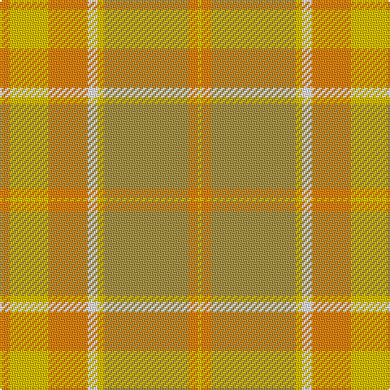

In pattern [YYYWYYYY](/patterns/yyywyyyy/).

This was sourced from register-of-tartans.  It is a [8 stripes tartan](/stripes/stripes8/).

Original link https://www.tartanregister.gov.uk/tartanDetails.aspx?ref=919

## Attestations

This cloth appears in 2 source records; the oldest owns this page.

- 01/01/1972 — Desert in Bloom (register-of-tartans, [record](https://www.tartanregister.gov.uk/tartanDetails.aspx?ref=919))
- 1972 — Desert in Bloom (Fashion) (tartans-authority, [record](http://www.tartansauthority.com/tartan-ferret/display/7054/))

## Thread count
O/6 Y24 O24 W6 Y4 LT52 O6 Y/2

## Palette
Each colour and its ΔE from the base-6 reference it is a variant of.

| Colour | Shade | Base | ΔE (OKLab) |
|---|---|---|---|
| LT | <code style="background-color:#A89448;">#A89448</code> `#A89448` | Y <code style="background-color:#F2BF00;">#F2BF00</code> | 0.17 |
| O | <code style="background-color:#F88410;">#F88410</code> `#F88410` | Y <code style="background-color:#F2BF00;">#F2BF00</code> | 0.14 |
| W | <code style="background-color:#F8F8F8;">#F8F8F8</code> `#F8F8F8` | W <code style="background-color:#F7F7F7;">#F7F7F7</code> | 0.00 |
| Y | <code style="background-color:#E8C000;">#E8C000</code> `#E8C000` | Y <code style="background-color:#F2BF00;">#F2BF00</code> | 0.02 |

# Sample pattern

## Nearest tartans

The nearest existing variants by ΔTartan distance.

1. [Cladish](/setts/s8/g10y5g54y2w32ya54b4ya10~b1474b4-g8c7038-we8ccb8-ydc943c-yaa08858/) — ΔT 1.83
1. [Wcwm 969-2](/setts/s12/w12y1g1ya1y22ya1g6y4g3y2ya12y2~g604000-we8ccb8-ybc8c00-yad09800~x4/) — ΔT 2.34
1. [Golden Pheasant](/setts/s7/r12w4r3y18r3ya4g2~g289c18-re87878-we0e0e0-ya08858-yad8b000~x2/) — ΔT 2.50
1. [McWilliams Hunting (2014)](/setts/s4/r22ra1g22b4~b4c0000-g767e52-rb07430-ra781c38~x4/) — ΔT 2.57
1. [Tricor](/setts/s12/g4w1g4ga6gb6r4g23r4gb6ga6g4w1~g8c7038-ga00643c-gb604000-r98481c-wc0c0c0~x4/) — ΔT 2.65
1. [Jardine of Castlemilk Family Tartan Tartan Number: 1432. Earliest known date: c.1978 The chiefly house is Jardine of Applegirth, a baronetcy created in 1672. The Jardines of Castlemilk in Dumfriesshire settled there in the early fourteenth century. The tartan is approved by Col Jardine. The darker brown is recorded as "J.Br", and the lighter as "Olive Br" in the Lyon Books. See products available Copyright © Blair Urquhart, Comrie, 2015](/setts/s8/r9ra9g9rb1b1ra9b1rb1~b5494bc-g686868-r88582c-rab87c00-rb7c0000~x4/) — ΔT 2.65
1. [Rikaco Morning Dew #2](/setts/s8/y3w3y1g25y15ya5w4yb2~g789484-w98c8e8-yb8b8b8-yae08070-ybe8c000~x2/) — ΔT 2.71
1. [Golden Heather, The](/setts/s10/r2y20ra2y2r3ya3r3yb6yc24y2~ra00000-rab84c00-yc8bc94-yaf47420-ybcc8024-ycd87c00~x2/) — ΔT 2.75
1. [elCorte](/setts/s20/w6wa5y4wa5ya2r5y2r14y10ya30wa1y2r4y2r1ya30r10wa14y2wa5~re87878-wffea97-wa82cffd-y86c67c-yadc943c~x2/) — ΔT 2.83
1. [Donachie of Brockloch Ancient Hunting](/setts/s10/g10k1g1r18g11k1g1k1g1r10~g757547-k101010-rcc7a00~x4/) — ΔT 2.84

## Neighbour map

Every grey dot is one of 15726 variants placed by the first two principal components of the ΔTartan feature space (44% of its variance). Red is this tartan; blue dots are its nearest — click one to open its page.

<svg viewBox="0 0 640 380" role="img" style="max-width:100%;height:auto;border:1px solid #e0e0e0;border-radius:4px;display:block" xmlns="http://www.w3.org/2000/svg"><image href="/nn/cloud.v1.png" width="640" height="380"/><a href="/setts/s8/g10y5g54y2w32ya54b4ya10~b1474b4-g8c7038-we8ccb8-ydc943c-yaa08858/"><circle cx="321.7" cy="163.1" r="4" fill="#3465a4"><title>Cladish</title></circle></a><a href="/setts/s12/w12y1g1ya1y22ya1g6y4g3y2ya12y2~g604000-we8ccb8-ybc8c00-yad09800~x4/"><circle cx="323.4" cy="139.7" r="4" fill="#3465a4"><title>Wcwm 969-2</title></circle></a><a href="/setts/s7/r12w4r3y18r3ya4g2~g289c18-re87878-we0e0e0-ya08858-yad8b000~x2/"><circle cx="284.1" cy="208.7" r="4" fill="#3465a4"><title>Golden Pheasant</title></circle></a><a href="/setts/s4/r22ra1g22b4~b4c0000-g767e52-rb07430-ra781c38~x4/"><circle cx="409.8" cy="244.5" r="4" fill="#3465a4"><title>McWilliams Hunting (2014)</title></circle></a><a href="/setts/s12/g4w1g4ga6gb6r4g23r4gb6ga6g4w1~g8c7038-ga00643c-gb604000-r98481c-wc0c0c0~x4/"><circle cx="385.2" cy="174.2" r="4" fill="#3465a4"><title>Tricor</title></circle></a><a href="/setts/s8/r9ra9g9rb1b1ra9b1rb1~b5494bc-g686868-r88582c-rab87c00-rb7c0000~x4/"><circle cx="316.3" cy="226.5" r="4" fill="#3465a4"><title>Jardine of Castlemilk Family Tartan Tartan Number: 1432. Earliest known date: c.1978 The chiefly house is Jardine of Applegirth, a baronetcy created in 1672. The Jardines of Castlemilk in Dumfriesshire settled there in the early fourteenth century. The tartan is approved by Col Jardine. The darker brown is recorded as &quot;J.Br&quot;, and the lighter as &quot;Olive Br&quot; in the Lyon Books. See products available Copyright © Blair Urquhart, Comrie, 2015</title></circle></a><a href="/setts/s8/y3w3y1g25y15ya5w4yb2~g789484-w98c8e8-yb8b8b8-yae08070-ybe8c000~x2/"><circle cx="374.5" cy="173.9" r="4" fill="#3465a4"><title>Rikaco Morning Dew #2</title></circle></a><a href="/setts/s10/r2y20ra2y2r3ya3r3yb6yc24y2~ra00000-rab84c00-yc8bc94-yaf47420-ybcc8024-ycd87c00~x2/"><circle cx="253.4" cy="136.7" r="4" fill="#3465a4"><title>Golden Heather, The</title></circle></a><a href="/setts/s20/w6wa5y4wa5ya2r5y2r14y10ya30wa1y2r4y2r1ya30r10wa14y2wa5~re87878-wffea97-wa82cffd-y86c67c-yadc943c~x2/"><circle cx="287.7" cy="95.7" r="4" fill="#3465a4"><title>elCorte</title></circle></a><a href="/setts/s10/g10k1g1r18g11k1g1k1g1r10~g757547-k101010-rcc7a00~x4/"><circle cx="421.2" cy="191.2" r="4" fill="#3465a4"><title>Donachie of Brockloch Ancient Hunting</title></circle></a><circle cx="377.5" cy="176.1" r="5" fill="#c00000"/></svg>

ID: /setts/s8/y3ya12y12w3ya2yb26y3ya1~wf8f8f8-yf88410-yae8c000-yba89448~x2/
