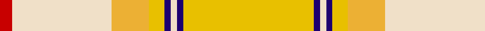

In pattern [RWYYBWBY](/patterns/rwyybwby/).

This was sourced from tartans-authority.  It is a [8 stripes tartan](/stripes/stripes8/).

Original link http://www.tartansauthority.com/tartan-ferret/display/7606/

## Attestations

This cloth appears in 3 source records; the oldest owns this page.

- March 2008 — Comrie, Gold (Dance) (tartans-authority, [record](http://www.tartansauthority.com/tartan-ferret/display/7606/))
- undated — Comrie Gold (register-of-tartans, [record](https://www.tartanregister.gov.uk/tartanDetails.aspx?ref=5630))
- undated — Comrie Gold Fashion Tartan Tartan Number: 7606. Earliest known date: March 2008 One of a series of dancer's tartans for the House of Edgar's in-house collection designed by Kirsty Anderson. See products available Copyright © Blair Urquhart, Comrie, 2015 (house-of-tartan, [record](http://www.house-of-tartan.scotland.net/house/TartanViewjs.asp?colr=Def&tnam=7606))

## Thread count
R/8 W64 Ya24 Y10 DB4 W4 DB4 Y/84

## Palette
Each colour and its ΔE from the base-6 reference it is a variant of.

| Colour | Shade | Base | ΔE (OKLab) |
|---|---|---|---|
| DB | <code style="background-color:#1C0070;">#1C0070</code> `#1C0070` | B <code style="background-color:#2A418A;">#2A418A</code> | 0.14 |
| R | <code style="background-color:#C80000;">#C80000</code> `#C80000` | R <code style="background-color:#CC0000;">#CC0000</code> | 0.01 |
| W | <code style="background-color:#F0E0C8;">#F0E0C8</code> `#F0E0C8` | W <code style="background-color:#F7F7F7;">#F7F7F7</code> | 0.07 |
| Y | <code style="background-color:#E8C000;">#E8C000</code> `#E8C000` | Y <code style="background-color:#F2BF00;">#F2BF00</code> | 0.02 |
| Ya | <code style="background-color:#ECB034;">#ECB034</code> `#ECB034` | Y <code style="background-color:#F2BF00;">#F2BF00</code> | 0.05 |

# Sample pattern

## Nearest tartans

The nearest existing variants by ΔTartan distance.

1. [Glen Talloch](/setts/s11/y32r2ya3k3r2y3ya3y3yb3y3yb32~k000000-rdc0000-yd09800-yac4bc68-ybf8e38c~x2/) — ΔT 1.45
1. [de Meuron Dress (Family)](/setts/s7/w40b5w6y26r13w9g3~b440044-g604000-r888888-we8ccb8-ye8c000~x2/) — ΔT 1.80
1. [Wcwm 969-2](/setts/s12/w12y1g1ya1y22ya1g6y4g3y2ya12y2~g604000-we8ccb8-ybc8c00-yad09800~x4/) — ΔT 1.88
1. [Llama (Fashion)](/setts/s10/g2w19y2w2g3w3g3y6ya25w2~g745000-wf0e0d0-yfc8070-yab8a880~x2/) — ΔT 1.90
1. [Shenzhen (Sports)](/setts/s11/k3r29y2r2y4r2y20ya1y2ya10w3~k101010-rb84c00-we0e0e0-ydc943c-yae8c000~x2/) — ΔT 2.08
1. [Rutlin (Personal)](/setts/s9/g6b2g1w17g1b2g16y27ga2~b2c4084-g808080-ga005020-we0e0e0-ybe9650~x2/) — ΔT 2.18
1. [Australian Dress District Tartan Tartan Number: 612. Earliest known date: 1987 Information from the Scottish Australian Heritage Council See products available Copyright © Blair Urquhart, Comrie, 2015](/setts/s9/w50r4y2k2y2r4y10r15b2~b5c8ca8-k101010-rac6444-we0e0e0-ybc9450~x2/) — ΔT 2.33
1. [Sakura (Japanese Four Seasons)](/setts/s14/w6wa2w25g2wa9y2ya4y2wa9y2ya15g2ya2g4~g604000-wf4c8c8-wae0e0e0-y00c02c-yaa0d090~x2/) — ΔT 2.34
1. [Gift of Life Michigan](/setts/s7/r2w1r1w11y16g1wa1~g006400-rff0000-w82cffd-waffffff-y86c67c~x2/) — ΔT 2.34
1. [Delta Dental Association (Corporate)](/setts/s13/b4r1y29r6w13r13w6r13w13r6y29r1g4~b2888c4-g289c18-r888888-wfcfcfc-ya08858~x2/) — ΔT 2.35

## Neighbour map

Every grey dot is one of 15726 variants placed by the first two principal components of the ΔTartan feature space (44% of its variance). Red is this tartan; blue dots are its nearest — click one to open its page.

<svg viewBox="0 0 640 380" role="img" style="max-width:100%;height:auto;border:1px solid #e0e0e0;border-radius:4px;display:block" xmlns="http://www.w3.org/2000/svg"><image href="/nn/cloud.v1.png" width="640" height="380"/><a href="/setts/s11/y32r2ya3k3r2y3ya3y3yb3y3yb32~k000000-rdc0000-yd09800-yac4bc68-ybf8e38c~x2/"><circle cx="285.3" cy="102.5" r="4" fill="#3465a4"><title>Glen Talloch</title></circle></a><a href="/setts/s7/w40b5w6y26r13w9g3~b440044-g604000-r888888-we8ccb8-ye8c000~x2/"><circle cx="286.4" cy="165.5" r="4" fill="#3465a4"><title>de Meuron Dress (Family)</title></circle></a><a href="/setts/s12/w12y1g1ya1y22ya1g6y4g3y2ya12y2~g604000-we8ccb8-ybc8c00-yad09800~x4/"><circle cx="323.4" cy="139.7" r="4" fill="#3465a4"><title>Wcwm 969-2</title></circle></a><a href="/setts/s10/g2w19y2w2g3w3g3y6ya25w2~g745000-wf0e0d0-yfc8070-yab8a880~x2/"><circle cx="265.4" cy="151.3" r="4" fill="#3465a4"><title>Llama (Fashion)</title></circle></a><a href="/setts/s11/k3r29y2r2y4r2y20ya1y2ya10w3~k101010-rb84c00-we0e0e0-ydc943c-yae8c000~x2/"><circle cx="303.7" cy="98.4" r="4" fill="#3465a4"><title>Shenzhen (Sports)</title></circle></a><a href="/setts/s9/g6b2g1w17g1b2g16y27ga2~b2c4084-g808080-ga005020-we0e0e0-ybe9650~x2/"><circle cx="251.0" cy="122.3" r="4" fill="#3465a4"><title>Rutlin (Personal)</title></circle></a><a href="/setts/s9/w50r4y2k2y2r4y10r15b2~b5c8ca8-k101010-rac6444-we0e0e0-ybc9450~x2/"><circle cx="338.6" cy="92.7" r="4" fill="#3465a4"><title>Australian Dress District Tartan Tartan Number: 612. Earliest known date: 1987 Information from the Scottish Australian Heritage Council See products available Copyright © Blair Urquhart, Comrie, 2015</title></circle></a><a href="/setts/s14/w6wa2w25g2wa9y2ya4y2wa9y2ya15g2ya2g4~g604000-wf4c8c8-wae0e0e0-y00c02c-yaa0d090~x2/"><circle cx="193.3" cy="128.5" r="4" fill="#3465a4"><title>Sakura (Japanese Four Seasons)</title></circle></a><a href="/setts/s7/r2w1r1w11y16g1wa1~g006400-rff0000-w82cffd-waffffff-y86c67c~x2/"><circle cx="306.0" cy="149.5" r="4" fill="#3465a4"><title>Gift of Life Michigan</title></circle></a><a href="/setts/s13/b4r1y29r6w13r13w6r13w13r6y29r1g4~b2888c4-g289c18-r888888-wfcfcfc-ya08858~x2/"><circle cx="251.2" cy="122.3" r="4" fill="#3465a4"><title>Delta Dental Association (Corporate)</title></circle></a><circle cx="300.5" cy="126.5" r="5" fill="#c00000"/></svg>

ID: /setts/s8/y42b2w2b2y5ya12w32r4~b1c0070-rc80000-wf0e0c8-ye8c000-yaecb034~x2/
