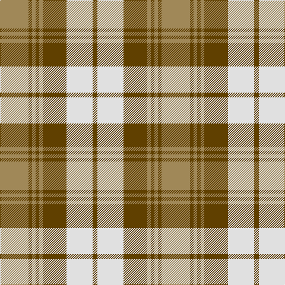

In pattern [GWGYGYGY](/patterns/gwgygygy/).

This was sourced from register-of-tartans.  It is a [8 stripes tartan](/stripes/stripes8/).

Original link https://www.tartanregister.gov.uk/tartanDetails.aspx?ref=164

## Thread count
LT/48 Ta6 LT6 Ta6 LT6 Ta40 LN44 Ta/8

## Palette
Each colour and its ΔE from the base-6 reference it is a variant of.

| Colour | Shade | Base | ΔE (OKLab) |
|---|---|---|---|
| DR | <code style="background-color:#441800;">#441800</code> `#441800` | B <code style="background-color:#2C4084;">#2C4084</code> | 0.22 |
| LN | <code style="background-color:#E0E0E0;">#E0E0E0</code> `#E0E0E0` | W <code style="background-color:#F4F4F0;">#F4F4F0</code> | 0.06 |
| LT | <code style="background-color:#A08858;">#A08858</code> `#A08858` | Y <code style="background-color:#E8C000;">#E8C000</code> | 0.21 |
| N | <code style="background-color:#B8B8B8;">#B8B8B8</code> `#B8B8B8` | Y <code style="background-color:#E8C000;">#E8C000</code> | 0.17 |
| T | <code style="background-color:#603800;">#603800</code> `#603800` | G <code style="background-color:#006400;">#006400</code> | 0.16 |
| Ta | <code style="background-color:#604000;">#604000</code> `#604000` | G <code style="background-color:#006400;">#006400</code> | 0.14 |

# Sample pattern

## Nearest tartans

The nearest existing variants by ΔTartan distance.

1. [Snaefell (District)](/setts/s8/g44ga4g4ga4g4ga28w32ga6-g685838-ga604000-we8e4d0/) — ΔT 0.87
1. [Lindsay, dress Red](/setts/s9/g52r6g6r6g6r22w54r6w10-g008000-rc00000-we0e0e0/) — ΔT 0.95
1. [Turnberry Manx Snaefell Family Tartan Tartan Number: 1749. Earliest known date: 1981 A coincidence. See products available Copyright © Blair Urquhart, Comrie, 2015](/setts/s8/y44b4y4b4y4b30w34b6-b441800-we0e0e0-ya08858/) — ΔT 1.03
1. [Prince George](/setts/s11/g12w8g6w8g4w14g4w4g10r30w4-g008000-rc00000-we0e0e0/) — ΔT 1.04
1. [Lindsay Dress Red](/setts/s9/g52r6g6r6g6r22w54r6w10-g005020-rdc0000-we0e0e0/) — ΔT 1.04
1. [Prince George Royal Family Tartan Tartan Number: 942. Earliest known date: pre 2003 The warmth and glow of the fertile soil, The green field and tree, The yellow and the brown of Autumn, The white of surf or a summer snow, Rust, green, yellow and white, Yes! That's our Island Tartan. See products available Copyright © Blair Urquhart, Comrie, 2015](/setts/s11/g12w8g6w8g4w14g4w4g10r30w4-g006818-rc80000-we0e0e0/) — ΔT 1.05
1. [Gleneagles USA (Dalgleish)](/setts/s6/g8w62g14r28g22r6-g006818-r880000-wc0c0c0/) — ΔT 1.11
1. [Kildonan Brown (Fashion)](/setts/s9/g44b6g6b6g6b18w56b6w12-b441800-g604000-wc0c0c0/) — ΔT 1.14
1. [Bannock Bane M.406](/setts/s8/g8ga6g42ga4w28r44ga6r8-g005020-ga604000-rbe7832-we0e0e0/) — ΔT 1.23
1. [Grey Watch, Dress](/setts/s8/g36b4g4b4g4b28w28b8-b3c3c3c-g808080-we0e0e0/) — ΔT 1.25

## Neighbour map

Every grey dot is one of 15726 variants placed by the first two principal components of the ΔTartan feature space (44% of its variance). Red is this tartan; blue dots are its nearest — click one to open its page.

<svg viewBox="0 0 640 380" role="img" style="max-width:100%;height:auto;border:1px solid #e0e0e0;border-radius:4px;display:block" xmlns="http://www.w3.org/2000/svg"><image href="/nn/cloud.v1.png" width="640" height="380"/><a href="/setts/s8/g44ga4g4ga4g4ga28w32ga6-g685838-ga604000-we8e4d0/"><circle cx="246.1" cy="189.5" r="4" fill="#3465a4"><title>Snaefell (District)</title></circle></a><a href="/setts/s9/g52r6g6r6g6r22w54r6w10-g008000-rc00000-we0e0e0/"><circle cx="208.5" cy="175.9" r="4" fill="#3465a4"><title>Lindsay, dress Red</title></circle></a><a href="/setts/s8/y44b4y4b4y4b30w34b6-b441800-we0e0e0-ya08858/"><circle cx="221.3" cy="176.9" r="4" fill="#3465a4"><title>Turnberry Manx Snaefell Family Tartan Tartan Number: 1749. Earliest known date: 1981 A coincidence. See products available Copyright © Blair Urquhart, Comrie, 2015</title></circle></a><a href="/setts/s11/g12w8g6w8g4w14g4w4g10r30w4-g008000-rc00000-we0e0e0/"><circle cx="172.3" cy="191.8" r="4" fill="#3465a4"><title>Prince George</title></circle></a><a href="/setts/s9/g52r6g6r6g6r22w54r6w10-g005020-rdc0000-we0e0e0/"><circle cx="202.9" cy="172.0" r="4" fill="#3465a4"><title>Lindsay Dress Red</title></circle></a><a href="/setts/s11/g12w8g6w8g4w14g4w4g10r30w4-g006818-rc80000-we0e0e0/"><circle cx="170.8" cy="190.7" r="4" fill="#3465a4"><title>Prince George Royal Family Tartan Tartan Number: 942. Earliest known date: pre 2003 The warmth and glow of the fertile soil, The green field and tree, The yellow and the brown of Autumn, The white of surf or a summer snow, Rust, green, yellow and white, Yes! That's our Island Tartan. See products available Copyright © Blair Urquhart, Comrie, 2015</title></circle></a><a href="/setts/s6/g8w62g14r28g22r6-g006818-r880000-wc0c0c0/"><circle cx="239.5" cy="211.3" r="4" fill="#3465a4"><title>Gleneagles USA (Dalgleish)</title></circle></a><a href="/setts/s9/g44b6g6b6g6b18w56b6w12-b441800-g604000-wc0c0c0/"><circle cx="234.3" cy="180.8" r="4" fill="#3465a4"><title>Kildonan Brown (Fashion)</title></circle></a><a href="/setts/s8/g8ga6g42ga4w28r44ga6r8-g005020-ga604000-rbe7832-we0e0e0/"><circle cx="178.6" cy="178.4" r="4" fill="#3465a4"><title>Bannock Bane M.406</title></circle></a><a href="/setts/s8/g36b4g4b4g4b28w28b8-b3c3c3c-g808080-we0e0e0/"><circle cx="214.0" cy="201.6" r="4" fill="#3465a4"><title>Grey Watch, Dress</title></circle></a><circle cx="210.6" cy="201.8" r="5" fill="#c00000"/></svg>

ID: /setts/s8/y48g6y6g6y6g40w44g8-g604000-we0e0e0-ya08858/
