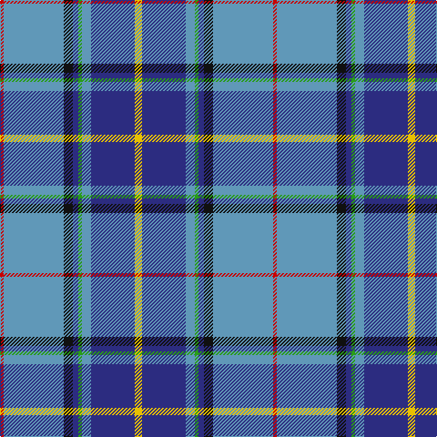

In pattern [RBKBGBBY](/patterns/rbkbgbby/).

This was sourced from register-of-tartans.  It is a [8 stripes tartan](/stripes/stripes8/).

Original link https://www.tartanregister.gov.uk/tartanDetails.aspx?ref=2223

## Thread count
R/4 B66 K10 DB6 G4 B10 DB48 Y/8

## Palette
Each colour and its ΔE from the base-6 reference it is a variant of.

| Colour | Shade | Base | ΔE (OKLab) |
|---|---|---|---|
| B | <code style="background-color:#6098B8;">#6098B8</code> `#6098B8` | B <code style="background-color:#2A418A;">#2A418A</code> | 0.26 |
| DB | <code style="background-color:#2C2C80;">#2C2C80</code> `#2C2C80` | B <code style="background-color:#2A418A;">#2A418A</code> | 0.06 |
| G | <code style="background-color:#289C18;">#289C18</code> `#289C18` | G <code style="background-color:#006100;">#006100</code> | 0.19 |
| K | <code style="background-color:#101010;">#101010</code> `#101010` | K <code style="background-color:#000000;">#000000</code> | 0.17 |
| R | <code style="background-color:#C80000;">#C80000</code> `#C80000` | R <code style="background-color:#CC0000;">#CC0000</code> | 0.01 |
| Y | <code style="background-color:#E8C000;">#E8C000</code> `#E8C000` | Y <code style="background-color:#F2BF00;">#F2BF00</code> | 0.02 |

# Sample pattern

## Nearest tartans

The nearest existing variants by ΔTartan distance.

1. [Heirloom Blue Alba (Fashion)](/setts/s9/b4y2b34ba10ya4ba4bb4ba23w3~b5c8ca8-ba202060-bb780078-we0e0e0-ybc8c00-yaa0a0a0~x2/) — ΔT 0.70
1. [Peterson, Oren (Name)](/setts/s6/w1g2r10ra1b15wa1~b2c2c80-g009020-r888888-rac80000-wc49cd8-wae0e0e0~x4/) — ΔT 0.88
1. [Queensferry High (School)](/setts/s9/y5w3wa7y5wa27b8ba43wb3wa3~b4444bc-ba003c64-wc8c8c8-waa8ace8-wbe0e0e0-y949494/) — ΔT 0.97
1. [Blue Ridge Highlands Heritage](/setts/s8/b27ba9w3g6ba33w3bb3y2~b5c8ca8-ba2c2c80-bb680028-g00643c-wa8ace8-ye8c000~x2/) — ΔT 0.98
1. [McCartney (Night)](/setts/s11/b4g2b24g8ba2r2ba2y2ba10b2w3~b304080-ba8080d0-g008000-rc00000-we0e0e0-yf0c000~x2/) — ΔT 0.99
1. [Shearer (2016)](/setts/s6/k4b4ba32r4bb17w2~b646464-ba003c64-bb788cb4-k000000-rc8002c-wfcfcfc~x2/) — ΔT 1.00
1. [O'Donohue Personal)](/setts/s10/b24w2b6g9r6b3r6g35k2y2~b3850c8-g009468-k101010-rc80000-we0e0e0-yfccc00~x2/) — ΔT 1.01
1. [McCartney (Evening/Night)](/setts/s11/b4g2b24g8ba2r2ba2y2ba10b2w3~b2c2c80-ba2888c4-g006818-rc80000-we0e0e0-ye8c000~x2/) — ΔT 1.01
1. [Kruenaegel and Schropp](/setts/s8/b20r1w3ba1w2ba8g3w1~b2c5890-ba043c48-g549028-r902c58-we8e8e8~x4/) — ΔT 1.06
1. [Scotia](/setts/s9/w4b58g28r4w18b14ra3b8y4~b304080-g008000-r806050-rac00000-we0e0e0-yf0c000/) — ΔT 1.07

## Neighbour map

Every grey dot is one of 15726 variants placed by the first two principal components of the ΔTartan feature space (44% of its variance). Red is this tartan; blue dots are its nearest — click one to open its page.

<svg viewBox="0 0 640 380" role="img" style="max-width:100%;height:auto;border:1px solid #e0e0e0;border-radius:4px;display:block" xmlns="http://www.w3.org/2000/svg"><image href="/nn/cloud.v1.png" width="640" height="380"/><a href="/setts/s9/b4y2b34ba10ya4ba4bb4ba23w3~b5c8ca8-ba202060-bb780078-we0e0e0-ybc8c00-yaa0a0a0~x2/"><circle cx="234.8" cy="127.3" r="4" fill="#3465a4"><title>Heirloom Blue Alba (Fashion)</title></circle></a><a href="/setts/s6/w1g2r10ra1b15wa1~b2c2c80-g009020-r888888-rac80000-wc49cd8-wae0e0e0~x4/"><circle cx="267.4" cy="147.7" r="4" fill="#3465a4"><title>Peterson, Oren (Name)</title></circle></a><a href="/setts/s9/y5w3wa7y5wa27b8ba43wb3wa3~b4444bc-ba003c64-wc8c8c8-waa8ace8-wbe0e0e0-y949494/"><circle cx="193.6" cy="119.5" r="4" fill="#3465a4"><title>Queensferry High (School)</title></circle></a><a href="/setts/s8/b27ba9w3g6ba33w3bb3y2~b5c8ca8-ba2c2c80-bb680028-g00643c-wa8ace8-ye8c000~x2/"><circle cx="260.6" cy="141.2" r="4" fill="#3465a4"><title>Blue Ridge Highlands Heritage</title></circle></a><a href="/setts/s11/b4g2b24g8ba2r2ba2y2ba10b2w3~b304080-ba8080d0-g008000-rc00000-we0e0e0-yf0c000~x2/"><circle cx="228.4" cy="125.0" r="4" fill="#3465a4"><title>McCartney (Night)</title></circle></a><a href="/setts/s6/k4b4ba32r4bb17w2~b646464-ba003c64-bb788cb4-k000000-rc8002c-wfcfcfc~x2/"><circle cx="246.5" cy="148.7" r="4" fill="#3465a4"><title>Shearer (2016)</title></circle></a><a href="/setts/s10/b24w2b6g9r6b3r6g35k2y2~b3850c8-g009468-k101010-rc80000-we0e0e0-yfccc00~x2/"><circle cx="238.6" cy="119.2" r="4" fill="#3465a4"><title>O'Donohue Personal)</title></circle></a><a href="/setts/s11/b4g2b24g8ba2r2ba2y2ba10b2w3~b2c2c80-ba2888c4-g006818-rc80000-we0e0e0-ye8c000~x2/"><circle cx="223.1" cy="126.6" r="4" fill="#3465a4"><title>McCartney (Evening/Night)</title></circle></a><a href="/setts/s8/b20r1w3ba1w2ba8g3w1~b2c5890-ba043c48-g549028-r902c58-we8e8e8~x4/"><circle cx="279.2" cy="130.5" r="4" fill="#3465a4"><title>Kruenaegel and Schropp</title></circle></a><a href="/setts/s9/w4b58g28r4w18b14ra3b8y4~b304080-g008000-r806050-rac00000-we0e0e0-yf0c000/"><circle cx="271.2" cy="116.7" r="4" fill="#3465a4"><title>Scotia</title></circle></a><circle cx="248.1" cy="126.3" r="5" fill="#c00000"/></svg>

ID: /setts/s8/y4b24ba5g2b3k5ba33r2~b2c2c80-ba6098b8-g289c18-k101010-rc80000-ye8c000~x2/
