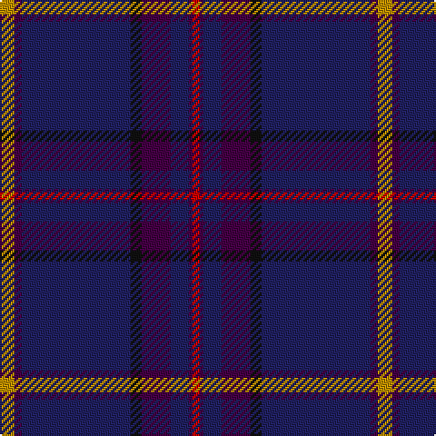

In pattern [RBBBKBBY](/patterns/rbbbkbby/).

This was sourced from tartans-authority.  It is a [8 stripes tartan](/stripes/stripes8/).

Original link http://www.tartansauthority.com/tartan-ferret/display/8434/

## Thread count
DY/8 DP4 DB60 K6 DP16 DB10 DP2 R/4

## Palette
Each colour and its ΔE from the base-6 reference it is a variant of.

| Colour | Shade | Base | ΔE (OKLab) |
|---|---|---|---|
| DB | <code style="background-color:#202060;">#202060</code> `#202060` | B <code style="background-color:#2A418A;">#2A418A</code> | 0.11 |
| DP | <code style="background-color:#440044;">#440044</code> `#440044` | B <code style="background-color:#2A418A;">#2A418A</code> | 0.18 |
| DY | <code style="background-color:#BC8C00;">#BC8C00</code> `#BC8C00` | Y <code style="background-color:#F2BF00;">#F2BF00</code> | 0.16 |
| K | <code style="background-color:#101010;">#101010</code> `#101010` | K <code style="background-color:#000000;">#000000</code> | 0.17 |
| R | <code style="background-color:#C80000;">#C80000</code> `#C80000` | R <code style="background-color:#CC0000;">#CC0000</code> | 0.01 |

# Sample pattern

## Nearest tartans

The nearest existing variants by ΔTartan distance.

1. [Pride of Fife](/setts/s10/b2w2ba16y2ba2r5b37ba6y2b2~b202060-ba440044-r800028-wfcfcfc-y48a4c0~x2/) — ΔT 1.39
1. [Earl Blue Marl](/setts/s6/b80k28ba9k3r5k12~b2c2c80-ba780078-k101010-r9c68a4~x2/) — ΔT 1.39
1. [Pagus Wasia District Tartan Tartan Number: 10962. Earliest known date: 2012 Pagus (shire) Wasia (wetland) is a rural district in Belgium. The tartan was created by the founding members of the new Pagus Wasia Pipes & Drums, based on the colours of the District Coat of Arms. The district is associated with the Belgian surname, Waas. Registration was authorised by Marc Van de Vijver, Mayor of the city of Beveren. See products available Copyright © Blair Urquhart, Comrie, 2015](/setts/s9/r1b2ba1bb3ba19b3y1b2y1~b040470-ba444878-bb1c2448-r9c2430-ycccc08~x4/) — ΔT 1.43
1. [Scottish American](/setts/s11/b50ba3k3b11ba8b2r6b2bb8b2w4~b202060-ba440044-bb2c2c80-k101010-rc80000-wf8f8f8~x2/) — ΔT 1.46
1. [Concours of Elegance](/setts/s11/b130k18r6k6r6k6ba18b14ba5b18y4~b141e46-ba3850c8-k101010-ra00048-ye0a126/) — ΔT 1.47
1. [Law Enforcement Officers' Memorial](/setts/s8/b6ba4k37g6ba80r4k4y4~b1c0070-ba2c2c80-g006818-k101010-r888888-ybc8c00/) — ΔT 1.47
1. [Round Table (1997)](/setts/s6/b47g14ba5bb2r3g7~b202060-ba440044-bb4c3428-g285800-r880000~x2/) — ΔT 1.48
1. [Barrance, Paul and Kelly (Personal)](/setts/s7/b3ba42k2g17ba9b3w2~b64008c-ba14283c-g005448-k101010-wffffff~x2/) — ΔT 1.51
1. [Home or Hume Clan Tartan Tartan Number: 127. Earliest known date: 1842 D.W.Stewart says, "The tartan of the ancient and notable family of Home, though differing in colour, has the same scheme as the Grey Douglas. Both first appear in the Vestiarium Scoticum." Border 'Clans' are mentioned in an Act of the Scottish Parliament in 1587, but no evidence of a Clan tartan exists before the earliest date given here. See products available Copyright © Blair Urquhart, Comrie, 2015](/setts/s8/k28r1k2r1k8b24g2b3~b2c2c80-g006818-k101010-rc80000~x2/) — ΔT 1.52
1. [Glen Innes (District)](/setts/s8/b142ba12bb24w7bb5w5bb5r10~b2c2c80-ba003c64-bb1c0070-rc80000-we0e0e0/) — ΔT 1.54

## Neighbour map

Every grey dot is one of 15726 variants placed by the first two principal components of the ΔTartan feature space (44% of its variance). Red is this tartan; blue dots are its nearest — click one to open its page.

<svg viewBox="0 0 640 380" role="img" style="max-width:100%;height:auto;border:1px solid #e0e0e0;border-radius:4px;display:block" xmlns="http://www.w3.org/2000/svg"><image href="/nn/cloud.v1.png" width="640" height="380"/><a href="/setts/s10/b2w2ba16y2ba2r5b37ba6y2b2~b202060-ba440044-r800028-wfcfcfc-y48a4c0~x2/"><circle cx="371.2" cy="143.0" r="4" fill="#3465a4"><title>Pride of Fife</title></circle></a><a href="/setts/s6/b80k28ba9k3r5k12~b2c2c80-ba780078-k101010-r9c68a4~x2/"><circle cx="451.2" cy="193.1" r="4" fill="#3465a4"><title>Earl Blue Marl</title></circle></a><a href="/setts/s9/r1b2ba1bb3ba19b3y1b2y1~b040470-ba444878-bb1c2448-r9c2430-ycccc08~x4/"><circle cx="395.6" cy="140.0" r="4" fill="#3465a4"><title>Pagus Wasia District Tartan Tartan Number: 10962. Earliest known date: 2012 Pagus (shire) Wasia (wetland) is a rural district in Belgium. The tartan was created by the founding members of the new Pagus Wasia Pipes &amp; Drums, based on the colours of the District Coat of Arms. The district is associated with the Belgian surname, Waas. Registration was authorised by Marc Van de Vijver, Mayor of the city of Beveren. See products available Copyright © Blair Urquhart, Comrie, 2015</title></circle></a><a href="/setts/s11/b50ba3k3b11ba8b2r6b2bb8b2w4~b202060-ba440044-bb2c2c80-k101010-rc80000-wf8f8f8~x2/"><circle cx="428.8" cy="109.5" r="4" fill="#3465a4"><title>Scottish American</title></circle></a><a href="/setts/s11/b130k18r6k6r6k6ba18b14ba5b18y4~b141e46-ba3850c8-k101010-ra00048-ye0a126/"><circle cx="514.8" cy="125.6" r="4" fill="#3465a4"><title>Concours of Elegance</title></circle></a><a href="/setts/s8/b6ba4k37g6ba80r4k4y4~b1c0070-ba2c2c80-g006818-k101010-r888888-ybc8c00/"><circle cx="379.2" cy="137.6" r="4" fill="#3465a4"><title>Law Enforcement Officers' Memorial</title></circle></a><a href="/setts/s6/b47g14ba5bb2r3g7~b202060-ba440044-bb4c3428-g285800-r880000~x2/"><circle cx="440.5" cy="183.1" r="4" fill="#3465a4"><title>Round Table (1997)</title></circle></a><a href="/setts/s7/b3ba42k2g17ba9b3w2~b64008c-ba14283c-g005448-k101010-wffffff~x2/"><circle cx="448.6" cy="178.5" r="4" fill="#3465a4"><title>Barrance, Paul and Kelly (Personal)</title></circle></a><a href="/setts/s8/k28r1k2r1k8b24g2b3~b2c2c80-g006818-k101010-rc80000~x2/"><circle cx="433.5" cy="177.1" r="4" fill="#3465a4"><title>Home or Hume Clan Tartan Tartan Number: 127. Earliest known date: 1842 D.W.Stewart says, &quot;The tartan of the ancient and notable family of Home, though differing in colour, has the same scheme as the Grey Douglas. Both first appear in the Vestiarium Scoticum.&quot; Border 'Clans' are mentioned in an Act of the Scottish Parliament in 1587, but no evidence of a Clan tartan exists before the earliest date given here. See products available Copyright © Blair Urquhart, Comrie, 2015</title></circle></a><a href="/setts/s8/b142ba12bb24w7bb5w5bb5r10~b2c2c80-ba003c64-bb1c0070-rc80000-we0e0e0/"><circle cx="470.2" cy="128.1" r="4" fill="#3465a4"><title>Glen Innes (District)</title></circle></a><circle cx="449.4" cy="147.4" r="5" fill="#c00000"/></svg>

ID: /setts/s8/y4b2ba30k3b8ba5b1r2~b440044-ba202060-k101010-rc80000-ybc8c00~x2/
