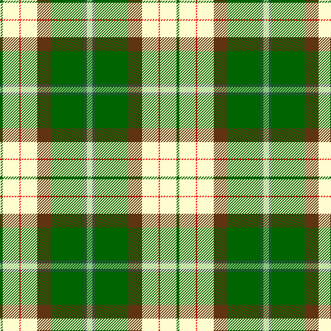

In pattern [GWRWGGBY](/patterns/gwrwggby/).

This was sourced from register-of-tartans.  It is a [8 stripes tartan](/stripes/stripes8/).

Original link https://www.tartanregister.gov.uk/tartanDetails.aspx?ref=10503

## Register references

External register numbers recorded for this tartan.

- Scottish Register of Tartans: [10503](https://www.tartanregister.gov.uk/tartanDetails.aspx?ref=10503)

## Thread count
G/4 LY24 R2 LY24 T20 G48 N4 LG/8

## Palette
Each colour and its ΔE from the base-6 reference it is a variant of.

| Colour | Shade | Base | ΔE (OKLab) |
|---|---|---|---|
| G | <code style="background-color:#006400;">#006400</code> `#006400` | G <code style="background-color:#006100;">#006100</code> | 0.01 |
| LG | <code style="background-color:#86C67C;">#86C67C</code> `#86C67C` | Y <code style="background-color:#F2BF00;">#F2BF00</code> | 0.15 |
| LY | <code style="background-color:#FFFCCF;">#FFFCCF</code> `#FFFCCF` | W <code style="background-color:#F7F7F7;">#F7F7F7</code> | 0.06 |
| N | <code style="background-color:#2F4F4F;">#2F4F4F</code> `#2F4F4F` | B <code style="background-color:#2A418A;">#2A418A</code> | 0.12 |
| R | <code style="background-color:#FF0000;">#FF0000</code> `#FF0000` | R <code style="background-color:#CC0000;">#CC0000</code> | 0.11 |
| T | <code style="background-color:#603311;">#603311</code> `#603311` | G <code style="background-color:#006100;">#006100</code> | 0.17 |

# Sample pattern

## Nearest tartans

The nearest existing variants by ΔTartan distance.

1. [Taylor, dress](/setts/s9/g9k2r4g14w3wa3w23g5y3~g008000-k000000-rd03030-we0e0e0-wac0a0e0-yf0c000~x2/) — ΔT 1.35
1. [Taylor Dress Family Tartan Tartan Number: 823. Earliest known date: 1992 A dress tartan for dancers See products available Copyright © Blair Urquhart, Comrie, 2015](/setts/s9/g9k2r4g14w3wa3w23g5y3~g006818-k101010-rd05054-we0e0e0-wac49cd8-ye8c000~x2/) — ΔT 1.41
1. [Gillies Dress, Green (Dance)](/setts/s10/y6k2g12r4g8k10w24b2w3b2~b1474b4-g00a824-k000000-rc80000-we0e0e0-ye8c000~x2/) — ΔT 1.41
1. [Fredericton (District)](/setts/s12/b6ba2w24r15g12ba4w4ba4w4ba4g34y4~b780078-ba5c8ca8-g006818-rc80000-wfcfcfc-ye8c000/) — ΔT 1.43
1. [Carmen Lau (Hong Kong) (Personal)](/setts/s7/y8r3b2ba1w6g12ba2~b1474b4-ba2c2c80-g006818-r901c38-wfcfcfc-yfccc00~x2/) — ΔT 1.46
1. [Carmen Lau (Hong Kong) (Personal)](/setts/s7/y8k3b2ba1w6g12ba2~b5f749c-ba3d3134-g649848-k000000-wf9f5ef-yf8e38c~x2/) — ΔT 1.47
1. [Kintail Dress](/setts/s8/g3ga32g36r12k2w68ga3k2~g487044-ga006818-k101010-ra07c58-wf8e8d8~x2/) — ΔT 1.49
1. [Fiander, Julian (Personal)](/setts/s9/r6g2w21y2k8y2g32w1k3~g006818-k101010-rc80000-wfcfcfc-ye8c000~x2/) — ΔT 1.53
1. [Gigha, Green (Dance)](/setts/s8/b4w2b1w18g18ga18y3ga4~b2c2c80-g003820-ga38885c-wf0e0c8-ye8d468~x2/) — ΔT 1.53
1. [Taylor Dress #2](/setts/s9/g9k2r4g14w3wa3w23g5y3~g005020-k101010-rc82828-we0e0e0-wac49cd8-ye8c000~x2/) — ΔT 1.54

## Neighbour map

Every grey dot is one of 15726 variants placed by the first two principal components of the ΔTartan feature space (44% of its variance). Red is this tartan; blue dots are its nearest — click one to open its page.

<svg viewBox="0 0 640 380" role="img" style="max-width:100%;height:auto;border:1px solid #e0e0e0;border-radius:4px;display:block" xmlns="http://www.w3.org/2000/svg"><image href="/nn/cloud.v1.png" width="640" height="380"/><a href="/setts/s9/g9k2r4g14w3wa3w23g5y3~g008000-k000000-rd03030-we0e0e0-wac0a0e0-yf0c000~x2/"><circle cx="161.0" cy="131.5" r="4" fill="#3465a4"><title>Taylor, dress</title></circle></a><a href="/setts/s9/g9k2r4g14w3wa3w23g5y3~g006818-k101010-rd05054-we0e0e0-wac49cd8-ye8c000~x2/"><circle cx="161.9" cy="131.9" r="4" fill="#3465a4"><title>Taylor Dress Family Tartan Tartan Number: 823. Earliest known date: 1992 A dress tartan for dancers See products available Copyright © Blair Urquhart, Comrie, 2015</title></circle></a><a href="/setts/s10/y6k2g12r4g8k10w24b2w3b2~b1474b4-g00a824-k000000-rc80000-we0e0e0-ye8c000~x2/"><circle cx="89.5" cy="116.4" r="4" fill="#3465a4"><title>Gillies Dress, Green (Dance)</title></circle></a><a href="/setts/s12/b6ba2w24r15g12ba4w4ba4w4ba4g34y4~b780078-ba5c8ca8-g006818-rc80000-wfcfcfc-ye8c000/"><circle cx="134.6" cy="93.9" r="4" fill="#3465a4"><title>Fredericton (District)</title></circle></a><a href="/setts/s7/y8r3b2ba1w6g12ba2~b1474b4-ba2c2c80-g006818-r901c38-wfcfcfc-yfccc00~x2/"><circle cx="86.9" cy="144.9" r="4" fill="#3465a4"><title>Carmen Lau (Hong Kong) (Personal)</title></circle></a><a href="/setts/s7/y8k3b2ba1w6g12ba2~b5f749c-ba3d3134-g649848-k000000-wf9f5ef-yf8e38c~x2/"><circle cx="80.8" cy="141.7" r="4" fill="#3465a4"><title>Carmen Lau (Hong Kong) (Personal)</title></circle></a><a href="/setts/s8/g3ga32g36r12k2w68ga3k2~g487044-ga006818-k101010-ra07c58-wf8e8d8~x2/"><circle cx="225.3" cy="97.0" r="4" fill="#3465a4"><title>Kintail Dress</title></circle></a><a href="/setts/s9/r6g2w21y2k8y2g32w1k3~g006818-k101010-rc80000-wfcfcfc-ye8c000~x2/"><circle cx="214.4" cy="89.1" r="4" fill="#3465a4"><title>Fiander, Julian (Personal)</title></circle></a><a href="/setts/s8/b4w2b1w18g18ga18y3ga4~b2c2c80-g003820-ga38885c-wf0e0c8-ye8d468~x2/"><circle cx="133.4" cy="140.1" r="4" fill="#3465a4"><title>Gigha, Green (Dance)</title></circle></a><a href="/setts/s9/g9k2r4g14w3wa3w23g5y3~g005020-k101010-rc82828-we0e0e0-wac49cd8-ye8c000~x2/"><circle cx="156.8" cy="129.9" r="4" fill="#3465a4"><title>Taylor Dress #2</title></circle></a><circle cx="154.6" cy="109.6" r="5" fill="#c00000"/></svg>

ID: /setts/s8/y4b2g24ga10w12r1w12g2~b2f4f4f-g006400-ga603311-rff0000-wfffccf-y86c67c~x2/
