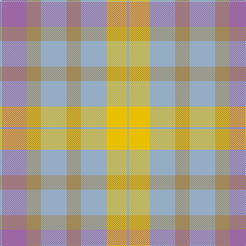

In pattern [YRYYYYYY](/patterns/yryyyyyy/).

This was sourced from register-of-tartans.  It is a [8 stripes tartan](/stripes/stripes8/).

Original link https://www.tartanregister.gov.uk/tartanDetails.aspx?ref=1282

## Attestations

This cloth appears in 2 source records; the oldest owns this page.

- 01/01/2007 — Froach's Grian (register-of-tartans, [record](https://www.tartanregister.gov.uk/tartanDetails.aspx?ref=1282))
- pre 2007 — Fraoch's Grian (Fashion) (tartans-authority, [record](http://www.tartansauthority.com/tartan-ferret/display/7095/))

## Thread count
N/4 LP48 LT28 N50 LT28 N50 Y40 N/4

## Palette
Each colour and its ΔE from the base-6 reference it is a variant of.

| Colour | Shade | Base | ΔE (OKLab) |
|---|---|---|---|
| LP | <code style="background-color:#9C68A4;">#9C68A4</code> `#9C68A4` | R <code style="background-color:#C80000;">#C80000</code> | 0.21 |
| LT | <code style="background-color:#A08858;">#A08858</code> `#A08858` | Y <code style="background-color:#E8C000;">#E8C000</code> | 0.21 |
| N | <code style="background-color:#94ACC4;">#94ACC4</code> `#94ACC4` | Y <code style="background-color:#E8C000;">#E8C000</code> | 0.22 |
| Y | <code style="background-color:#E8C000;">#E8C000</code> `#E8C000` | Y <code style="background-color:#E8C000;">#E8C000</code> | 0.00 |

# Sample pattern

## Nearest tartans

The nearest existing variants by ΔTartan distance.

1. [Scottish Ballet](/setts/s6/y10g44r30w22r10g4-g789484-r9c68a4-wc49cd8-ye0a126/) — ΔT 1.54
1. [Peter Rabbit (Corporate)](/setts/s10/y14g4w4wa10w6wa14w10wa28w10r10-g006818-re87878-we0e0e0-wa98c8e8-yd87c00/) — ΔT 1.82
1. [Porcelanosa](/setts/s4/y48r18b46ya6-b5c5c5c-r888888-ya0a0a0-yae8c000/) — ΔT 1.83
1. [Organic](/setts/s9/g50b6g16b26y16ya4yb22g4b6-b9058d8-g669999-yc89800-yaa0a0a0-ybc4bc68/) — ΔT 1.85
1. [Buchanhaven Heritage](/setts/s7/b48r54g40y12g40r4w6-b5c8ca8-g408060-rc82828-we0e0e0-ye0a126/) — ΔT 1.96
1. [Universal, Ancient](/setts/s8/b24g4b4g4b4r16ga16r2-b5480b0-g008000-ga30a010-r806050/) — ΔT 2.00
1. [Brodie Silver Clan Tartan Tartan Number: 1630. Earliest known date: c.1940-50 Probably a trade design based on Hunting Brodie, that has appeared in the last forty years. It is sometimes referred to as muted Brodie. (P.E. MacDonald, STS 1984) See products available Copyright © Blair Urquhart, Comrie, 2015](/setts/s7/r6b40y4b40ra40w40r6-b5c5c5c-rc80000-ra888888-wc0c0c0-ye8c000/) — ΔT 2.07
1. [Trinity Bicycles](/setts/s5/g8y22g28r60ra8-g6b4226-r8b7355-racd0000-y6ca6cd/) — ΔT 2.10
1. [Golden Pheasant](/setts/s7/r24w8r6y36r6ya8g4-g289c18-re87878-we0e0e0-ya08858-yad8b000/) — ΔT 2.10
1. [Bannockbane, Grey](/setts/s8/g4r4g30r4w20ra30r4ra4-g808080-r806050-ra906030-we0e0e0/) — ΔT 2.12

## Neighbour map

Every grey dot is one of 15726 variants placed by the first two principal components of the ΔTartan feature space (44% of its variance). Red is this tartan; blue dots are its nearest — click one to open its page.

<svg viewBox="0 0 640 380" role="img" style="max-width:100%;height:auto;border:1px solid #e0e0e0;border-radius:4px;display:block" xmlns="http://www.w3.org/2000/svg"><image href="/nn/cloud.v1.png" width="640" height="380"/><a href="/setts/s6/y10g44r30w22r10g4-g789484-r9c68a4-wc49cd8-ye0a126/"><circle cx="307.6" cy="256.7" r="4" fill="#3465a4"><title>Scottish Ballet</title></circle></a><a href="/setts/s10/y14g4w4wa10w6wa14w10wa28w10r10-g006818-re87878-we0e0e0-wa98c8e8-yd87c00/"><circle cx="223.3" cy="216.8" r="4" fill="#3465a4"><title>Peter Rabbit (Corporate)</title></circle></a><a href="/setts/s4/y48r18b46ya6-b5c5c5c-r888888-ya0a0a0-yae8c000/"><circle cx="280.3" cy="285.2" r="4" fill="#3465a4"><title>Porcelanosa</title></circle></a><a href="/setts/s9/g50b6g16b26y16ya4yb22g4b6-b9058d8-g669999-yc89800-yaa0a0a0-ybc4bc68/"><circle cx="266.5" cy="184.4" r="4" fill="#3465a4"><title>Organic</title></circle></a><a href="/setts/s7/b48r54g40y12g40r4w6-b5c8ca8-g408060-rc82828-we0e0e0-ye0a126/"><circle cx="223.2" cy="203.6" r="4" fill="#3465a4"><title>Buchanhaven Heritage</title></circle></a><a href="/setts/s8/b24g4b4g4b4r16ga16r2-b5480b0-g008000-ga30a010-r806050/"><circle cx="286.4" cy="226.0" r="4" fill="#3465a4"><title>Universal, Ancient</title></circle></a><a href="/setts/s7/r6b40y4b40ra40w40r6-b5c5c5c-rc80000-ra888888-wc0c0c0-ye8c000/"><circle cx="234.5" cy="210.7" r="4" fill="#3465a4"><title>Brodie Silver Clan Tartan Tartan Number: 1630. Earliest known date: c.1940-50 Probably a trade design based on Hunting Brodie, that has appeared in the last forty years. It is sometimes referred to as muted Brodie. (P.E. MacDonald, STS 1984) See products available Copyright © Blair Urquhart, Comrie, 2015</title></circle></a><a href="/setts/s5/g8y22g28r60ra8-g6b4226-r8b7355-racd0000-y6ca6cd/"><circle cx="316.6" cy="263.5" r="4" fill="#3465a4"><title>Trinity Bicycles</title></circle></a><a href="/setts/s7/r24w8r6y36r6ya8g4-g289c18-re87878-we0e0e0-ya08858-yad8b000/"><circle cx="282.1" cy="212.5" r="4" fill="#3465a4"><title>Golden Pheasant</title></circle></a><a href="/setts/s8/g4r4g30r4w20ra30r4ra4-g808080-r806050-ra906030-we0e0e0/"><circle cx="218.3" cy="212.3" r="4" fill="#3465a4"><title>Bannockbane, Grey</title></circle></a><circle cx="265.8" cy="237.8" r="5" fill="#c00000"/></svg>

ID: /setts/s8/y4r48ya28y50ya28y50yb40y4-r9c68a4-y94acc4-yaa08858-ybe8c000/
