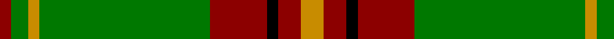
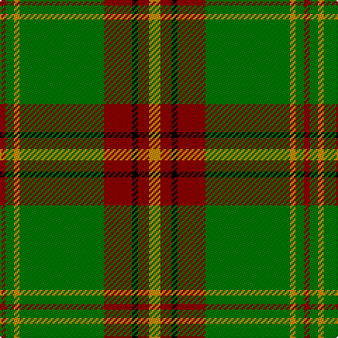

In pattern [RGYGRKRY](/patterns/rgygrkry/).

This was sourced from register-of-tartans.  It is a [8 stripes tartan](/stripes/stripes8/).

Original link https://www.tartanregister.gov.uk/tartanDetails.aspx?ref=4890

## Register references

External register numbers recorded for this tartan.

- Scottish Register of Tartans: [4890](https://www.tartanregister.gov.uk/tartanDetails.aspx?ref=4890)
- Scottish Tartans Authority (ITI): 3666

## Thread count
DR/4 G6 DY4 G60 DR20 K4 DR8 DY/8

## Palette
Each colour and its ΔE from the base-6 reference it is a variant of.

| Colour | Shade | Base | ΔE (OKLab) |
|---|---|---|---|
| B | <code style="background-color:#788CB4;">#788CB4</code> `#788CB4` | B <code style="background-color:#2A418A;">#2A418A</code> | 0.25 |
| DB | <code style="background-color:#00008C;">#00008C</code> `#00008C` | B <code style="background-color:#2A418A;">#2A418A</code> | 0.13 |
| DR | <code style="background-color:#8C0000;">#8C0000</code> `#8C0000` | R <code style="background-color:#CC0000;">#CC0000</code> | 0.14 |
| DY | <code style="background-color:#C88C00;">#C88C00</code> `#C88C00` | Y <code style="background-color:#F2BF00;">#F2BF00</code> | 0.15 |
| G | <code style="background-color:#007800;">#007800</code> `#007800` | G <code style="background-color:#006100;">#006100</code> | 0.07 |
| K | <code style="background-color:#000000;">#000000</code> `#000000` | K <code style="background-color:#000000;">#000000</code> | 0.00 |
| N | <code style="background-color:#C8C8C8;">#C8C8C8</code> `#C8C8C8` | W <code style="background-color:#F7F7F7;">#F7F7F7</code> | 0.14 |
| P | <code style="background-color:#64008C;">#64008C</code> `#64008C` | B <code style="background-color:#2A418A;">#2A418A</code> | 0.14 |

# Sample pattern

## Nearest tartans

The nearest existing variants by ΔTartan distance.

1. [Ulster Red Irish District Tartan Tartan Number: 792. Earliest known date: pre 1999 Originally listed as MacNeil, this sett was identified by Ken Dalgliesh, weaver in Selkirk, in 1999. See products available Copyright © Blair Urquhart, Comrie, 2015](/setts/s12/g13k1g13r1g1k1g1k1r13k1y1k1~g006818-k101010-rc80000-ye8c000~x3/) — ΔT 1.05
1. [Crieff, and Strathearn](/setts/s7/g55b7r24g12ba4y3ba4~b800080-ba304080-g008000-rc00000-yf0c000~x2/) — ΔT 1.15
1. [Canadian Caledonian](/setts/s10/b3g16y1r1w1r6g3r1g3w1~b304080-g008000-rc00000-we0e0e0-yf0c000~x2/) — ΔT 1.23
1. [Hall (P.I.E.) (Personal)](/setts/s8/y5g3y3g53r7b5r13w4~b2c2c80-g006818-r901c38-wf8f8f8-ye8c000~x2/) — ΔT 1.26
1. [Canadian Caledonian District Tartan Tartan Number: 203. Earliest known date: 1939 MacKinlay strip. Designers Hastie-Cochrane and George MacBeth of Vancouver. See products available Copyright © Blair Urquhart, Comrie, 2015](/setts/s10/b3g16y1r1w1r6g3r1g3w1~b2c2c80-g006818-rc80000-we0e0e0-ye8c000~x2/) — ΔT 1.27
1. [MacCall/McCall](/setts/s8/r3k2r3g12r3w1r1g1~g006818-k101010-r880000-wffffff~x4/) — ΔT 1.30
1. [Crieff and Strathearn District Tartan Tartan Number: 664. Earliest known date: 1988 A branch of the Stewart clan from Galloway and the South West of Scotland. See products available Copyright © Blair Urquhart, Comrie, 2015](/setts/s7/g55b7r24g12ba4y3ba4~b780078-ba2c2c80-g006818-rc80000-ye8c000~x2/) — ΔT 1.31
1. [O'Neill (Name)](/setts/s8/w6g5r5g45k4y24k4g5~g006818-k101010-ra00024-we0e0e0-ya08858~x2/) — ΔT 1.34
1. [Ulster](/setts/s12/g13k1g13r1g1k1g1k1r13k1y1k1~g008000-k000000-rc00000-yf0c000~x3/) — ΔT 1.35
1. [Canadian Caledonian](/setts/s10/b3g16y1r1w1r6g3r1g3w1~b2c2c80-g006818-rc80000-wfcfcfc-ye8c000~x4/) — ΔT 1.36

## Neighbour map

Every grey dot is one of 15726 variants placed by the first two principal components of the ΔTartan feature space (44% of its variance). Red is this tartan; blue dots are its nearest — click one to open its page.

<svg viewBox="0 0 640 380" role="img" style="max-width:100%;height:auto;border:1px solid #e0e0e0;border-radius:4px;display:block" xmlns="http://www.w3.org/2000/svg"><image href="/nn/cloud.v1.png" width="640" height="380"/><a href="/setts/s12/g13k1g13r1g1k1g1k1r13k1y1k1~g006818-k101010-rc80000-ye8c000~x3/"><circle cx="352.8" cy="148.5" r="4" fill="#3465a4"><title>Ulster Red Irish District Tartan Tartan Number: 792. Earliest known date: pre 1999 Originally listed as MacNeil, this sett was identified by Ken Dalgliesh, weaver in Selkirk, in 1999. See products available Copyright © Blair Urquhart, Comrie, 2015</title></circle></a><a href="/setts/s7/g55b7r24g12ba4y3ba4~b800080-ba304080-g008000-rc00000-yf0c000~x2/"><circle cx="357.2" cy="154.3" r="4" fill="#3465a4"><title>Crieff, and Strathearn</title></circle></a><a href="/setts/s10/b3g16y1r1w1r6g3r1g3w1~b304080-g008000-rc00000-we0e0e0-yf0c000~x2/"><circle cx="338.5" cy="133.7" r="4" fill="#3465a4"><title>Canadian Caledonian</title></circle></a><a href="/setts/s8/y5g3y3g53r7b5r13w4~b2c2c80-g006818-r901c38-wf8f8f8-ye8c000~x2/"><circle cx="343.3" cy="131.8" r="4" fill="#3465a4"><title>Hall (P.I.E.) (Personal)</title></circle></a><a href="/setts/s10/b3g16y1r1w1r6g3r1g3w1~b2c2c80-g006818-rc80000-we0e0e0-ye8c000~x2/"><circle cx="339.3" cy="133.9" r="4" fill="#3465a4"><title>Canadian Caledonian District Tartan Tartan Number: 203. Earliest known date: 1939 MacKinlay strip. Designers Hastie-Cochrane and George MacBeth of Vancouver. See products available Copyright © Blair Urquhart, Comrie, 2015</title></circle></a><a href="/setts/s8/r3k2r3g12r3w1r1g1~g006818-k101010-r880000-wffffff~x4/"><circle cx="306.1" cy="182.3" r="4" fill="#3465a4"><title>MacCall/McCall</title></circle></a><a href="/setts/s7/g55b7r24g12ba4y3ba4~b780078-ba2c2c80-g006818-rc80000-ye8c000~x2/"><circle cx="364.5" cy="157.2" r="4" fill="#3465a4"><title>Crieff and Strathearn District Tartan Tartan Number: 664. Earliest known date: 1988 A branch of the Stewart clan from Galloway and the South West of Scotland. See products available Copyright © Blair Urquhart, Comrie, 2015</title></circle></a><a href="/setts/s8/w6g5r5g45k4y24k4g5~g006818-k101010-ra00024-we0e0e0-ya08858~x2/"><circle cx="297.4" cy="165.2" r="4" fill="#3465a4"><title>O'Neill (Name)</title></circle></a><a href="/setts/s12/g13k1g13r1g1k1g1k1r13k1y1k1~g008000-k000000-rc00000-yf0c000~x3/"><circle cx="324.7" cy="138.7" r="4" fill="#3465a4"><title>Ulster</title></circle></a><a href="/setts/s10/b3g16y1r1w1r6g3r1g3w1~b2c2c80-g006818-rc80000-wfcfcfc-ye8c000~x4/"><circle cx="332.6" cy="131.1" r="4" fill="#3465a4"><title>Canadian Caledonian</title></circle></a><circle cx="359.8" cy="164.7" r="5" fill="#c00000"/></svg>

ID: /setts/s8/y4r4k2r10g30y2g3r2~g007800-k000000-r8c0000-yc88c00~x2/
