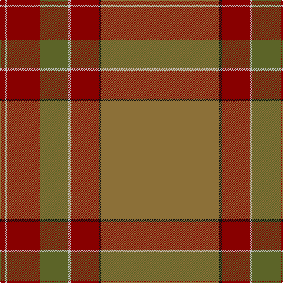

In pattern [GKRWGRWR](/stripes/gkrwgrwr/).

This was sourced from register-of-tartans.  It is a [8 stripe tartan](/stripes/stripes8/).

Original link https://www.tartanregister.gov.uk/tartanDetails.aspx?ref=5224

## Register references

External register numbers recorded for this tartan.

- Scottish Register of Tartans: [5224](https://www.tartanregister.gov.uk/tartanDetails.aspx?ref=5224)
- Scottish Tartans Authority (ITI): 3323

## Thread count
LT/200 K4 DR48 N4 G48 DR56 N4 DR/8

## Palette
Each colour and the base-6 reference it is a variant of.

| Colour | Shade | Base |
|---|---|---|
| DR | <code style="background-color:#880000;">#880000</code> `oklch(39.4% 0.162 29.2)` <small>#880000</small> | R <code style="background-color:#CC0000;">#CC0000</code> |
| G | <code style="background-color:#5C6428;">#5C6428</code> `oklch(48.3% 0.084 116.0)` <small>#5C6428</small> | G <code style="background-color:#006100;">#006100</code> |
| K | <code style="background-color:#101010;">#101010</code> `oklch(17.3% 0.000 89.9)` <small>#101010</small> | K <code style="background-color:#000000;">#000000</code> |
| LT | <code style="background-color:#8C7038;">#8C7038</code> `oklch(56.0% 0.082 83.0)` <small>#8C7038</small> | G <code style="background-color:#006100;">#006100</code> |
| N | <code style="background-color:#C0C0C0;">#C0C0C0</code> `oklch(80.8% 0.000 89.9)` <small>#C0C0C0</small> | W <code style="background-color:#F7F7F7;">#F7F7F7</code> |

# Sample pattern

## Nearest tartans

The nearest existing variants by ΔTartan distance, with this tartan at the top so the swatches line up against it.

ΔTartan

Tartan

Sett

—

<a href="/ttd/edit/#slug=y50k1r12lb1y12r14lb1r2~x4">MacByrd (Personal)</a> <a class="nn-out" href="/setts/s8/y50k1r12lb1y12r14lb1r2~x4/" title="open its dictionary page">↗</a>

1.14

<a href="/ttd/edit/#slug=o50k1r14lb1dg14r14lb1r2~x4">McBrayer Htg (Personal)</a> <a class="nn-out" href="/setts/s8/o50k1r14lb1dg14r14lb1r2~x4/" title="open its dictionary page">↗</a>

1.18

<a href="/ttd/edit/#slug=o50k1r12lb1y12r14lb1r2~x4">MacByrd (Personal)</a> <a class="nn-out" href="/setts/s8/o50k1r12lb1y12r14lb1r2~x4/" title="open its dictionary page">↗</a>

1.35

<a href="/ttd/edit/#slug=lo60w1r15w1lo9r15w1y9w1r15~x2">Smith Hunting (Name)</a> <a class="nn-out" href="/setts/s10/lo60w1r15w1lo9r15w1y9w1r15~x2/" title="open its dictionary page">↗</a>

1.56

<a href="/ttd/edit/#slug=o7r4o4r25dp1y32dp4y2w2y5~x2">Bell of Ardbel (Name)</a> <a class="nn-out" href="/setts/s10/o7r4o4r25dp1y32dp4y2w2y5~x2/" title="open its dictionary page">↗</a>

1.59

<a href="/ttd/edit/#slug=dy36k3o6k3do10o5do3lo4k1dy2~x2">Mead (Tennessee) Hunting (Personal)</a> <a class="nn-out" href="/setts/s10/dy36k3o6k3do10o5do3lo4k1dy2~x2/" title="open its dictionary page">↗</a>

1.59

<a href="/ttd/edit/#slug=o65dr9r11o5t2lo2y5o2lo13~x2">Down</a> <a class="nn-out" href="/setts/s9/o65dr9r11o5t2lo2y5o2lo13~x2/" title="open its dictionary page">↗</a>

1.66

<a href="/ttd/edit/#slug=g6w1g12o4r4o2r4o32g1o2~x2">Seton, hunting</a> <a class="nn-out" href="/setts/s10/g6w1g12o4r4o2r4o32g1o2~x2/" title="open its dictionary page">↗</a>

1.67

<a href="/ttd/edit/#slug=lo57k1r12lb1g12r14lb1r2~x2">MacBrair Hunting</a> <a class="nn-out" href="/setts/s8/lo57k1r12lb1g12r14lb1r2~x2/" title="open its dictionary page">↗</a>

1.68

<a href="/ttd/edit/#slug=r5n2r2dg42r5n36r70n2ly2r7dg2~x2">MacPherson Of Cluny</a> <a class="nn-out" href="/setts/s11/r5n2r2dg42r5n36r70n2ly2r7dg2~x2/" title="open its dictionary page">↗</a>

1.68

<a href="/ttd/edit/#slug=r5n2r2dg42r5n36r70n2ly2r7dg2">MacPherson Of Cluny</a> <a class="nn-out" href="/setts/s11/r5n2r2dg42r5n36r70n2ly2r7dg2/" title="open its dictionary page">↗</a>

## Neighbour map

Every grey dot is one of 14299 variants placed by the first two principal components of the ΔTartan feature space (44% of its variance). Red is this tartan; blue dots are its nearest — click one to open its page.

<svg viewBox="0 0 640 380" role="img" style="max-width:100%;height:auto;border:1px solid #e0e0e0;border-radius:4px;display:block" xmlns="http://www.w3.org/2000/svg"><image href="/nn/cloud.v1.png" width="640" height="380"/><a href="/setts/s8/o50k1r14lb1dg14r14lb1r2~x4/"><circle cx="460.3" cy="146.3" r="4" fill="#3465a4"><title>McBrayer Htg (Personal)</title></circle></a><a href="/setts/s8/o50k1r12lb1y12r14lb1r2~x4/"><circle cx="425.8" cy="114.2" r="4" fill="#3465a4"><title>MacByrd (Personal)</title></circle></a><a href="/setts/s10/lo60w1r15w1lo9r15w1y9w1r15~x2/"><circle cx="461.8" cy="127.9" r="4" fill="#3465a4"><title>Smith Hunting (Name)</title></circle></a><a href="/setts/s10/o7r4o4r25dp1y32dp4y2w2y5~x2/"><circle cx="360.3" cy="142.5" r="4" fill="#3465a4"><title>Bell of Ardbel (Name)</title></circle></a><a href="/setts/s10/dy36k3o6k3do10o5do3lo4k1dy2~x2/"><circle cx="413.0" cy="146.8" r="4" fill="#3465a4"><title>Mead (Tennessee) Hunting (Personal)</title></circle></a><a href="/setts/s9/o65dr9r11o5t2lo2y5o2lo13~x2/"><circle cx="460.0" cy="117.1" r="4" fill="#3465a4"><title>Down</title></circle></a><a href="/setts/s10/g6w1g12o4r4o2r4o32g1o2~x2/"><circle cx="464.4" cy="157.6" r="4" fill="#3465a4"><title>Seton, hunting</title></circle></a><a href="/setts/s8/lo57k1r12lb1g12r14lb1r2~x2/"><circle cx="442.4" cy="104.9" r="4" fill="#3465a4"><title>MacBrair Hunting</title></circle></a><a href="/setts/s11/r5n2r2dg42r5n36r70n2ly2r7dg2~x2/"><circle cx="421.2" cy="135.6" r="4" fill="#3465a4"><title>MacPherson Of Cluny</title></circle></a><a href="/setts/s11/r5n2r2dg42r5n36r70n2ly2r7dg2/"><circle cx="421.2" cy="135.6" r="4" fill="#3465a4"><title>MacPherson Of Cluny</title></circle></a><circle cx="450.8" cy="134.1" r="5" fill="#c00000"/></svg>

ID: /setts/s8/y50k1r12lb1y12r14lb1r2~x4/
