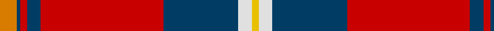

In pattern [YBRBRBWY](/patterns/ybrbrbwy/).

This was sourced from house-of-tartan.  It is a [8 stripes tartan](/stripes/stripes8/).

Original link http://www.house-of-tartan.scotland.net/house/TartanViewjs.asp?colr=Def&tnam=2694

## Thread count
O/10 DB2 R4 DB8 R72 DB44 LN8 Y/4

## Palette
Each colour and its ΔE from the base-6 reference it is a variant of.

| Colour | Shade | Base | ΔE (OKLab) |
|---|---|---|---|
| DB | <code style="background-color:#003C64;">#003C64</code> `#003C64` | B <code style="background-color:#2A418A;">#2A418A</code> | 0.08 |
| LN | <code style="background-color:#E0E0E0;">#E0E0E0</code> `#E0E0E0` | W <code style="background-color:#F7F7F7;">#F7F7F7</code> | 0.07 |
| O | <code style="background-color:#D87C00;">#D87C00</code> `#D87C00` | Y <code style="background-color:#F2BF00;">#F2BF00</code> | 0.17 |
| R | <code style="background-color:#C80000;">#C80000</code> `#C80000` | R <code style="background-color:#CC0000;">#CC0000</code> | 0.01 |
| Y | <code style="background-color:#E8C000;">#E8C000</code> `#E8C000` | Y <code style="background-color:#F2BF00;">#F2BF00</code> | 0.02 |

# Sample pattern

## Nearest tartans

The nearest existing variants by ΔTartan distance.

1. [MacLeay](/setts/s7/r27g4k4g4k4b6y1~b5c8ca8-g789484-k101010-rc80000-yd09800~x4/) — ΔT 0.84
1. [MacDonald of Glenaladale](/setts/s11/b3ba1r30b32r3w1r3g23r31b3w1~b2c4084-ba3c82af-g005020-rdc0000-we0e0e0/) — ΔT 0.86
1. [Livingstone MacLay MacLeay](/setts/s7/r28g4k4g4k4b6y1~b3c82af-g005020-k101010-rdc0000-ye8c000~x2/) — ΔT 0.87
1. [MacDonald of Glenaladale Artifact Tartan Tartan Number: 79. Earliest known date: c.1745 Said to have belonged to Alexander MacDonald of Glenaladale at the time of Culloden, and shipped out to Canada when he and his son emigrated in 1772. See products available Copyright © Blair Urquhart, Comrie, 2015](/setts/s11/b3ba1r30b32r3w1r3g23r31b3w1~b2c2c80-ba5c8ca8-g006818-rc80000-we0e0e0/) — ΔT 0.93
1. [Livingstone MacLay MacLeay Clan Tartan Tartan Number: 1488. Earliest known date: 1934 Nothing See products available Copyright © Blair Urquhart, Comrie, 2015](/setts/s7/r28g4k4g4k4b6y1~b5c8ca8-g006818-k101010-rc80000-ye8c000~x2/) — ΔT 0.94
1. [MacLeay (Clan)](/setts/s7/r27g4k4g4k4b6y1~b2c2c80-g006818-k101010-rc80000-yd09800~x4/) — ΔT 0.96
1. [MacEdward](/setts/s10/r6y1r24g6b2k1b2k1b12r1~b304080-g008000-k000000-rc00000-yf0c000~x2/) — ΔT 0.98
1. [Aberdeen Football Club (1999)](/setts/s8/r5k1ra2k4ra36k23w4y2~k101010-re13200-rac80028-we0e0e0-ye8c000~x2/) — ΔT 0.99
1. [Mensah](/setts/s8/y3g9b9k1y2k15r37g2~b2c2c80-g006818-k101010-rc80000-ye8c000~x2/) — ΔT 1.07
1. [MacDonald of Glenaladale](/setts/s11/b3ba1r30b32r3w1r3g23r31b3w1~b304080-ba5480b0-g008000-rc00000-we0e0e0/) — ΔT 1.08

## Neighbour map

Every grey dot is one of 15726 variants placed by the first two principal components of the ΔTartan feature space (44% of its variance). Red is this tartan; blue dots are its nearest — click one to open its page.

<svg viewBox="0 0 640 380" role="img" style="max-width:100%;height:auto;border:1px solid #e0e0e0;border-radius:4px;display:block" xmlns="http://www.w3.org/2000/svg"><image href="/nn/cloud.v1.png" width="640" height="380"/><a href="/setts/s7/r27g4k4g4k4b6y1~b5c8ca8-g789484-k101010-rc80000-yd09800~x4/"><circle cx="325.3" cy="118.9" r="4" fill="#3465a4"><title>MacLeay</title></circle></a><a href="/setts/s11/b3ba1r30b32r3w1r3g23r31b3w1~b2c4084-ba3c82af-g005020-rdc0000-we0e0e0/"><circle cx="320.4" cy="100.7" r="4" fill="#3465a4"><title>MacDonald of Glenaladale</title></circle></a><a href="/setts/s7/r28g4k4g4k4b6y1~b3c82af-g005020-k101010-rdc0000-ye8c000~x2/"><circle cx="324.8" cy="113.5" r="4" fill="#3465a4"><title>Livingstone MacLay MacLeay</title></circle></a><a href="/setts/s11/b3ba1r30b32r3w1r3g23r31b3w1~b2c2c80-ba5c8ca8-g006818-rc80000-we0e0e0/"><circle cx="321.1" cy="102.9" r="4" fill="#3465a4"><title>MacDonald of Glenaladale Artifact Tartan Tartan Number: 79. Earliest known date: c.1745 Said to have belonged to Alexander MacDonald of Glenaladale at the time of Culloden, and shipped out to Canada when he and his son emigrated in 1772. See products available Copyright © Blair Urquhart, Comrie, 2015</title></circle></a><a href="/setts/s7/r28g4k4g4k4b6y1~b5c8ca8-g006818-k101010-rc80000-ye8c000~x2/"><circle cx="330.7" cy="117.6" r="4" fill="#3465a4"><title>Livingstone MacLay MacLeay Clan Tartan Tartan Number: 1488. Earliest known date: 1934 Nothing See products available Copyright © Blair Urquhart, Comrie, 2015</title></circle></a><a href="/setts/s7/r27g4k4g4k4b6y1~b2c2c80-g006818-k101010-rc80000-yd09800~x4/"><circle cx="325.5" cy="122.4" r="4" fill="#3465a4"><title>MacLeay (Clan)</title></circle></a><a href="/setts/s10/r6y1r24g6b2k1b2k1b12r1~b304080-g008000-k000000-rc00000-yf0c000~x2/"><circle cx="343.3" cy="108.0" r="4" fill="#3465a4"><title>MacEdward</title></circle></a><a href="/setts/s8/r5k1ra2k4ra36k23w4y2~k101010-re13200-rac80028-we0e0e0-ye8c000~x2/"><circle cx="316.1" cy="92.1" r="4" fill="#3465a4"><title>Aberdeen Football Club (1999)</title></circle></a><a href="/setts/s8/y3g9b9k1y2k15r37g2~b2c2c80-g006818-k101010-rc80000-ye8c000~x2/"><circle cx="279.5" cy="99.0" r="4" fill="#3465a4"><title>Mensah</title></circle></a><a href="/setts/s11/b3ba1r30b32r3w1r3g23r31b3w1~b304080-ba5480b0-g008000-rc00000-we0e0e0/"><circle cx="326.3" cy="105.7" r="4" fill="#3465a4"><title>MacDonald of Glenaladale</title></circle></a><circle cx="327.9" cy="96.8" r="5" fill="#c00000"/></svg>

ID: /setts/s8/y5b1r2b4r36b22w4ya2~b003c64-rc80000-we0e0e0-yd87c00-yae8c000~x2/
