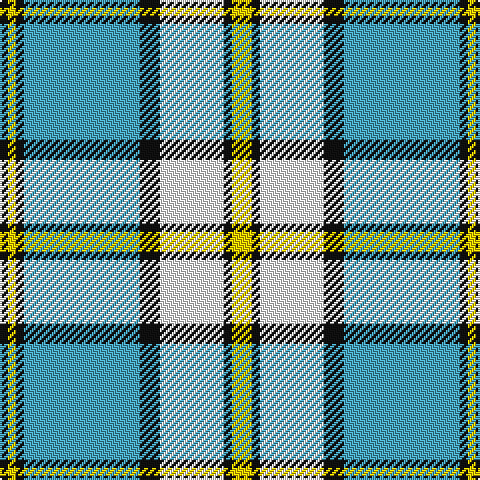

In pattern [KYKYKWKY](/patterns/kykykwky/).

This was sourced from tartans-authority.  It is a [8 stripes tartan](/stripes/stripes8/).

Original link http://www.tartansauthority.com/tartan-ferret/display/11074/

## Thread count
K/4 Y4 K4 B58 K10 W32 K4 Y/10

## Palette
Each colour and its ΔE from the base-6 reference it is a variant of.

| Colour | Shade | Base | ΔE (OKLab) |
|---|---|---|---|
| B | <code style="background-color:#48A4C0;">#48A4C0</code> `#48A4C0` | Y <code style="background-color:#F2BF00;">#F2BF00</code> | 0.29 |
| K | <code style="background-color:#101010;">#101010</code> `#101010` | K <code style="background-color:#000000;">#000000</code> | 0.17 |
| W | <code style="background-color:#FCFCFC;">#FCFCFC</code> `#FCFCFC` | W <code style="background-color:#F7F7F7;">#F7F7F7</code> | 0.01 |
| Y | <code style="background-color:#FCCC00;">#FCCC00</code> `#FCCC00` | Y <code style="background-color:#F2BF00;">#F2BF00</code> | 0.04 |

# Sample pattern

## Nearest tartans

The nearest existing variants by ΔTartan distance.

1. [Children's Wish Foundation of Canada, The](/setts/s8/y5k2w16k5b29k2y5k2~b3c82af-k000000-wffffff-yffcc00~x2/) — ΔT 0.73
1. [Elsa Dance](/setts/s10/w8g6w44b10ga6k3ga4k3ga34w4~b00008c-g006818-ga048888-k101010-wf8f4d0/) — ΔT 1.06
1. [Henderson Dress (Clan?)](/setts/s9/w1b6w4b1w16k1g4k6y1~b2888c4-g006818-k101010-wfcfcfc-ye8c000~x2/) — ΔT 1.21
1. [Fraser, Arisaid](/setts/s10/b14w2b3w2g10w32g10b10w2b3~b304080-g008000-we0e0e0~x2/) — ΔT 1.21
1. [Virtuoso](/setts/s9/r4w4k4w4k4w4k2g23w2~g838b83-k101010-rff0000-wffffff~x2/) — ΔT 1.25
1. [Henderson Dress](/setts/s9/w1b6w4b1w16k1g4k6y1~b8080d0-g008000-k000000-we0e0e0-yf0c000~x2/) — ΔT 1.31
1. [Nova Scotia, dress](/setts/s9/g3w29g3b3g3b6g13y3r2~b304080-g008000-rc00000-we0e0e0-yf0c000~x2/) — ΔT 1.32
1. [Torridon, Royal Blue (Dance)](/setts/s7/b3ba2w2ba30w30r2w3~b003c64-ba0c5488-rc80000-wf0e0c8~x2/) — ΔT 1.34
1. [Stephen-Mathieson (Name)](/setts/s12/w16g1w1g1w1k12g1w1g1w1g6b2~b780078-g00a824-k101010-w98c8e8~x4/) — ΔT 1.36
1. [Hannay](/setts/s10/k9w4k2w4k2w29k9w4b14y2~b3850c8-k101010-wffffff-yd09800~x2/) — ΔT 1.36

## Neighbour map

Every grey dot is one of 15726 variants placed by the first two principal components of the ΔTartan feature space (44% of its variance). Red is this tartan; blue dots are its nearest — click one to open its page.

<svg viewBox="0 0 640 380" role="img" style="max-width:100%;height:auto;border:1px solid #e0e0e0;border-radius:4px;display:block" xmlns="http://www.w3.org/2000/svg"><image href="/nn/cloud.v1.png" width="640" height="380"/><a href="/setts/s8/y5k2w16k5b29k2y5k2~b3c82af-k000000-wffffff-yffcc00~x2/"><circle cx="189.0" cy="139.5" r="4" fill="#3465a4"><title>Children's Wish Foundation of Canada, The</title></circle></a><a href="/setts/s10/w8g6w44b10ga6k3ga4k3ga34w4~b00008c-g006818-ga048888-k101010-wf8f4d0/"><circle cx="202.3" cy="115.9" r="4" fill="#3465a4"><title>Elsa Dance</title></circle></a><a href="/setts/s9/w1b6w4b1w16k1g4k6y1~b2888c4-g006818-k101010-wfcfcfc-ye8c000~x2/"><circle cx="212.3" cy="117.0" r="4" fill="#3465a4"><title>Henderson Dress (Clan?)</title></circle></a><a href="/setts/s10/b14w2b3w2g10w32g10b10w2b3~b304080-g008000-we0e0e0~x2/"><circle cx="232.1" cy="157.0" r="4" fill="#3465a4"><title>Fraser, Arisaid</title></circle></a><a href="/setts/s9/r4w4k4w4k4w4k2g23w2~g838b83-k101010-rff0000-wffffff~x2/"><circle cx="204.6" cy="141.7" r="4" fill="#3465a4"><title>Virtuoso</title></circle></a><a href="/setts/s9/w1b6w4b1w16k1g4k6y1~b8080d0-g008000-k000000-we0e0e0-yf0c000~x2/"><circle cx="214.7" cy="118.6" r="4" fill="#3465a4"><title>Henderson Dress</title></circle></a><a href="/setts/s9/g3w29g3b3g3b6g13y3r2~b304080-g008000-rc00000-we0e0e0-yf0c000~x2/"><circle cx="208.2" cy="121.9" r="4" fill="#3465a4"><title>Nova Scotia, dress</title></circle></a><a href="/setts/s7/b3ba2w2ba30w30r2w3~b003c64-ba0c5488-rc80000-wf0e0c8~x2/"><circle cx="282.7" cy="146.0" r="4" fill="#3465a4"><title>Torridon, Royal Blue (Dance)</title></circle></a><a href="/setts/s12/w16g1w1g1w1k12g1w1g1w1g6b2~b780078-g00a824-k101010-w98c8e8~x4/"><circle cx="223.2" cy="114.5" r="4" fill="#3465a4"><title>Stephen-Mathieson (Name)</title></circle></a><a href="/setts/s10/k9w4k2w4k2w29k9w4b14y2~b3850c8-k101010-wffffff-yd09800~x2/"><circle cx="231.7" cy="133.5" r="4" fill="#3465a4"><title>Hannay</title></circle></a><circle cx="213.3" cy="137.4" r="5" fill="#c00000"/></svg>

ID: /setts/s8/y5k2w16k5ya29k2y2k2~k101010-wfcfcfc-yfccc00-ya48a4c0~x2/
