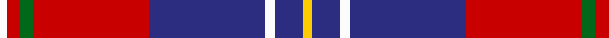

In pattern [WRGRBWBY](/patterns/wrgrbwby/).

This was sourced from tartans-authority.  It is a [8 stripes tartan](/stripes/stripes8/).

Original link http://www.tartansauthority.com/tartan-ferret/display/10615/

## Thread count
W/4 R8 G8 R68 DB68 W6 DB16 Y/6

## Palette
Each colour and its ΔE from the base-6 reference it is a variant of.

| Colour | Shade | Base | ΔE (OKLab) |
|---|---|---|---|
| DB | <code style="background-color:#2C2C80;">#2C2C80</code> `#2C2C80` | B <code style="background-color:#2A418A;">#2A418A</code> | 0.06 |
| G | <code style="background-color:#006818;">#006818</code> `#006818` | G <code style="background-color:#006100;">#006100</code> | 0.02 |
| R | <code style="background-color:#C80000;">#C80000</code> `#C80000` | R <code style="background-color:#CC0000;">#CC0000</code> | 0.01 |
| W | <code style="background-color:#FCFCFC;">#FCFCFC</code> `#FCFCFC` | W <code style="background-color:#F7F7F7;">#F7F7F7</code> | 0.01 |
| Y | <code style="background-color:#FCCC00;">#FCCC00</code> `#FCCC00` | Y <code style="background-color:#F2BF00;">#F2BF00</code> | 0.04 |

# Sample pattern

## Nearest tartans

The nearest existing variants by ΔTartan distance.

1. [Cherry, John S (Personal)](/setts/s7/r8b72ra70g4ra4g16w8-b000080-g006400-re3170d-raff0000-wffffff/) — ΔT 0.88
1. [Mercer, James (Personal)](/setts/s9/b24w3b4y6b4w3b15r52b6-b2c2c80-rc80000-wf8f8f8-ye8c000/) — ΔT 0.94
1. [Mercer Personal Tartan Tartan Number: 3019. Earliest known date: 2004 Sent to House of Tartan by the owner. See products available Copyright © Blair Urquhart, Comrie, 2015](/setts/s9/b32w4b6y8b6w4b20r70b8-b2c2c80-rc80000-we0e0e0-ye8c000/) — ΔT 0.94
1. [Wishart Dress Family Tartan Tartan Number: 2105. Earliest known date: 1990 The Wisharts of Pittarrow and Logie Wishart were a lowland family dating from around the 12th Century. The family's origins are unknown, but the name Guiscard, Wiscard, Wishart, meaning 'cunning' is Norman-French. We have also sought to associate the Wishart tartan with that of another family by virtue of the marriage of a Sir John Wishart to Jean, daughter of William Douglas, 9th Earl of Angus in the 16th Century. The Wishart tartan combines the Wallace and Douglas tartans, in an original new sett which was designed by Dr David Wishart with the assistance of the Scottish College of Textiles in Galashiels. (D. Wishart, 1990) See products available Copyright © Blair Urquhart, Comrie, 2015](/setts/s7/k4b4r32ba4y2ba26w4-b2c2c80-ba202060-k101010-rc80000-we0e0e0-ye8c000/) — ΔT 1.12
1. [Royal Scottish Assurance (Corporate)](/setts/s9/b52g22r16k4r4w4r8w2r30-b2c2c80-g006818-k101010-rc80000-wfcfcfc/) — ΔT 1.16
1. [Richardson (Personal?)](/setts/s10/r50k2y4k2y4k2r20b36w4b24-b1474b4-k101010-rc80000-we0e0e0-ye8c000/) — ΔT 1.16
1. [Java Saint Andrew Society Dress](/setts/s7/b100r52k18r8w4y4r20-b003c64-k101010-rc80000-we0e0e0-yd09800/) — ΔT 1.17
1. [Sea Dog Bamse, Pride of Norway](/setts/s9/b6y4b64r56w4r4w4r4w6-b003c64-rc80000-we0e0e0-ybc8c00/) — ΔT 1.18
1. [Cherry, John S. (Personal)](/setts/s7/r8b72ra70g4ra4g16w8-b003c64-g006818-re86000-rac80000-wfcfcfc/) — ΔT 1.18
1. [Widows Sons Scotland Dress](/setts/s6/w12g12k12g24b75y4-b780078-g006818-k101010-wc0c0c0-yfccc00/) — ΔT 1.18

## Neighbour map

Every grey dot is one of 15726 variants placed by the first two principal components of the ΔTartan feature space (44% of its variance). Red is this tartan; blue dots are its nearest — click one to open its page.

<svg viewBox="0 0 640 380" role="img" style="max-width:100%;height:auto;border:1px solid #e0e0e0;border-radius:4px;display:block" xmlns="http://www.w3.org/2000/svg"><image href="/nn/cloud.v1.png" width="640" height="380"/><a href="/setts/s7/r8b72ra70g4ra4g16w8-b000080-g006400-re3170d-raff0000-wffffff/"><circle cx="218.4" cy="122.7" r="4" fill="#3465a4"><title>Cherry, John S (Personal)</title></circle></a><a href="/setts/s9/b24w3b4y6b4w3b15r52b6-b2c2c80-rc80000-wf8f8f8-ye8c000/"><circle cx="294.7" cy="133.3" r="4" fill="#3465a4"><title>Mercer, James (Personal)</title></circle></a><a href="/setts/s9/b32w4b6y8b6w4b20r70b8-b2c2c80-rc80000-we0e0e0-ye8c000/"><circle cx="299.6" cy="135.3" r="4" fill="#3465a4"><title>Mercer Personal Tartan Tartan Number: 3019. Earliest known date: 2004 Sent to House of Tartan by the owner. See products available Copyright © Blair Urquhart, Comrie, 2015</title></circle></a><a href="/setts/s7/k4b4r32ba4y2ba26w4-b2c2c80-ba202060-k101010-rc80000-we0e0e0-ye8c000/"><circle cx="223.2" cy="124.5" r="4" fill="#3465a4"><title>Wishart Dress Family Tartan Tartan Number: 2105. Earliest known date: 1990 The Wisharts of Pittarrow and Logie Wishart were a lowland family dating from around the 12th Century. The family's origins are unknown, but the name Guiscard, Wiscard, Wishart, meaning 'cunning' is Norman-French. We have also sought to associate the Wishart tartan with that of another family by virtue of the marriage of a Sir John Wishart to Jean, daughter of William Douglas, 9th Earl of Angus in the 16th Century. The Wishart tartan combines the Wallace and Douglas tartans, in an original new sett which was designed by Dr David Wishart with the assistance of the Scottish College of Textiles in Galashiels. (D. Wishart, 1990) See products available Copyright © Blair Urquhart, Comrie, 2015</title></circle></a><a href="/setts/s9/b52g22r16k4r4w4r8w2r30-b2c2c80-g006818-k101010-rc80000-wfcfcfc/"><circle cx="239.7" cy="119.2" r="4" fill="#3465a4"><title>Royal Scottish Assurance (Corporate)</title></circle></a><a href="/setts/s10/r50k2y4k2y4k2r20b36w4b24-b1474b4-k101010-rc80000-we0e0e0-ye8c000/"><circle cx="291.9" cy="108.9" r="4" fill="#3465a4"><title>Richardson (Personal?)</title></circle></a><a href="/setts/s7/b100r52k18r8w4y4r20-b003c64-k101010-rc80000-we0e0e0-yd09800/"><circle cx="310.9" cy="133.2" r="4" fill="#3465a4"><title>Java Saint Andrew Society Dress</title></circle></a><a href="/setts/s9/b6y4b64r56w4r4w4r4w6-b003c64-rc80000-we0e0e0-ybc8c00/"><circle cx="300.6" cy="129.1" r="4" fill="#3465a4"><title>Sea Dog Bamse, Pride of Norway</title></circle></a><a href="/setts/s7/r8b72ra70g4ra4g16w8-b003c64-g006818-re86000-rac80000-wfcfcfc/"><circle cx="244.2" cy="137.0" r="4" fill="#3465a4"><title>Cherry, John S. (Personal)</title></circle></a><a href="/setts/s6/w12g12k12g24b75y4-b780078-g006818-k101010-wc0c0c0-yfccc00/"><circle cx="296.1" cy="149.3" r="4" fill="#3465a4"><title>Widows Sons Scotland Dress</title></circle></a><circle cx="267.2" cy="126.3" r="5" fill="#c00000"/></svg>

ID: /setts/s8/y6b16w6b68r68g8r8w4-b2c2c80-g006818-rc80000-wfcfcfc-yfccc00/
