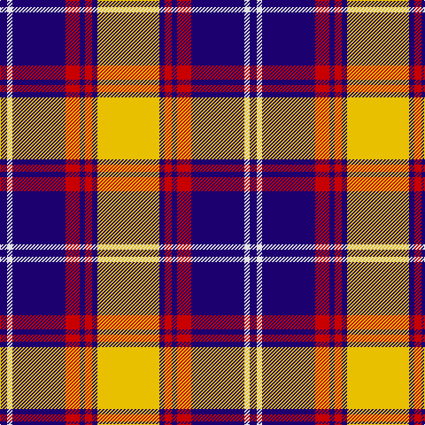

In pattern [BWBRBRBY](/patterns/bwbrbrby/).

This was sourced from register-of-tartans.  It is a [8 stripes tartan](/stripes/stripes8/).

Original link https://www.tartanregister.gov.uk/tartanDetails.aspx?ref=5781

## Thread count
DB/8 LN6 DB60 R16 DB6 R8 DB6 Y/70

## Palette
Each colour and its ΔE from the base-6 reference it is a variant of.

| Colour | Shade | Base | ΔE (OKLab) |
|---|---|---|---|
| DB | <code style="background-color:#1C0070;">#1C0070</code> `#1C0070` | B <code style="background-color:#2A418A;">#2A418A</code> | 0.14 |
| LN | <code style="background-color:#E0E0E0;">#E0E0E0</code> `#E0E0E0` | W <code style="background-color:#F7F7F7;">#F7F7F7</code> | 0.07 |
| R | <code style="background-color:#C80000;">#C80000</code> `#C80000` | R <code style="background-color:#CC0000;">#CC0000</code> | 0.01 |
| Y | <code style="background-color:#E8C000;">#E8C000</code> `#E8C000` | Y <code style="background-color:#F2BF00;">#F2BF00</code> | 0.02 |

# Sample pattern

## Nearest tartans

The nearest existing variants by ΔTartan distance.

1. [Merric, Dark Camel..](/setts/s7/r4w16k28ra50w4k4w4-k000000-rc00000-ra806050-we0e0e0/) — ΔT 0.89
1. [MacPherson #4](/setts/s9/r2b2k22b2r2b2w22b2r2-b3c82af-k101010-rdc0000-we0e0e0/) — ΔT 0.95
1. [Virtuoso (Corporate)](/setts/s9/r8w8k8w8k8w8k4ra46w4-k101010-rc80000-ra888888-we0e0e0/) — ΔT 0.96
1. [MacRae Dress Clan Tartan Tartan Number: 2186. Earliest known date: pre 2003 Also known as Scott Dress. See products available Copyright © Blair Urquhart, Comrie, 2015](/setts/s11/r4w12b4w32b6w2k32w2b4k8r4-b2c2c80-k101010-rc80000-we0e0e0/) — ΔT 0.97
1. [Auld Lang Syne, Grey (Fashion)](/setts/s12/k8w4k18k6r6w6r6w46k20w4k12w4-k101010-r880000-we0e0e0/) — ΔT 0.99
1. [St. Piran Dress](/setts/s8/r8w38g4w16g4w16k76w8-g003820-k101010-rc80000-we0e0e0/) — ΔT 1.03
1. [Meg Merrilees, New (1831)](/setts/s9/b5r5k58r5b5r5w25r5b4-b5c8ca8-k101010-rc80000-wfcfcfc/) — ΔT 1.04
1. [Kyle, Grape (Dance)](/setts/s10/b68y4b8k8b8y4b12k32w68y8-b440044-k101010-wf0e0c8-y58bc70/) — ΔT 1.04
1. [Downside (Corporate)](/setts/s6/r8ra82k10w28k36r8-k101010-rc80000-ra888888-we0e0e0/) — ΔT 1.06
1. [MacRae, Dress](/setts/s11/r4k18b8w4k44w4b8w44b4w16r4-b5c8ca8-k101010-r880000-wf8f8f8/) — ΔT 1.07

## Neighbour map

Every grey dot is one of 15726 variants placed by the first two principal components of the ΔTartan feature space (44% of its variance). Red is this tartan; blue dots are its nearest — click one to open its page.

<svg viewBox="0 0 640 380" role="img" style="max-width:100%;height:auto;border:1px solid #e0e0e0;border-radius:4px;display:block" xmlns="http://www.w3.org/2000/svg"><image href="/nn/cloud.v1.png" width="640" height="380"/><a href="/setts/s7/r4w16k28ra50w4k4w4-k000000-rc00000-ra806050-we0e0e0/"><circle cx="219.2" cy="158.3" r="4" fill="#3465a4"><title>Merric, Dark Camel..</title></circle></a><a href="/setts/s9/r2b2k22b2r2b2w22b2r2-b3c82af-k101010-rdc0000-we0e0e0/"><circle cx="184.6" cy="131.9" r="4" fill="#3465a4"><title>MacPherson #4</title></circle></a><a href="/setts/s9/r8w8k8w8k8w8k4ra46w4-k101010-rc80000-ra888888-we0e0e0/"><circle cx="214.9" cy="145.6" r="4" fill="#3465a4"><title>Virtuoso (Corporate)</title></circle></a><a href="/setts/s11/r4w12b4w32b6w2k32w2b4k8r4-b2c2c80-k101010-rc80000-we0e0e0/"><circle cx="208.6" cy="124.1" r="4" fill="#3465a4"><title>MacRae Dress Clan Tartan Tartan Number: 2186. Earliest known date: pre 2003 Also known as Scott Dress. See products available Copyright © Blair Urquhart, Comrie, 2015</title></circle></a><a href="/setts/s12/k8w4k18k6r6w6r6w46k20w4k12w4-k101010-r880000-we0e0e0/"><circle cx="209.2" cy="139.3" r="4" fill="#3465a4"><title>Auld Lang Syne, Grey (Fashion)</title></circle></a><a href="/setts/s8/r8w38g4w16g4w16k76w8-g003820-k101010-rc80000-we0e0e0/"><circle cx="255.1" cy="133.9" r="4" fill="#3465a4"><title>St. Piran Dress</title></circle></a><a href="/setts/s9/b5r5k58r5b5r5w25r5b4-b5c8ca8-k101010-rc80000-wfcfcfc/"><circle cx="245.2" cy="124.5" r="4" fill="#3465a4"><title>Meg Merrilees, New (1831)</title></circle></a><a href="/setts/s10/b68y4b8k8b8y4b12k32w68y8-b440044-k101010-wf0e0c8-y58bc70/"><circle cx="215.6" cy="125.4" r="4" fill="#3465a4"><title>Kyle, Grape (Dance)</title></circle></a><a href="/setts/s6/r8ra82k10w28k36r8-k101010-rc80000-ra888888-we0e0e0/"><circle cx="222.6" cy="183.1" r="4" fill="#3465a4"><title>Downside (Corporate)</title></circle></a><a href="/setts/s11/r4k18b8w4k44w4b8w44b4w16r4-b5c8ca8-k101010-r880000-wf8f8f8/"><circle cx="189.1" cy="138.4" r="4" fill="#3465a4"><title>MacRae, Dress</title></circle></a><circle cx="225.1" cy="147.7" r="5" fill="#c00000"/></svg>

ID: /setts/s8/y70b6r8b6r16b60w6b8-b1c0070-rc80000-we0e0e0-ye8c000/
