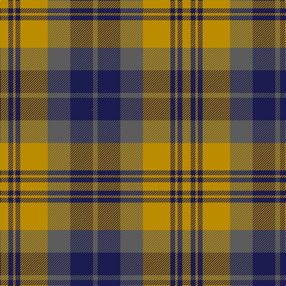

In pattern [BBBYBYBY](/patterns/bbbybyby/).

This was sourced from tartans-authority.  It is a [8 stripes tartan](/stripes/stripes8/).

Original link http://www.tartansauthority.com/tartan-ferret/display/10254/

## Thread count
DY/14 DB8 DY4 DB8 DY46 N38 DB38 N/8

## Palette
Each colour and its ΔE from the base-6 reference it is a variant of.

| Colour | Shade | Base | ΔE (OKLab) |
|---|---|---|---|
| DB | <code style="background-color:#1C1C50;">#1C1C50</code> `#1C1C50` | B <code style="background-color:#2A418A;">#2A418A</code> | 0.14 |
| DY | <code style="background-color:#BC8C00;">#BC8C00</code> `#BC8C00` | Y <code style="background-color:#F2BF00;">#F2BF00</code> | 0.16 |
| N | <code style="background-color:#5C5C5C;">#5C5C5C</code> `#5C5C5C` | B <code style="background-color:#2A418A;">#2A418A</code> | 0.15 |

# Sample pattern

## Nearest tartans

The nearest existing variants by ΔTartan distance.

1. [Logan, or Skene](/setts/s7/b9r3b1r3g9r3b1~b304080-g008000-rc00000~x2/) — ΔT 0.70
1. [Red Remony](/setts/s8/r17b2r2b13r2b2g17b2~b304080-g008000-rc00000~x2/) — ΔT 0.95
1. [Logan](/setts/s7/b8r3b1r3g14r3b1~b304080-g008000-rc00000~x4/) — ΔT 1.02
1. [Logan](/setts/s7/b8r3b1r3g14r3b1~b2c4084-g005020-rdc0000~x4/) — ΔT 1.05
1. [Robertson of Struan](/setts/s7/r6b2r2b21g20r4g4~b304080-g008000-rc00000~x2/) — ΔT 1.07
1. [Red Remony Trade Tartan Tartan Number: 2235. Earliest known date: 1971 Red Remony See products available Copyright © Blair Urquhart, Comrie, 2015](/setts/s8/r17b2r2b13r2b2g17b2~b2c2c80-g006818-rc80000~x2/) — ΔT 1.08
1. [Inverness, Fencibles](/setts/s12/b10r1b1r1g10r13g2r13g10b10r1b1~b304080-g008000-rc00000~x2/) — ΔT 1.13
1. [Grey Watch, Dress](/setts/s8/g9b1g1b1g1b7w7b2~b3c3c3c-g808080-we0e0e0~x4/) — ΔT 1.16
1. [Snaefell (District)](/setts/s8/g22ga2g2ga2g2ga14w16ga3~g685838-ga604000-we8e4d0~x2/) — ΔT 1.17
1. [Fraser of Stratherrick](/setts/s12/b20r2b2r2g19r18g2r18g19b19r2b2~b2c2c80-g006818-rc80000~x2/) — ΔT 1.17

## Neighbour map

Every grey dot is one of 15726 variants placed by the first two principal components of the ΔTartan feature space (44% of its variance). Red is this tartan; blue dots are its nearest — click one to open its page.

<svg viewBox="0 0 640 380" role="img" style="max-width:100%;height:auto;border:1px solid #e0e0e0;border-radius:4px;display:block" xmlns="http://www.w3.org/2000/svg"><image href="/nn/cloud.v1.png" width="640" height="380"/><a href="/setts/s7/b9r3b1r3g9r3b1~b304080-g008000-rc00000~x2/"><circle cx="233.8" cy="231.5" r="4" fill="#3465a4"><title>Logan, or Skene</title></circle></a><a href="/setts/s8/r17b2r2b13r2b2g17b2~b304080-g008000-rc00000~x2/"><circle cx="240.4" cy="211.2" r="4" fill="#3465a4"><title>Red Remony</title></circle></a><a href="/setts/s7/b8r3b1r3g14r3b1~b304080-g008000-rc00000~x4/"><circle cx="277.9" cy="205.0" r="4" fill="#3465a4"><title>Logan</title></circle></a><a href="/setts/s7/b8r3b1r3g14r3b1~b2c4084-g005020-rdc0000~x4/"><circle cx="287.1" cy="207.8" r="4" fill="#3465a4"><title>Logan</title></circle></a><a href="/setts/s7/r6b2r2b21g20r4g4~b304080-g008000-rc00000~x2/"><circle cx="266.9" cy="219.3" r="4" fill="#3465a4"><title>Robertson of Struan</title></circle></a><a href="/setts/s8/r17b2r2b13r2b2g17b2~b2c2c80-g006818-rc80000~x2/"><circle cx="239.1" cy="210.3" r="4" fill="#3465a4"><title>Red Remony Trade Tartan Tartan Number: 2235. Earliest known date: 1971 Red Remony See products available Copyright © Blair Urquhart, Comrie, 2015</title></circle></a><a href="/setts/s12/b10r1b1r1g10r13g2r13g10b10r1b1~b304080-g008000-rc00000~x2/"><circle cx="250.0" cy="187.6" r="4" fill="#3465a4"><title>Inverness, Fencibles</title></circle></a><a href="/setts/s8/g9b1g1b1g1b7w7b2~b3c3c3c-g808080-we0e0e0~x4/"><circle cx="213.7" cy="202.7" r="4" fill="#3465a4"><title>Grey Watch, Dress</title></circle></a><a href="/setts/s8/g22ga2g2ga2g2ga14w16ga3~g685838-ga604000-we8e4d0~x2/"><circle cx="246.1" cy="190.8" r="4" fill="#3465a4"><title>Snaefell (District)</title></circle></a><a href="/setts/s12/b20r2b2r2g19r18g2r18g19b19r2b2~b2c2c80-g006818-rc80000~x2/"><circle cx="217.3" cy="199.1" r="4" fill="#3465a4"><title>Fraser of Stratherrick</title></circle></a><circle cx="230.1" cy="210.3" r="5" fill="#c00000"/></svg>

ID: /setts/s8/y7b4y2b4y23ba19b19ba4~b1c1c50-ba5c5c5c-ybc8c00~x2/
