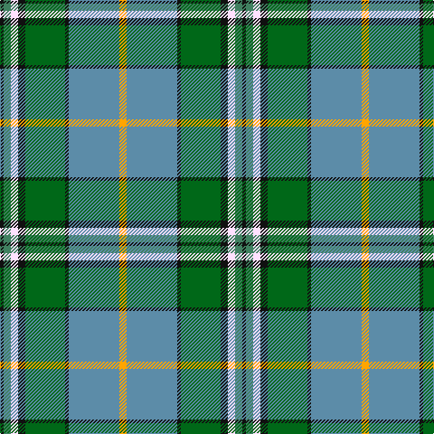

In pattern [KGWKGKBY](/patterns/kgwkgkby/).

This was sourced from register-of-tartans.  It is a [8 stripes tartan](/stripes/stripes8/).

Original link https://www.tartanregister.gov.uk/tartanDetails.aspx?ref=2964

## Thread count
K/4 Ga8 W8 K8 G44 K4 B56 Y/8

## Palette
Each colour and its ΔE from the base-6 reference it is a variant of.

| Colour | Shade | Base | ΔE (OKLab) |
|---|---|---|---|
| B | <code style="background-color:#5C8CA8;">#5C8CA8</code> `#5C8CA8` | B <code style="background-color:#2A418A;">#2A418A</code> | 0.23 |
| G | <code style="background-color:#006818;">#006818</code> `#006818` | G <code style="background-color:#006100;">#006100</code> | 0.02 |
| Ga | <code style="background-color:#408060;">#408060</code> `#408060` | G <code style="background-color:#006100;">#006100</code> | 0.14 |
| K | <code style="background-color:#101010;">#101010</code> `#101010` | K <code style="background-color:#000000;">#000000</code> | 0.17 |
| W | <code style="background-color:#FFE1FF;">#FFE1FF</code> `#FFE1FF` | W <code style="background-color:#F7F7F7;">#F7F7F7</code> | 0.06 |
| Y | <code style="background-color:#FFA500;">#FFA500</code> `#FFA500` | Y <code style="background-color:#F2BF00;">#F2BF00</code> | 0.06 |

# Sample pattern

## Nearest tartans

The nearest existing variants by ΔTartan distance.

1. [Mission](/setts/s8/r8b56k4g44k8y8ga8k4-b5480b0-g008000-ga407050-k000000-r703000-ye0a0a0/) — ΔT 0.49
1. [Currie of Arran (Clan/family)](/setts/s11/b32w6b4y8g48r4g8r10g8r4wa16-b3048b4-g009020-rc80000-wf8f8f8-waa4b4cc-ye8c000/) — ΔT 0.96
1. [Dunedin (USA) (District)](/setts/s9/w6b50k6r6k6r16g42k6k4-b2888c4-g006818-k101010-rc80000-wfcfcfc/) — ΔT 0.97
1. [Hogg Dress (Name)](/setts/s9/b34r3b8ba4b8k24g34k2w6-b4880a0-ba1c1c50-g006818-k101010-rc80000-we0e0e0/) — ΔT 0.99
1. [Iroquois Falls Centenary](/setts/s8/g36y12ga6w2ga6w2wa12b12-b000080-g006400-ga603311-wffffff-wa82cffd-y86c67c/) — ΔT 1.04
1. [Gallagher Ancient](/setts/s9/b8g82y8ga8y8ga18r36y8w8-b202060-g005448-ga008c54-re87878-we0e0e0-ya08858/) — ΔT 1.04
1. [Hek Family (Sunningdale, Berwick on Tweed)](/setts/s9/w2wa4g24k4w4k4b30w4y2-b816687-g1b6453-k101010-w00bfff-wafff8dc-yffb90f/) — ΔT 1.06
1. [MacManus](/setts/s9/w12y8g32y8k12y8b60k4y8-b3c5c6c-g006818-k101010-wf8f8f8-yc4bc68/) — ΔT 1.07
1. [Ayrshire](/setts/s8/b8r4b40w4ra16g32y4g8-b304080-g008000-rc00000-ra806050-we0e0e0-yf0c000/) — ΔT 1.08
1. [Royal British Legion, The](/setts/s7/r12b4g40k6ba16ga4b8-b8080d0-ba304080-g008000-ga30a010-k000000-rc00000/) — ΔT 1.09

## Neighbour map

Every grey dot is one of 15726 variants placed by the first two principal components of the ΔTartan feature space (44% of its variance). Red is this tartan; blue dots are its nearest — click one to open its page.

<svg viewBox="0 0 640 380" role="img" style="max-width:100%;height:auto;border:1px solid #e0e0e0;border-radius:4px;display:block" xmlns="http://www.w3.org/2000/svg"><image href="/nn/cloud.v1.png" width="640" height="380"/><a href="/setts/s8/r8b56k4g44k8y8ga8k4-b5480b0-g008000-ga407050-k000000-r703000-ye0a0a0/"><circle cx="169.1" cy="132.9" r="4" fill="#3465a4"><title>Mission</title></circle></a><a href="/setts/s11/b32w6b4y8g48r4g8r10g8r4wa16-b3048b4-g009020-rc80000-wf8f8f8-waa4b4cc-ye8c000/"><circle cx="158.9" cy="124.8" r="4" fill="#3465a4"><title>Currie of Arran (Clan/family)</title></circle></a><a href="/setts/s9/w6b50k6r6k6r16g42k6k4-b2888c4-g006818-k101010-rc80000-wfcfcfc/"><circle cx="134.8" cy="129.3" r="4" fill="#3465a4"><title>Dunedin (USA) (District)</title></circle></a><a href="/setts/s9/b34r3b8ba4b8k24g34k2w6-b4880a0-ba1c1c50-g006818-k101010-rc80000-we0e0e0/"><circle cx="176.1" cy="138.4" r="4" fill="#3465a4"><title>Hogg Dress (Name)</title></circle></a><a href="/setts/s8/g36y12ga6w2ga6w2wa12b12-b000080-g006400-ga603311-wffffff-wa82cffd-y86c67c/"><circle cx="141.6" cy="127.4" r="4" fill="#3465a4"><title>Iroquois Falls Centenary</title></circle></a><a href="/setts/s9/b8g82y8ga8y8ga18r36y8w8-b202060-g005448-ga008c54-re87878-we0e0e0-ya08858/"><circle cx="198.8" cy="140.0" r="4" fill="#3465a4"><title>Gallagher Ancient</title></circle></a><a href="/setts/s9/w2wa4g24k4w4k4b30w4y2-b816687-g1b6453-k101010-w00bfff-wafff8dc-yffb90f/"><circle cx="176.8" cy="120.9" r="4" fill="#3465a4"><title>Hek Family (Sunningdale, Berwick on Tweed)</title></circle></a><a href="/setts/s9/w12y8g32y8k12y8b60k4y8-b3c5c6c-g006818-k101010-wf8f8f8-yc4bc68/"><circle cx="168.4" cy="139.6" r="4" fill="#3465a4"><title>MacManus</title></circle></a><a href="/setts/s8/b8r4b40w4ra16g32y4g8-b304080-g008000-rc00000-ra806050-we0e0e0-yf0c000/"><circle cx="187.5" cy="168.6" r="4" fill="#3465a4"><title>Ayrshire</title></circle></a><a href="/setts/s7/r12b4g40k6ba16ga4b8-b8080d0-ba304080-g008000-ga30a010-k000000-rc00000/"><circle cx="164.5" cy="162.2" r="4" fill="#3465a4"><title>Royal British Legion, The</title></circle></a><circle cx="176.4" cy="133.9" r="5" fill="#c00000"/></svg>

ID: /setts/s8/y8b56k4g44k8w8ga8k4-b5c8ca8-g006818-ga408060-k101010-wffe1ff-yffa500/
