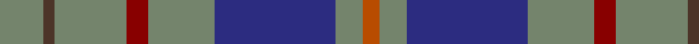

In pattern [GBGRGBGR](/stripes/gbgrgbgr/).

This was sourced from tartans-authority.  It is a [8 stripe tartan](/stripes/stripes8/).

Original link http://www.tartansauthority.com/tartan-ferret/display/2262/

## Thread count
N/16 T4 N26 DR8 N24 DB44 N10 DO/6

## Palette
Each colour and the base-6 reference it is a variant of.

| Colour | Shade | Base |
|---|---|---|
| DB | <code style="background-color:#2C2C80;">#2C2C80</code> `oklch(35.0% 0.138 276.6)` <small>#2C2C80</small> | B <code style="background-color:#2A418A;">#2A418A</code> |
| DO | <code style="background-color:#B84C00;">#B84C00</code> `oklch(55.1% 0.156 45.5)` <small>#B84C00</small> | R <code style="background-color:#CC0000;">#CC0000</code> |
| DR | <code style="background-color:#880000;">#880000</code> `oklch(39.4% 0.162 29.2)` <small>#880000</small> | R <code style="background-color:#CC0000;">#CC0000</code> |
| N | <code style="background-color:#74846C;">#74846C</code> `oklch(59.3% 0.040 135.2)` <small>#74846C</small> | G <code style="background-color:#006100;">#006100</code> |
| T | <code style="background-color:#4C3428;">#4C3428</code> `oklch(34.9% 0.040 47.5)` <small>#4C3428</small> | B <code style="background-color:#2A418A;">#2A418A</code> |

# Sample pattern

## Nearest tartans

The nearest existing variants by ΔTartan distance, with this tartan at the top so the swatches line up against it.

ΔTartan

Tartan

Sett

—

<a href="/ttd/edit/#slug=y8do2y13r4y12db22y5o3~x2">Kildare, County (District)</a> <a class="nn-out" href="/setts/s8/y8do2y13r4y12db22y5o3~x2/" title="open its dictionary page">↗</a>

1.15

<a href="/setts/s14/y8do2y13r4y12db22y5o3~x2/">Kildare, County</a>

1.15

<a href="/ttd/edit/#slug=dp3o15dt15r2dt15ly3~x2">HMS Duncan (Military)</a> <a class="nn-out" href="/setts/s6/dp3o15dt15r2dt15ly3~x2/" title="open its dictionary page">↗</a>

1.21

<a href="/ttd/edit/#slug=do15r5do30b32do4lo3~x2">Cameron Hunting</a> <a class="nn-out" href="/setts/s6/do15r5do30b32do4lo3~x2/" title="open its dictionary page">↗</a>

1.30

<a href="/ttd/edit/#slug=lr13lr2n38k13n8k8n17k2n17k4o11">Bute Heather, Grey (Fashion)</a> <a class="nn-out" href="/setts/s11/lr13lr2n38k13n8k8n17k2n17k4o11/" title="open its dictionary page">↗</a>

1.31

<a href="/ttd/edit/#slug=n8ly2n22dg6r2lb10dg12n3~x2">Bahamas</a> <a class="nn-out" href="/setts/s8/n8ly2n22dg6r2lb10dg12n3~x2/" title="open its dictionary page">↗</a>

1.32

<a href="/ttd/edit/#slug=t33r8db12g12t8db2t8~x2">Bermuda Plaid (1947) (District)</a> <a class="nn-out" href="/setts/s7/t33r8db12g12t8db2t8~x2/" title="open its dictionary page">↗</a>

1.33

<a href="/ttd/edit/#slug=g14dp11t3k2t3dp11g14ly1~x2">Wellington (Wilson 122)</a> <a class="nn-out" href="/setts/s8/g14dp11t3k2t3dp11g14ly1~x2/" title="open its dictionary page">↗</a>

1.36

<a href="/ttd/edit/#slug=lo3g17n3g3n3k5n18r2n8r2~x2">Donegal Irish County Tartan Tartan Number: 2247. Earliest known date: 1996 One of a series of Irish District tartans designed by Polly Wittering of the House of Edgar, with colours reminiscent of the Country with soft warm colours dominating. See products available Copyright © Blair Urquhart, Comrie, 2015</a> <a class="nn-out" href="/setts/s10/lo3g17n3g3n3k5n18r2n8r2~x2/" title="open its dictionary page">↗</a>

1.38

<a href="/ttd/edit/#slug=y3g17db3g3db3dr5db18r2db8r2~x2">Donegal</a> <a class="nn-out" href="/setts/s10/y3g17db3g3db3dr5db18r2db8r2~x2/" title="open its dictionary page">↗</a>

1.41

<a href="/ttd/edit/#slug=lo3dg17b3dg3b3do5b18r2b8r2~x2">Donegal, County</a> <a class="nn-out" href="/setts/s10/lo3dg17b3dg3b3do5b18r2b8r2~x2/" title="open its dictionary page">↗</a>

## Neighbour map

Every grey dot is one of 14299 variants placed by the first two principal components of the ΔTartan feature space (44% of its variance). Red is this tartan; blue dots are its nearest — click one to open its page.

<svg viewBox="0 0 640 380" role="img" style="max-width:100%;height:auto;border:1px solid #e0e0e0;border-radius:4px;display:block" xmlns="http://www.w3.org/2000/svg"><image href="/nn/cloud.v1.png" width="640" height="380"/><a href="/setts/s14/y8do2y13r4y12db22y5o3~x2/"><circle cx="285.0" cy="184.9" r="4" fill="#3465a4"><title>Kildare, County</title></circle></a><a href="/setts/s6/dp3o15dt15r2dt15ly3~x2/"><circle cx="279.3" cy="231.6" r="4" fill="#3465a4"><title>HMS Duncan (Military)</title></circle></a><a href="/setts/s6/do15r5do30b32do4lo3~x2/"><circle cx="349.0" cy="234.3" r="4" fill="#3465a4"><title>Cameron Hunting</title></circle></a><a href="/setts/s11/lr13lr2n38k13n8k8n17k2n17k4o11/"><circle cx="333.4" cy="167.0" r="4" fill="#3465a4"><title>Bute Heather, Grey (Fashion)</title></circle></a><a href="/setts/s8/n8ly2n22dg6r2lb10dg12n3~x2/"><circle cx="249.2" cy="195.7" r="4" fill="#3465a4"><title>Bahamas</title></circle></a><a href="/setts/s7/t33r8db12g12t8db2t8~x2/"><circle cx="347.0" cy="210.5" r="4" fill="#3465a4"><title>Bermuda Plaid (1947) (District)</title></circle></a><a href="/setts/s8/g14dp11t3k2t3dp11g14ly1~x2/"><circle cx="245.5" cy="189.3" r="4" fill="#3465a4"><title>Wellington (Wilson 122)</title></circle></a><a href="/setts/s10/lo3g17n3g3n3k5n18r2n8r2~x2/"><circle cx="249.0" cy="184.4" r="4" fill="#3465a4"><title>Donegal Irish County Tartan Tartan Number: 2247. Earliest known date: 1996 One of a series of Irish District tartans designed by Polly Wittering of the House of Edgar, with colours reminiscent of the Country with soft warm colours dominating. See products available Copyright © Blair Urquhart, Comrie, 2015</title></circle></a><a href="/setts/s10/y3g17db3g3db3dr5db18r2db8r2~x2/"><circle cx="259.1" cy="190.8" r="4" fill="#3465a4"><title>Donegal</title></circle></a><a href="/setts/s10/lo3dg17b3dg3b3do5b18r2b8r2~x2/"><circle cx="266.3" cy="196.2" r="4" fill="#3465a4"><title>Donegal, County</title></circle></a><circle cx="302.8" cy="207.2" r="5" fill="#c00000"/></svg>

ID: /setts/s8/y8do2y13r4y12db22y5o3~x2/
