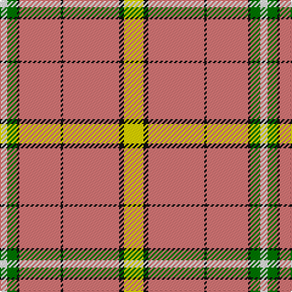

In pattern [WGKRKRKY](/patterns/wgkrkrky/).

This was sourced from register-of-tartans.  It is a [8 stripes tartan](/stripes/stripes8/).

Original link https://www.tartanregister.gov.uk/tartanDetails.aspx?ref=11414

## Register references

External register numbers recorded for this tartan.

- Scottish Register of Tartans: [11414](https://www.tartanregister.gov.uk/tartanDetails.aspx?ref=11414)

## Thread count
W/6 G8 K2 LR34 K2 LR46 K4 Y/16

## Palette
Each colour and its ΔE from the base-6 reference it is a variant of.

| Colour | Shade | Base | ΔE (OKLab) |
|---|---|---|---|
| G | <code style="background-color:#007800;">#007800</code> `#007800` | G <code style="background-color:#006100;">#006100</code> | 0.07 |
| K | <code style="background-color:#101010;">#101010</code> `#101010` | K <code style="background-color:#000000;">#000000</code> | 0.17 |
| LR | <code style="background-color:#E87878;">#E87878</code> `#E87878` | R <code style="background-color:#CC0000;">#CC0000</code> | 0.19 |
| W | <code style="background-color:#FFFFFF;">#FFFFFF</code> `#FFFFFF` | W <code style="background-color:#F7F7F7;">#F7F7F7</code> | 0.02 |
| Y | <code style="background-color:#FFE600;">#FFE600</code> `#FFE600` | Y <code style="background-color:#F2BF00;">#F2BF00</code> | 0.10 |

# Sample pattern

## Nearest tartans

The nearest existing variants by ΔTartan distance.

1. [Drummond of Perth, dress](/setts/s9/r67y3b6w3wa25r10b6w7wa3~b505050-rc00000-wc0c0c0-wae0e0e0-yf0c000~x2/) — ΔT 1.60
1. [Shawn Jones Afghan Memorial, The](/setts/s6/r12g4k8ga3y62ra8~g649848-ga5d321f-k1c1714-rca2625-rab62531-yf5d38b~x2/) — ΔT 1.62
1. [Irn Bru](/setts/s8/y98b32k3w6b4w4b6y4~b304080-k000000-we0e0e0-yff8500/) — ΔT 1.63
1. [Gary (Personal)](/setts/s12/b2r1y4w2y12w8y12w2y2y2w1y2~b6c0070-rc80000-wfcfcfc-yd87c00~x4/) — ΔT 1.64
1. [Drummond of Perth Dress #3](/setts/s9/r67y3b6w3wa25r10b6w7wa3~b505050-rdc0000-wc0c0c0-wae0e0e0-ye8c000~x2/) — ΔT 1.66
1. [Loch Skene (Fashion)](/setts/s10/w48g15y2g3w2g3ya12w8g2w6~g604000-we8ccb8-yfcb464-yaa08858~x2/) — ΔT 1.75
1. [Nicolson Dress (Clan)](/setts/s5/r62b8w20k3g4~b2c2c80-g006818-k101010-rc80000-we0e0e0~x2/) — ΔT 1.77
1. [Irn Bru Corporate Tartan Tartan Number: 2395. Earliest known date: Sep 1998 Irn Bru (Iron Brew) was first produced in 1901 by A.G. Barr and has been Scotland's favourite fizzy drink ever since. The colours are based on the brand label. Irn Bru was famously advertised on TV as 'being made in Scotland . . . from GIRDERS!" which was the subject of a complaint to the Advertising Standards Authority because it was 'untrue' !!! See products available Copyright © Blair Urquhart, Comrie, 2015](/setts/s8/y49b16k2w3b2w2b3y2~b2c2c80-k101010-wfcfcfc-yd87c00~x2/) — ΔT 1.78
1. [Irn Bru (Corporate)](/setts/s8/r49b16k2w3b2w2b3r2~b2c2c80-k101010-re86008-wfcfcfc~x2/) — ΔT 1.82
1. [Shaw of Tordarroch, Mrs (Personal)](/setts/s11/r8w46b4w4b4w5g7w7g7w4b2~b202060-g5c6428-re86000-we8ccb8~x2/) — ΔT 1.84

## Neighbour map

Every grey dot is one of 15726 variants placed by the first two principal components of the ΔTartan feature space (44% of its variance). Red is this tartan; blue dots are its nearest — click one to open its page.

<svg viewBox="0 0 640 380" role="img" style="max-width:100%;height:auto;border:1px solid #e0e0e0;border-radius:4px;display:block" xmlns="http://www.w3.org/2000/svg"><image href="/nn/cloud.v1.png" width="640" height="380"/><a href="/setts/s9/r67y3b6w3wa25r10b6w7wa3~b505050-rc00000-wc0c0c0-wae0e0e0-yf0c000~x2/"><circle cx="351.5" cy="93.3" r="4" fill="#3465a4"><title>Drummond of Perth, dress</title></circle></a><a href="/setts/s6/r12g4k8ga3y62ra8~g649848-ga5d321f-k1c1714-rca2625-rab62531-yf5d38b~x2/"><circle cx="334.4" cy="98.2" r="4" fill="#3465a4"><title>Shawn Jones Afghan Memorial, The</title></circle></a><a href="/setts/s8/y98b32k3w6b4w4b6y4~b304080-k000000-we0e0e0-yff8500/"><circle cx="428.4" cy="93.3" r="4" fill="#3465a4"><title>Irn Bru</title></circle></a><a href="/setts/s12/b2r1y4w2y12w8y12w2y2y2w1y2~b6c0070-rc80000-wfcfcfc-yd87c00~x4/"><circle cx="344.4" cy="135.1" r="4" fill="#3465a4"><title>Gary (Personal)</title></circle></a><a href="/setts/s9/r67y3b6w3wa25r10b6w7wa3~b505050-rdc0000-wc0c0c0-wae0e0e0-ye8c000~x2/"><circle cx="357.6" cy="92.2" r="4" fill="#3465a4"><title>Drummond of Perth Dress #3</title></circle></a><a href="/setts/s10/w48g15y2g3w2g3ya12w8g2w6~g604000-we8ccb8-yfcb464-yaa08858~x2/"><circle cx="389.2" cy="111.6" r="4" fill="#3465a4"><title>Loch Skene (Fashion)</title></circle></a><a href="/setts/s5/r62b8w20k3g4~b2c2c80-g006818-k101010-rc80000-we0e0e0~x2/"><circle cx="376.3" cy="134.4" r="4" fill="#3465a4"><title>Nicolson Dress (Clan)</title></circle></a><a href="/setts/s8/y49b16k2w3b2w2b3y2~b2c2c80-k101010-wfcfcfc-yd87c00~x2/"><circle cx="413.5" cy="108.9" r="4" fill="#3465a4"><title>Irn Bru Corporate Tartan Tartan Number: 2395. Earliest known date: Sep 1998 Irn Bru (Iron Brew) was first produced in 1901 by A.G. Barr and has been Scotland's favourite fizzy drink ever since. The colours are based on the brand label. Irn Bru was famously advertised on TV as 'being made in Scotland . . . from GIRDERS!&quot; which was the subject of a complaint to the Advertising Standards Authority because it was 'untrue' !!! See products available Copyright © Blair Urquhart, Comrie, 2015</title></circle></a><a href="/setts/s8/r49b16k2w3b2w2b3r2~b2c2c80-k101010-re86008-wfcfcfc~x2/"><circle cx="419.7" cy="105.9" r="4" fill="#3465a4"><title>Irn Bru (Corporate)</title></circle></a><a href="/setts/s11/r8w46b4w4b4w5g7w7g7w4b2~b202060-g5c6428-re86000-we8ccb8~x2/"><circle cx="396.2" cy="105.5" r="4" fill="#3465a4"><title>Shaw of Tordarroch, Mrs (Personal)</title></circle></a><circle cx="384.7" cy="117.8" r="5" fill="#c00000"/></svg>

ID: /setts/s8/y8k2r23k1r17k1g4w3~g007800-k101010-re87878-wffffff-yffe600~x2/
