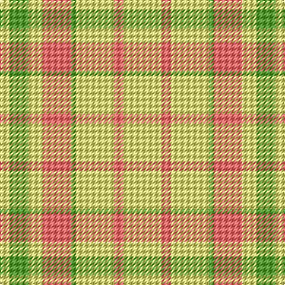

In pattern [YGYRGYRY](/patterns/ygyrgyry/).

This was sourced from register-of-tartans.  It is a [8 stripes tartan](/stripes/stripes8/).

Original link https://www.tartanregister.gov.uk/tartanDetails.aspx?ref=11299

## Thread count
LY/8 LG16 LY12 LR24 LG4 LY32 LR8 LY/32

## Palette
Each colour and its ΔE from the base-6 reference it is a variant of.

| Colour | Shade | Base | ΔE (OKLab) |
|---|---|---|---|
| LG | <code style="background-color:#649848;">#649848</code> `#649848` | G <code style="background-color:#006100;">#006100</code> | 0.20 |
| LR | <code style="background-color:#E87878;">#E87878</code> `#E87878` | R <code style="background-color:#CC0000;">#CC0000</code> | 0.19 |
| LY | <code style="background-color:#F8E38C;">#F8E38C</code> `#F8E38C` | Y <code style="background-color:#F2BF00;">#F2BF00</code> | 0.11 |

# Sample pattern

## Nearest tartans

The nearest existing variants by ΔTartan distance.

1. [Virgin One](/setts/s6/y11r2y11w6y7w6x2~rc80000-we0e0e0-ybc8c00/) — ΔT 1.67
1. [One Account](/setts/s6/y12w5y6w5y12r2x2~rc80000-wfcfcfc-ye8c000/) — ΔT 1.71
1. [Fallow Deer, The](/setts/s6/r3w17r11w2r11w2x4~r9c8000-wf8f4d0/) — ΔT 1.97
1. [Ailsa, Gold (Dance)](/setts/s6/y8w3y28w32b3w4x2~b780078-wf0e0c8-yf8b400/) — ΔT 2.10
1. [One Account (Corporate)](/setts/s4/y6w5y12r2x2~rc80000-wfcfcfc-ye8c000/) — ΔT 2.12
1. [Virgin One (Corporate)](/setts/s4/y7w6y11r2x2~rc80000-we0e0e0-ybc8c00/) — ΔT 2.13
1. [Twilfit](/setts/s9/b25r46w11r11w7r11w11r46b12~b5c8ca8-re87878-wffffff/) — ΔT 2.26
1. [O'Neill Pipe Band 1999/ Oliver dress](/setts/s9/w2g1w2r6w10g6w2r1w2x4~g289c18-rc80028-we0e0e0/) — ΔT 2.41
1. [MacLachlan, Marled Dress (Fashion)](/setts/s13/w16r2w2r2w2r16r16ra3r16r16w16r2w2x2~r888888-rac80000-we8ccb8/) — ΔT 2.46
1. [Ailsa, Pink (Dance)](/setts/s6/r8w3r28w32k3w4x2~k101010-re87878-wf0e0c8/) — ΔT 2.47

## Neighbour map

Every grey dot is one of 15726 variants placed by the first two principal components of the ΔTartan feature space (44% of its variance). Red is this tartan; blue dots are its nearest — click one to open its page.

<svg viewBox="0 0 640 380" role="img" style="max-width:100%;height:auto;border:1px solid #e0e0e0;border-radius:4px;display:block" xmlns="http://www.w3.org/2000/svg"><image href="/nn/cloud.v1.png" width="640" height="380"/><a href="/setts/s6/y11r2y11w6y7w6x2~rc80000-we0e0e0-ybc8c00/"><circle cx="377.2" cy="296.7" r="4" fill="#3465a4"><title>Virgin One</title></circle></a><a href="/setts/s6/y12w5y6w5y12r2x2~rc80000-wfcfcfc-ye8c000/"><circle cx="416.4" cy="278.7" r="4" fill="#3465a4"><title>One Account</title></circle></a><a href="/setts/s6/r3w17r11w2r11w2x4~r9c8000-wf8f4d0/"><circle cx="343.6" cy="245.0" r="4" fill="#3465a4"><title>Fallow Deer, The</title></circle></a><a href="/setts/s6/y8w3y28w32b3w4x2~b780078-wf0e0c8-yf8b400/"><circle cx="385.9" cy="222.5" r="4" fill="#3465a4"><title>Ailsa, Gold (Dance)</title></circle></a><a href="/setts/s4/y6w5y12r2x2~rc80000-wfcfcfc-ye8c000/"><circle cx="419.9" cy="286.0" r="4" fill="#3465a4"><title>One Account (Corporate)</title></circle></a><a href="/setts/s4/y7w6y11r2x2~rc80000-we0e0e0-ybc8c00/"><circle cx="401.9" cy="307.5" r="4" fill="#3465a4"><title>Virgin One (Corporate)</title></circle></a><a href="/setts/s9/b25r46w11r11w7r11w11r46b12~b5c8ca8-re87878-wffffff/"><circle cx="364.3" cy="228.5" r="4" fill="#3465a4"><title>Twilfit</title></circle></a><a href="/setts/s9/w2g1w2r6w10g6w2r1w2x4~g289c18-rc80028-we0e0e0/"><circle cx="286.4" cy="188.8" r="4" fill="#3465a4"><title>O'Neill Pipe Band 1999/ Oliver dress</title></circle></a><a href="/setts/s13/w16r2w2r2w2r16r16ra3r16r16w16r2w2x2~r888888-rac80000-we8ccb8/"><circle cx="410.0" cy="221.2" r="4" fill="#3465a4"><title>MacLachlan, Marled Dress (Fashion)</title></circle></a><a href="/setts/s6/r8w3r28w32k3w4x2~k101010-re87878-wf0e0c8/"><circle cx="341.2" cy="201.1" r="4" fill="#3465a4"><title>Ailsa, Pink (Dance)</title></circle></a><circle cx="348.6" cy="240.5" r="5" fill="#c00000"/></svg>

ID: /setts/s8/y8r2y8g1r6y3g4y2x4~g649848-re87878-yf8e38c/
