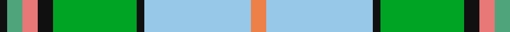

In pattern [KGRKGKWY](/patterns/kgrkgkwy/).

This was sourced from tartans-authority.  It is a [8 stripes tartan](/stripes/stripes8/).

Original link http://www.tartansauthority.com/tartan-ferret/display/2669/

## Thread count
K/4 LG8 LR8 K8 G44 K4 LB56 O/8

## Palette
Each colour and its ΔE from the base-6 reference it is a variant of.

| Colour | Shade | Base | ΔE (OKLab) |
|---|---|---|---|
| G | <code style="background-color:#00A424;">#00A424</code> `#00A424` | G <code style="background-color:#006400;">#006400</code> | 0.20 |
| K | <code style="background-color:#101010;">#101010</code> `#101010` | K <code style="background-color:#000000;">#000000</code> | 0.17 |
| LB | <code style="background-color:#98C8E8;">#98C8E8</code> `#98C8E8` | W <code style="background-color:#F4F4F0;">#F4F4F0</code> | 0.17 |
| LG | <code style="background-color:#50A47C;">#50A47C</code> `#50A47C` | G <code style="background-color:#006400;">#006400</code> | 0.23 |
| LR | <code style="background-color:#E87878;">#E87878</code> `#E87878` | R <code style="background-color:#C80000;">#C80000</code> | 0.19 |
| O | <code style="background-color:#EC8048;">#EC8048</code> `#EC8048` | Y <code style="background-color:#E8C000;">#E8C000</code> | 0.17 |

# Sample pattern

ID: /setts/s8/y8w56k4g44k8r8ga8k4-g00a424-ga50a47c-k101010-re87878-w98c8e8-yec8048/
