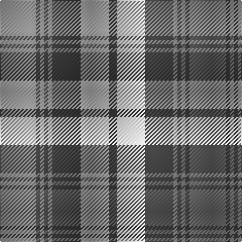

In pattern [BWBGBGBG](/stripes/bwbgbgbg/).

This was sourced from register-of-tartans.  It is a [8 stripe tartan](/stripes/stripes8/).

Original link https://www.tartanregister.gov.uk/tartanDetails.aspx?ref=1544

## Register references

External register numbers recorded for this tartan.

- Scottish Register of Tartans: [1544](https://www.tartanregister.gov.uk/tartanDetails.aspx?ref=1544)
- Scottish Tartans World Register: 2794

## Thread count
Na/36 N4 Na4 N4 Na4 N28 LN28 N/8

## Palette
Each colour and the base-6 reference it is a variant of.

| Colour | Shade | Base |
|---|---|---|
| LN | <code style="background-color:#E0E0E0;">#E0E0E0</code> `oklch(90.7% 0.000 89.9)` <small>#E0E0E0</small> | W <code style="background-color:#F7F7F7;">#F7F7F7</code> |
| N | <code style="background-color:#3C3C3C;">#3C3C3C</code> `oklch(35.6% 0.000 89.9)` <small>#3C3C3C</small> | B <code style="background-color:#2A418A;">#2A418A</code> |
| Na | <code style="background-color:#808080;">#808080</code> `oklch(60.0% 0.000 89.9)` <small>#808080</small> | G <code style="background-color:#006100;">#006100</code> |

# Sample pattern

## Nearest tartans

The nearest existing variants by ΔTartan distance.

1. [Chindecella Gorse (Personal)](/setts/s8/lo7db4lo2db4lo23n19db19n4~x2/) — ΔT 1.16
1. [Canadian Winter Games 1987](/setts/s9/lb8dt2lb1dt2lb1dt2r3dt3lb1~x4/) — ΔT 1.19
1. [Kildonan Brown (Fashion)](/setts/s9/dy22do3dy3do3dy3do9lb28do3lb6~x2/) — ΔT 1.20
1. [Lindsay Dress, Green (Dance)](/setts/s9/g33n4g4n4g4n12w33n3w6~x2/) — ΔT 1.23
1. [Baillie Dress](/setts/s8/lo24dy3lo3dy3lo3dy20w22dy4~x2/) — ΔT 1.25
1. [Grey Watch Dress (Fashion)](/setts/s8/n12dt2n2dt2n2dt10w12dt3~x2/) — ΔT 1.25
1. [Lindsay Dress](/setts/s9/dg33db4dg4db4dg4db12w33db3w6~x2/) — ΔT 1.26
1. [Gleneagles USA (Dalgleish)](/setts/s6/g4lb31g7r14g11r3~x2/) — ΔT 1.26
1. [Turnberry Manx Snaefell Family Tartan Tartan Number: 1749. Earliest known date: 1981 A coincidence. See products available Copyright © Blair Urquhart, Comrie, 2015](/setts/s8/lo22do2lo2do2lo2do15w17do3~x2/) — ΔT 1.29
1. [Snaefell (District)](/setts/s8/y22dy2y2dy2y2dy14w16dy3~x2/) — ΔT 1.29

## Neighbour map

Every grey dot is one of 14299 variants placed by the first two principal components of the ΔTartan feature space (44% of its variance). Red is this tartan; blue dots are its nearest — click one to open its page.

<svg viewBox="0 0 640 380" role="img" style="max-width:100%;height:auto;border:1px solid #e0e0e0;border-radius:4px;display:block" xmlns="http://www.w3.org/2000/svg"><image href="/nn/cloud.v1.png" width="640" height="380"/><a href="/setts/s8/lo7db4lo2db4lo23n19db19n4~x2/"><circle cx="232.2" cy="210.3" r="4" fill="#3465a4"><title>Chindecella Gorse (Personal)</title></circle></a><a href="/setts/s9/lb8dt2lb1dt2lb1dt2r3dt3lb1~x4/"><circle cx="240.1" cy="198.9" r="4" fill="#3465a4"><title>Canadian Winter Games 1987</title></circle></a><a href="/setts/s9/dy22do3dy3do3dy3do9lb28do3lb6~x2/"><circle cx="235.8" cy="179.7" r="4" fill="#3465a4"><title>Kildonan Brown (Fashion)</title></circle></a><a href="/setts/s9/g33n4g4n4g4n12w33n3w6~x2/"><circle cx="223.8" cy="176.3" r="4" fill="#3465a4"><title>Lindsay Dress, Green (Dance)</title></circle></a><a href="/setts/s8/lo24dy3lo3dy3lo3dy20w22dy4~x2/"><circle cx="211.8" cy="201.3" r="4" fill="#3465a4"><title>Baillie Dress</title></circle></a><a href="/setts/s8/n12dt2n2dt2n2dt10w12dt3~x2/"><circle cx="172.9" cy="217.2" r="4" fill="#3465a4"><title>Grey Watch Dress (Fashion)</title></circle></a><a href="/setts/s9/dg33db4dg4db4dg4db12w33db3w6~x2/"><circle cx="213.2" cy="172.7" r="4" fill="#3465a4"><title>Lindsay Dress</title></circle></a><a href="/setts/s6/g4lb31g7r14g11r3~x2/"><circle cx="240.2" cy="210.2" r="4" fill="#3465a4"><title>Gleneagles USA (Dalgleish)</title></circle></a><a href="/setts/s8/lo22do2lo2do2lo2do15w17do3~x2/"><circle cx="222.6" cy="175.0" r="4" fill="#3465a4"><title>Turnberry Manx Snaefell Family Tartan Tartan Number: 1749. Earliest known date: 1981 A coincidence. See products available Copyright © Blair Urquhart, Comrie, 2015</title></circle></a><a href="/setts/s8/y22dy2y2dy2y2dy14w16dy3~x2/"><circle cx="247.7" cy="189.7" r="4" fill="#3465a4"><title>Snaefell (District)</title></circle></a><circle cx="216.1" cy="201.7" r="5" fill="#c00000"/></svg>

ID: /setts/s8/y9do1y1do1y1do7w7do2~x4/
