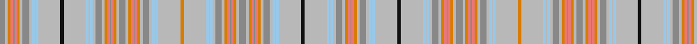

In pattern [RRYYRYWYWYKYWYWYRYYRRRYYRYYRRRYYRYWYWYYYWYWYRYYRRRYYRYYRRRYYRYWYWYKYWYWYRYYRRRYYR](/stripes/rryyrywywykywywyryyrrryyryyrrryyrywywyyywywyryyrrryyryyrrryyrywywykywywyryyrrryyr/).

This was sourced from register-of-tartans.  It is a [81 stripe tartan](/stripes/stripes81/).

Original link https://www.tartanregister.gov.uk/tartanDetails.aspx?ref=4369

## Register references

External register numbers recorded for this tartan.

- Scottish Register of Tartans: [4369](https://www.tartanregister.gov.uk/tartanDetails.aspx?ref=4369)
- Scottish Tartans Authority (ITI): 6337

## Thread count
Na/12 N6 O6 LR6 Na2 LR6 O6 N6 Na14 N6 LB6 N2 LB6 N48 K8 N48 LB6 N2 LB6 N6 Na14 N6 O6 LR6 Na2 LR6 O6 N6 Na14 N6 O6 LR6 Na2 LR6 O6 N6 Na14 N6 LB6 N2 LB6 N48 O8 N48 LB6 N2 LB6 N6 Na14 N6 O6 LR6 Na2 LR6 O6 N6 Na14 N6 O6 LR6 Na2 LR6 O6 N6 Na14 N6 LB6 N2 LB6 N48 K8 N48 LB6 N2 LB6 N6 Na14 N6 O6 LR6 Na/2

## Palette
Each colour and its ΔE from the base-6 reference it is a variant of.

| Colour | Shade | Base | ΔE (OKLab) |
|---|---|---|---|
| K | <code style="background-color:#101010;">#101010</code> `#101010` | K <code style="background-color:#000000;">#000000</code> | 0.17 |
| LB | <code style="background-color:#98C8E8;">#98C8E8</code> `#98C8E8` | W <code style="background-color:#F7F7F7;">#F7F7F7</code> | 0.18 |
| LR | <code style="background-color:#E87878;">#E87878</code> `#E87878` | R <code style="background-color:#CC0000;">#CC0000</code> | 0.19 |
| N | <code style="background-color:#B8B8B8;">#B8B8B8</code> `#B8B8B8` | Y <code style="background-color:#F2BF00;">#F2BF00</code> | 0.17 |
| Na | <code style="background-color:#888888;">#888888</code> `#888888` | R <code style="background-color:#CC0000;">#CC0000</code> | 0.24 |
| Nb | <code style="background-color:#C0C0C0;">#C0C0C0</code> `#C0C0C0` | W <code style="background-color:#F7F7F7;">#F7F7F7</code> | 0.17 |
| O | <code style="background-color:#D87C00;">#D87C00</code> `#D87C00` | Y <code style="background-color:#F2BF00;">#F2BF00</code> | 0.17 |
| R | <code style="background-color:#C80000;">#C80000</code> `#C80000` | R <code style="background-color:#CC0000;">#CC0000</code> | 0.01 |

## Nearest tartans

The nearest existing variants by ΔTartan distance.

1. [All Irish Blue Irish District Tartan Tartan Number: 4066. Earliest known date: 1997 Part of a collection produced by Lochcarron in 1997 to acknowledge the early historical and cultural links between the Scots and Irish. Lochcarron sample. See products available Copyright © Blair Urquhart, Comrie, 2015](/setts/s30/b6lb2db2b30g2b2lo2g4lo2g2lo1g18lo1lb2db2lo4~x2/) — ΔT 3.07
1. [Shapiro (Personal)](/setts/s39/k16lb2lp2ly2lp10lb4ly6lb10ly6lb10ly4lb10ly4lb10ly1ly1lb32ly2lb10lp4ly10ly4lb10ly10lb6ly10lb6ly10lb6ly10lb4ly10lb2ly28lb3ly10lp6lb4ly16~x2/) — ΔT 3.10
1. [Shapiro (Personal)](/setts/s39/lb16lb4k6lb10lb3lb28lb2lb10lb4lb10lb6lb10lb6lb10lb6lb10lb10lb4lb10k4lb10lb2lb32lb1lb1lb10lb4lb10lb4lb10lb6lb10lb6lb4k10lb2k2lb2lp16~x2/) — ΔT 3.25
1. [Allen hunting](/setts/s25/b22r1lo4b4lo1b1lo1b1lo1b1lo1b1lo1b1lo1b1lo1b1lo1b1lo1b1lo9o24db2~x4/) — ΔT 3.26
1. [LOOK Keith](/setts/s24/n10r2n2r2n2n5y25db6y2db2y1lb3y3lb3y11db2y2db6y25n5n2r2n2r2~x2/) — ΔT 3.34
1. [elCorte](/setts/s20/w6lt5lg4lt5lo2r5lg2r14lg10lo30lt1lg2r4lg2r1lo30r10lt14lg2lt5~x2/) — ΔT 3.38
1. [Jewel Look JTB](/setts/s28/g4o2r4w3r4o4r6m21o4g2o2g20o4g2ly4/) — ΔT 3.52
1. [Peeper](/setts/s46/r4g9y1lo1y1lo1y1lo1k1r8k1y1lo1y1lo1r6y1lo1y1lo1y1lo1y1lo1y1lo1y1lo1y1lo1y1lo1y1lo1y1lo1y1lo1y1lo1y1lo1y1lo1y1lo1~x2/) — ΔT 3.55
1. [Unidentified Cant #11](/setts/s48/m99g6m8g4m10dy34r2dy6r4dy4r6dy2r7w3r7dy2r6dy4r4dy6r2dy34t36dy6t18/) — ΔT 3.57
1. [Unidentified (2013)](/setts/s73/r5dg10lo1lo1lo1lo1lo1lo1lo1r9lo1lo1lo1lo1r7lo1lo1lo1lo1lo1lo1lo1lo1lo1lo1lo1lo1lo1lo1lo1lo1lo1lo1lo1lo1lo1lo1lo1lo1lo1lo1lo1lo1lo1lo1lo1lo1lo1lo1lo1lo1lo1lo1lo1lo1lo1lo1lo1lo1lo1lo1lo1lo1lo1lo1lo1lo1l-h4edcd23b4fcd6a86/) — ΔT 3.71

## Neighbour map

Every grey dot is one of 14299 variants placed by the first two principal components of the ΔTartan feature space (44% of its variance). Red is this tartan; blue dots are its nearest — click one to open its page.

<svg viewBox="0 0 640 380" role="img" style="max-width:100%;height:auto;border:1px solid #e0e0e0;border-radius:4px;display:block" xmlns="http://www.w3.org/2000/svg"><image href="/nn/cloud.v1.png" width="640" height="380"/><a href="/setts/s30/b6lb2db2b30g2b2lo2g4lo2g2lo1g18lo1lb2db2lo4~x2/"><circle cx="303.7" cy="69.9" r="4" fill="#3465a4"><title>All Irish Blue Irish District Tartan Tartan Number: 4066. Earliest known date: 1997 Part of a collection produced by Lochcarron in 1997 to acknowledge the early historical and cultural links between the Scots and Irish. Lochcarron sample. See products available Copyright © Blair Urquhart, Comrie, 2015</title></circle></a><a href="/setts/s39/k16lb2lp2ly2lp10lb4ly6lb10ly6lb10ly4lb10ly4lb10ly1ly1lb32ly2lb10lp4ly10ly4lb10ly10lb6ly10lb6ly10lb6ly10lb4ly10lb2ly28lb3ly10lp6lb4ly16~x2/"><circle cx="302.2" cy="107.6" r="4" fill="#3465a4"><title>Shapiro (Personal)</title></circle></a><a href="/setts/s39/lb16lb4k6lb10lb3lb28lb2lb10lb4lb10lb6lb10lb6lb10lb6lb10lb10lb4lb10k4lb10lb2lb32lb1lb1lb10lb4lb10lb4lb10lb6lb10lb6lb4k10lb2k2lb2lp16~x2/"><circle cx="320.9" cy="126.8" r="4" fill="#3465a4"><title>Shapiro (Personal)</title></circle></a><a href="/setts/s25/b22r1lo4b4lo1b1lo1b1lo1b1lo1b1lo1b1lo1b1lo1b1lo1b1lo1b1lo9o24db2~x4/"><circle cx="335.2" cy="80.0" r="4" fill="#3465a4"><title>Allen hunting</title></circle></a><a href="/setts/s24/n10r2n2r2n2n5y25db6y2db2y1lb3y3lb3y11db2y2db6y25n5n2r2n2r2~x2/"><circle cx="317.7" cy="86.6" r="4" fill="#3465a4"><title>LOOK Keith</title></circle></a><a href="/setts/s20/w6lt5lg4lt5lo2r5lg2r14lg10lo30lt1lg2r4lg2r1lo30r10lt14lg2lt5~x2/"><circle cx="287.6" cy="107.0" r="4" fill="#3465a4"><title>elCorte</title></circle></a><a href="/setts/s28/g4o2r4w3r4o4r6m21o4g2o2g20o4g2ly4/"><circle cx="167.6" cy="117.0" r="4" fill="#3465a4"><title>Jewel Look JTB</title></circle></a><a href="/setts/s46/r4g9y1lo1y1lo1y1lo1k1r8k1y1lo1y1lo1r6y1lo1y1lo1y1lo1y1lo1y1lo1y1lo1y1lo1y1lo1y1lo1y1lo1y1lo1y1lo1y1lo1y1lo1y1lo1~x2/"><circle cx="206.7" cy="128.9" r="4" fill="#3465a4"><title>Peeper</title></circle></a><a href="/setts/s48/m99g6m8g4m10dy34r2dy6r4dy4r6dy2r7w3r7dy2r6dy4r4dy6r2dy34t36dy6t18/"><circle cx="245.3" cy="14.0" r="4" fill="#3465a4"><title>Unidentified Cant #11</title></circle></a><a href="/setts/s73/r5dg10lo1lo1lo1lo1lo1lo1lo1r9lo1lo1lo1lo1r7lo1lo1lo1lo1lo1lo1lo1lo1lo1lo1lo1lo1lo1lo1lo1lo1lo1lo1lo1lo1lo1lo1lo1lo1lo1lo1lo1lo1lo1lo1lo1lo1lo1lo1lo1lo1lo1lo1lo1lo1lo1lo1lo1lo1lo1lo1lo1lo1lo1lo1lo1lo1l-h4edcd23b4fcd6a86/"><circle cx="212.2" cy="86.8" r="4" fill="#3465a4"><title>Unidentified (2013)</title></circle></a><circle cx="308.5" cy="46.5" r="5" fill="#c00000"/></svg>

ID: /setts/s81/o6lr3lo3r3o1r3lo3lr3o7lr3lb3lr1lb3lr24k4lr24lb3lr1lb3lr3o7lr3lo3r3o1r3lo3lr3o7lr3lo3r3o1r3lo3lr3o7lr3lb3lr1lb3lr24lo4lr24lb3lr1lb3lr3o7lr3lo3r3o1r3lo3lr3o7lr3lo3r3o1r3lo3lr3o7lr3lb3lr1lb3lr24k4lr24lb3-h8b85b6c6dc99fd8d/
