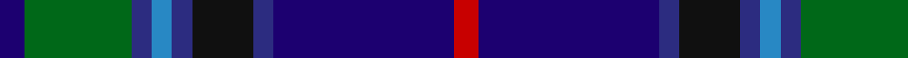

In pattern [BGBBBKBBR](/patterns/bgbbbkbbr/).

This was sourced from register-of-tartans.  It is a [9 stripes tartan](/stripes/stripes9/).

Original link https://www.tartanregister.gov.uk/tartanDetails.aspx?ref=3518

## Attestations

This cloth appears in 2 source records; the oldest owns this page.

- 01/02/2006 — Robert Burns Legacy (register-of-tartans, [record](https://www.tartanregister.gov.uk/tartanDetails.aspx?ref=3518))
- 2006 February — Robert Burns of Ayr (Corporate) (tartans-authority, [record](http://www.tartansauthority.com/tartan-ferret/display/6843/))

## Thread count
DB/10 G42 DBa8 B8 DBa8 K24 DBa8 DB71 R/10

## Palette
Each colour and its ΔE from the base-6 reference it is a variant of.

| Colour | Shade | Base | ΔE (OKLab) |
|---|---|---|---|
| B | <code style="background-color:#2888C4;">#2888C4</code> `#2888C4` | B <code style="background-color:#2A418A;">#2A418A</code> | 0.21 |
| DB | <code style="background-color:#1C0070;">#1C0070</code> `#1C0070` | B <code style="background-color:#2A418A;">#2A418A</code> | 0.14 |
| DBa | <code style="background-color:#2C2C80;">#2C2C80</code> `#2C2C80` | B <code style="background-color:#2A418A;">#2A418A</code> | 0.06 |
| G | <code style="background-color:#006818;">#006818</code> `#006818` | G <code style="background-color:#006100;">#006100</code> | 0.02 |
| K | <code style="background-color:#101010;">#101010</code> `#101010` | K <code style="background-color:#000000;">#000000</code> | 0.17 |
| R | <code style="background-color:#C80000;">#C80000</code> `#C80000` | R <code style="background-color:#CC0000;">#CC0000</code> | 0.01 |

## Nearest tartans

The nearest existing variants by ΔTartan distance.

1. [Schmidt (2014)](/setts/s10/k6b40ba16b8g40k4g4r4g6y6-b000048-ba202060-g005448-k101010-rc8002c-ye0a126/) — ΔT 0.81
1. [Remember the Somme 1916](/setts/s8/g20ga8b8ba60r8bb8g20r8-b1870a4-ba000048-bb788cb4-g003c14-ga408060-r880000/) — ΔT 0.81
1. [Suzugamine (Corporate)](/setts/s9/b8g10ga38ba10g10k10g10b72y6-b2c2c80-ba780078-g384020-ga006818-k000000-yd8d898/) — ΔT 0.93
1. [Scottish Italian](/setts/s8/b22ba10g8w6r6k32ba56b4-b1474b4-ba202060-g006818-k101010-rc80000-wfcfcfc/) — ΔT 1.13
1. [Blairmore House](/setts/s8/b68w8b8r8b8ba48g64y12-b003478-ba3c2010-g0c5454-r8c0000-wffffff-yc88c00/) — ΔT 1.13
1. [Yates](/setts/s8/k74r8b60ba14k20w10ba20g14-b000064-ba505050-g808080-k101010-rdc0000-we0e0e0/) — ΔT 1.16
1. [Fed. of Circles & Solitaries (Corp.)](/setts/s10/b18k60b18ba6b10r6b10y6b10g6-b202060-ba2888c4-g006818-k101010-rc80000-ye8c000/) — ΔT 1.18
1. [State Seal of North Dakota (Fashion)](/setts/s11/g74b10g10b24ba20bb10ba10bb80ga8bb8y8-b440044-ba1474b4-bb2c2c80-g006818-ga604000-ybc8c00/) — ΔT 1.22
1. [Creiff Highland Gathering](/setts/s9/k6b32g10b6ba4b4k24bb46w4-b780078-ba9058d8-bb003c64-g006818-k101010-wfcfcfc/) — ΔT 1.22
1. [Ertico](/setts/s10/k12y4b4ba24r8ba4r4ba4b40w4-b2c4084-ba141e46-k000000-ra00048-we0e0e0-yf8e38c/) — ΔT 1.22

## Neighbour map

Every grey dot is one of 15726 variants placed by the first two principal components of the ΔTartan feature space (44% of its variance). Red is this tartan; blue dots are its nearest — click one to open its page.

<svg viewBox="0 0 640 380" role="img" style="max-width:100%;height:auto;border:1px solid #e0e0e0;border-radius:4px;display:block" xmlns="http://www.w3.org/2000/svg"><image href="/nn/cloud.v1.png" width="640" height="380"/><a href="/setts/s10/k6b40ba16b8g40k4g4r4g6y6-b000048-ba202060-g005448-k101010-rc8002c-ye0a126/"><circle cx="186.1" cy="165.1" r="4" fill="#3465a4"><title>Schmidt (2014)</title></circle></a><a href="/setts/s8/g20ga8b8ba60r8bb8g20r8-b1870a4-ba000048-bb788cb4-g003c14-ga408060-r880000/"><circle cx="184.6" cy="183.0" r="4" fill="#3465a4"><title>Remember the Somme 1916</title></circle></a><a href="/setts/s9/b8g10ga38ba10g10k10g10b72y6-b2c2c80-ba780078-g384020-ga006818-k000000-yd8d898/"><circle cx="218.7" cy="151.0" r="4" fill="#3465a4"><title>Suzugamine (Corporate)</title></circle></a><a href="/setts/s8/b22ba10g8w6r6k32ba56b4-b1474b4-ba202060-g006818-k101010-rc80000-wfcfcfc/"><circle cx="203.0" cy="152.3" r="4" fill="#3465a4"><title>Scottish Italian</title></circle></a><a href="/setts/s8/b68w8b8r8b8ba48g64y12-b003478-ba3c2010-g0c5454-r8c0000-wffffff-yc88c00/"><circle cx="171.5" cy="183.8" r="4" fill="#3465a4"><title>Blairmore House</title></circle></a><a href="/setts/s8/k74r8b60ba14k20w10ba20g14-b000064-ba505050-g808080-k101010-rdc0000-we0e0e0/"><circle cx="169.7" cy="175.1" r="4" fill="#3465a4"><title>Yates</title></circle></a><a href="/setts/s10/b18k60b18ba6b10r6b10y6b10g6-b202060-ba2888c4-g006818-k101010-rc80000-ye8c000/"><circle cx="232.6" cy="160.3" r="4" fill="#3465a4"><title>Fed. of Circles &amp; Solitaries (Corp.)</title></circle></a><a href="/setts/s11/g74b10g10b24ba20bb10ba10bb80ga8bb8y8-b440044-ba1474b4-bb2c2c80-g006818-ga604000-ybc8c00/"><circle cx="188.4" cy="155.3" r="4" fill="#3465a4"><title>State Seal of North Dakota (Fashion)</title></circle></a><a href="/setts/s9/k6b32g10b6ba4b4k24bb46w4-b780078-ba9058d8-bb003c64-g006818-k101010-wfcfcfc/"><circle cx="163.0" cy="155.0" r="4" fill="#3465a4"><title>Creiff Highland Gathering</title></circle></a><a href="/setts/s10/k12y4b4ba24r8ba4r4ba4b40w4-b2c4084-ba141e46-k000000-ra00048-we0e0e0-yf8e38c/"><circle cx="166.4" cy="140.5" r="4" fill="#3465a4"><title>Ertico</title></circle></a><circle cx="187.6" cy="170.5" r="5" fill="#c00000"/></svg>

ID: /setts/s9/b10g42ba8bb8ba8k24ba8b71r10-b1c0070-ba2c2c80-bb2888c4-g006818-k101010-rc80000/
