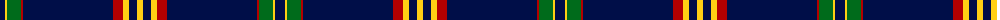

In pattern [BYGRBRYBY](/patterns/bygrbryby/).

This was sourced from register-of-tartans.  It is a [9 stripes tartan](/stripes/stripes9/).

Original link https://www.tartanregister.gov.uk/tartanDetails.aspx?ref=10652

## Thread count
DB/10 Y2 G14 DR2 DB90 DR10 Y6 DB8 Y/6

## Palette
Each colour and its ΔE from the base-6 reference it is a variant of.

| Colour | Shade | Base | ΔE (OKLab) |
|---|---|---|---|
| DB | <code style="background-color:#000E48;">#000E48</code> `#000E48` | B <code style="background-color:#2C4084;">#2C4084</code> | 0.19 |
| DR | <code style="background-color:#B30000;">#B30000</code> `#B30000` | R <code style="background-color:#C80000;">#C80000</code> | 0.04 |
| G | <code style="background-color:#006B1B;">#006B1B</code> `#006B1B` | G <code style="background-color:#006400;">#006400</code> | 0.02 |
| Y | <code style="background-color:#FFD014;">#FFD014</code> `#FFD014` | Y <code style="background-color:#E8C000;">#E8C000</code> | 0.06 |

ID: /setts/s9/b10y2g14r2b90r10y6b8y6-b000e48-g006b1b-rb30000-yffd014/
