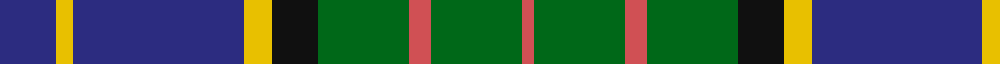

In pattern [BYBYKGRGR](/patterns/bybykgrgr/).

This was sourced from house-of-tartan.  It is a [9 stripes tartan](/stripes/stripes9/).

Original link http://www.house-of-tartan.scotland.net/house/TartanViewjs.asp?colr=Def&tnam=667

## Thread count
DB/20 Y6 DB60 Y10 K16 G32 DO8 G32 DO/4

## Palette
Each colour and its ΔE from the base-6 reference it is a variant of.

| Colour | Shade | Base | ΔE (OKLab) |
|---|---|---|---|
| DB | <code style="background-color:#2C2C80;">#2C2C80</code> `#2C2C80` | B <code style="background-color:#2A418A;">#2A418A</code> | 0.06 |
| DO | <code style="background-color:#D05054;">#D05054</code> `#D05054` | R <code style="background-color:#CC0000;">#CC0000</code> | 0.09 |
| G | <code style="background-color:#006818;">#006818</code> `#006818` | G <code style="background-color:#006100;">#006100</code> | 0.02 |
| K | <code style="background-color:#101010;">#101010</code> `#101010` | K <code style="background-color:#000000;">#000000</code> | 0.17 |
| Y | <code style="background-color:#E8C000;">#E8C000</code> `#E8C000` | Y <code style="background-color:#F2BF00;">#F2BF00</code> | 0.02 |

## Nearest tartans

The nearest existing variants by ΔTartan distance.

1. [MacMillan Hunting](/setts/s9/b10y3b30y5k8g16r4g16r2~b2c4084-g005020-k101010-rc82828-ye8c000~x2/) — ΔT 0.54
1. [MacFadzean/MacPhedran](/setts/s7/g3b12w1k12g13r2g2~b2c2c80-g408060-k101010-rc80000-wf8f8f8~x4/) — ΔT 0.66
1. [MacMillan, hunting](/setts/s9/b10y3b30y5k8g16r4g16r2~b304080-g008000-k000000-rd03030-yf0c000~x2/) — ΔT 0.74
1. [Glasgow Cathedral](/setts/s10/g18b3ba10bb2ba10b20g20b3y2ba2~b780078-ba000050-bb00248c-g007800-yc88c00~x2/) — ΔT 0.75
1. [Dunbartonshire](/setts/s9/g11k2g1r4b1r4b13w2b1~b304080-g008000-k000000-r802040-w90d0f0~x4/) — ΔT 0.77
1. [Gillies](/setts/s8/b32k12b12g6r6g18k2y3~b304080-g008000-k000000-rc00000-yf0c000~x2/) — ΔT 0.79
1. [MacRae Hunting #2](/setts/s9/g14k2g4r2g4k14b15k1w3~b5a008c-g006428-k101010-r960028-we0e0e0~x2/) — ΔT 0.80
1. [Snodgrass Family Tartan Tartan Number: 1216. Earliest known date: 1978 Designed for the Snodgrass Clan Association. It is based on the Cunningham tartan, and the colours chosen were, Black, Green and Gold - of the Snodgrass Coat of Arms, Green - for the 'grasy place' (sic) alluded to in the name, and Blue - representing the traditional Highland 'Blue Bonnet'. See products available Copyright © Blair Urquhart, Comrie, 2015](/setts/s8/k3r1y1b11g13b5r1y1~b2c2c80-g006818-k101010-rc80000-ye8c000~x2/) — ΔT 0.83
1. [Wilson's No.111](/setts/s8/b19w2g12ba3k4ba3g12w2~b440044-ba5c8ca8-g006818-k101010-we0e0e0~x2/) — ΔT 0.87
1. [Dunfermline Bank of Scotland (Corp)](/setts/s8/g24k5g6r6g6k20b20w2~b1474b4-g285800-k101010-rc80000-wfcfcfc~x2/) — ΔT 0.89

## Neighbour map

Every grey dot is one of 15726 variants placed by the first two principal components of the ΔTartan feature space (44% of its variance). Red is this tartan; blue dots are its nearest — click one to open its page.

<svg viewBox="0 0 640 380" role="img" style="max-width:100%;height:auto;border:1px solid #e0e0e0;border-radius:4px;display:block" xmlns="http://www.w3.org/2000/svg"><image href="/nn/cloud.v1.png" width="640" height="380"/><a href="/setts/s9/b10y3b30y5k8g16r4g16r2~b2c4084-g005020-k101010-rc82828-ye8c000~x2/"><circle cx="215.8" cy="173.1" r="4" fill="#3465a4"><title>MacMillan Hunting</title></circle></a><a href="/setts/s7/g3b12w1k12g13r2g2~b2c2c80-g408060-k101010-rc80000-wf8f8f8~x4/"><circle cx="190.7" cy="184.6" r="4" fill="#3465a4"><title>MacFadzean/MacPhedran</title></circle></a><a href="/setts/s9/b10y3b30y5k8g16r4g16r2~b304080-g008000-k000000-rd03030-yf0c000~x2/"><circle cx="185.7" cy="160.6" r="4" fill="#3465a4"><title>MacMillan, hunting</title></circle></a><a href="/setts/s10/g18b3ba10bb2ba10b20g20b3y2ba2~b780078-ba000050-bb00248c-g007800-yc88c00~x2/"><circle cx="185.0" cy="175.5" r="4" fill="#3465a4"><title>Glasgow Cathedral</title></circle></a><a href="/setts/s9/g11k2g1r4b1r4b13w2b1~b304080-g008000-k000000-r802040-w90d0f0~x4/"><circle cx="192.5" cy="158.0" r="4" fill="#3465a4"><title>Dunbartonshire</title></circle></a><a href="/setts/s8/b32k12b12g6r6g18k2y3~b304080-g008000-k000000-rc00000-yf0c000~x2/"><circle cx="218.8" cy="167.3" r="4" fill="#3465a4"><title>Gillies</title></circle></a><a href="/setts/s9/g14k2g4r2g4k14b15k1w3~b5a008c-g006428-k101010-r960028-we0e0e0~x2/"><circle cx="180.5" cy="162.7" r="4" fill="#3465a4"><title>MacRae Hunting #2</title></circle></a><a href="/setts/s8/k3r1y1b11g13b5r1y1~b2c2c80-g006818-k101010-rc80000-ye8c000~x2/"><circle cx="237.9" cy="167.3" r="4" fill="#3465a4"><title>Snodgrass Family Tartan Tartan Number: 1216. Earliest known date: 1978 Designed for the Snodgrass Clan Association. It is based on the Cunningham tartan, and the colours chosen were, Black, Green and Gold - of the Snodgrass Coat of Arms, Green - for the 'grasy place' (sic) alluded to in the name, and Blue - representing the traditional Highland 'Blue Bonnet'. See products available Copyright © Blair Urquhart, Comrie, 2015</title></circle></a><a href="/setts/s8/b19w2g12ba3k4ba3g12w2~b440044-ba5c8ca8-g006818-k101010-we0e0e0~x2/"><circle cx="180.3" cy="182.0" r="4" fill="#3465a4"><title>Wilson's No.111</title></circle></a><a href="/setts/s8/g24k5g6r6g6k20b20w2~b1474b4-g285800-k101010-rc80000-wfcfcfc~x2/"><circle cx="178.9" cy="190.4" r="4" fill="#3465a4"><title>Dunfermline Bank of Scotland (Corp)</title></circle></a><circle cx="201.0" cy="166.7" r="5" fill="#c00000"/></svg>

ID: /setts/s9/b10y3b30y5k8g16r4g16r2~b2c2c80-g006818-k101010-rd05054-ye8c000~x2/
