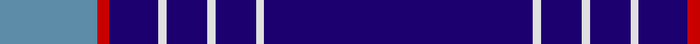

In pattern [BRBWBWBWB](/patterns/brbwbwbwb/).

This was sourced from register-of-tartans.  It is a [9 stripes tartan](/stripes/stripes9/).

Original link https://www.tartanregister.gov.uk/tartanDetails.aspx?ref=4846

## Thread count
B/48 R6 DB24 LN4 DB20 LN4 DB20 LN4 DB/132

## Palette
Each colour and its ΔE from the base-6 reference it is a variant of.

| Colour | Shade | Base | ΔE (OKLab) |
|---|---|---|---|
| B | <code style="background-color:#5C8CA8;">#5C8CA8</code> `#5C8CA8` | B <code style="background-color:#2C4084;">#2C4084</code> | 0.23 |
| DB | <code style="background-color:#1C0070;">#1C0070</code> `#1C0070` | B <code style="background-color:#2C4084;">#2C4084</code> | 0.14 |
| LN | <code style="background-color:#E0E0E0;">#E0E0E0</code> `#E0E0E0` | W <code style="background-color:#F4F4F0;">#F4F4F0</code> | 0.06 |
| R | <code style="background-color:#C80000;">#C80000</code> `#C80000` | R <code style="background-color:#C80000;">#C80000</code> | 0.00 |

## Nearest tartans

The nearest existing variants by ΔTartan distance.

1. [Duke of York (Royal)](/setts/s8/b122r12w4r16y4b6y4b30-b00008c-r8c0000-wfcfcfc-yc88c00/) — ΔT 0.98
1. [United States (Corporate)](/setts/s9/b7ba5w6ba5r7ba2b2ba70w2-b1474b4-ba202060-rc80000-wfcfcfc/) — ΔT 1.19
1. [Inverness Htg (Royal)](/setts/s8/b122r12w4r16y4b6y4b30-b1c0070-r880000-wfcfcfc-yd09800/) — ΔT 1.20
1. [Cougan Irish Personal Tartan Tartan Number: 6782. Earliest known date: 2005 September Designed by Douglas Gregor of Tartanweb as a personal tartan for Margot Coogan of County Laois, Ireland. The colours reflect those in the Cougan coat of arms - deep red representing the red cross in the shield and the white lines representing the three silver oak leaves. See products available Copyright © Blair Urquhart, Comrie, 2015](/setts/s10/b132r32w4r2w2r2w4r32b132y4-b1c0070-r880000-wf8f8f8-ye8c000/) — ΔT 1.23
1. [Calum's Cabin](/setts/s9/b32y4ba12b2ba4b2r16b67y6-b202060-ba2c2c80-r888888-yfccc00/) — ΔT 1.32
1. [RAAF #4](/setts/s9/b96w4b14w4b14w4b40ba22r4-b2c2c80-ba5c8ca8-rc80000-we0e0e0/) — ΔT 1.37
1. [Hoosier (Fashion)](/setts/s8/b30ba130y14b8y6ba60b30w6-b1474b4-ba1c0070-we0e0e0-ye8c000/) — ΔT 1.37
1. [Calum's Cabin](/setts/s10/b32r4ba12b2ba4b2ba2g16b67r6-b000048-ba003c64-g808080-re86000/) — ΔT 1.45
1. [Marist School, The](/setts/s8/b116ba8b4ba4b4ba4bb32y4-b1c0070-ba2c2c80-bb5c8ca8-yd09800/) — ΔT 1.45
1. [Coogan (Personal)](/setts/s6/y4b132r32w4r2w2-b1c0070-r880000-wf8f8f8-ye8c000/) — ΔT 1.47

## Neighbour map

Every grey dot is one of 15726 variants placed by the first two principal components of the ΔTartan feature space (44% of its variance). Red is this tartan; blue dots are its nearest — click one to open its page.

<svg viewBox="0 0 640 380" role="img" style="max-width:100%;height:auto;border:1px solid #e0e0e0;border-radius:4px;display:block" xmlns="http://www.w3.org/2000/svg"><image href="/nn/cloud.v1.png" width="640" height="380"/><a href="/setts/s8/b122r12w4r16y4b6y4b30-b00008c-r8c0000-wfcfcfc-yc88c00/"><circle cx="547.6" cy="138.3" r="4" fill="#3465a4"><title>Duke of York (Royal)</title></circle></a><a href="/setts/s9/b7ba5w6ba5r7ba2b2ba70w2-b1474b4-ba202060-rc80000-wfcfcfc/"><circle cx="522.3" cy="106.2" r="4" fill="#3465a4"><title>United States (Corporate)</title></circle></a><a href="/setts/s8/b122r12w4r16y4b6y4b30-b1c0070-r880000-wfcfcfc-yd09800/"><circle cx="558.4" cy="137.1" r="4" fill="#3465a4"><title>Inverness Htg (Royal)</title></circle></a><a href="/setts/s10/b132r32w4r2w2r2w4r32b132y4-b1c0070-r880000-wf8f8f8-ye8c000/"><circle cx="543.2" cy="111.6" r="4" fill="#3465a4"><title>Cougan Irish Personal Tartan Tartan Number: 6782. Earliest known date: 2005 September Designed by Douglas Gregor of Tartanweb as a personal tartan for Margot Coogan of County Laois, Ireland. The colours reflect those in the Cougan coat of arms - deep red representing the red cross in the shield and the white lines representing the three silver oak leaves. See products available Copyright © Blair Urquhart, Comrie, 2015</title></circle></a><a href="/setts/s9/b32y4ba12b2ba4b2r16b67y6-b202060-ba2c2c80-r888888-yfccc00/"><circle cx="464.3" cy="137.2" r="4" fill="#3465a4"><title>Calum's Cabin</title></circle></a><a href="/setts/s9/b96w4b14w4b14w4b40ba22r4-b2c2c80-ba5c8ca8-rc80000-we0e0e0/"><circle cx="547.3" cy="154.8" r="4" fill="#3465a4"><title>RAAF #4</title></circle></a><a href="/setts/s8/b30ba130y14b8y6ba60b30w6-b1474b4-ba1c0070-we0e0e0-ye8c000/"><circle cx="402.5" cy="159.2" r="4" fill="#3465a4"><title>Hoosier (Fashion)</title></circle></a><a href="/setts/s10/b32r4ba12b2ba4b2ba2g16b67r6-b000048-ba003c64-g808080-re86000/"><circle cx="457.8" cy="133.6" r="4" fill="#3465a4"><title>Calum's Cabin</title></circle></a><a href="/setts/s8/b116ba8b4ba4b4ba4bb32y4-b1c0070-ba2c2c80-bb5c8ca8-yd09800/"><circle cx="497.9" cy="138.6" r="4" fill="#3465a4"><title>Marist School, The</title></circle></a><a href="/setts/s6/y4b132r32w4r2w2-b1c0070-r880000-wf8f8f8-ye8c000/"><circle cx="539.5" cy="120.8" r="4" fill="#3465a4"><title>Coogan (Personal)</title></circle></a><circle cx="491.3" cy="131.2" r="5" fill="#c00000"/></svg>

ID: /setts/s9/b132w4b20w4b20w4b24r6ba48-b1c0070-ba5c8ca8-rc80000-we0e0e0/
