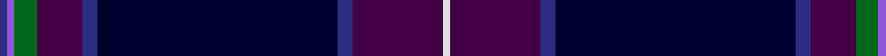

In pattern [BBGBBKBBW](/patterns/bbgbbkbbw/).

This was sourced from register-of-tartans.  It is a [9 stripes tartan](/stripes/stripes9/).

Original link https://www.tartanregister.gov.uk/tartanDetails.aspx?ref=3720

## Attestations

This cloth appears in 3 source records; the oldest owns this page.

- 02/10/2001 — Scottish Heather (register-of-tartans, [record](https://www.tartanregister.gov.uk/tartanDetails.aspx?ref=3720))
- Oct. 2001 — Scottish Heather (Fashion) (tartans-authority, [record](http://www.tartansauthority.com/tartan-ferret/display/3909/))
- undated — Scottish Heather (Fashion) Fashion Tartan Tartan Number: 3909. Earliest known date: Oct. 2001 Designed for Houston Kiltmakers of Paisley. See products available Copyright © Blair Urquhart, Comrie, 2015 (house-of-tartan, [record](http://www.house-of-tartan.scotland.net/house/TartanViewjs.asp?colr=Def&tnam=3909))

## Register references

External register numbers recorded for this tartan.

- Scottish Register of Tartans: [3720](https://www.tartanregister.gov.uk/tartanDetails.aspx?ref=3720)
- Scottish Tartans Authority (ITI): 3909
- Scottish Tartans World Register: 2859

## Thread count
DBa/2 Pa2 G6 DP12 DBa4 DBb64 DBa4 DP24 LN/2

## Palette
Each colour and its ΔE from the base-6 reference it is a variant of.

| Colour | Shade | Base | ΔE (OKLab) |
|---|---|---|---|
| DB | <code style="background-color:#202060;">#202060</code> `#202060` | B <code style="background-color:#2A418A;">#2A418A</code> | 0.11 |
| DBa | <code style="background-color:#2C2C80;">#2C2C80</code> `#2C2C80` | B <code style="background-color:#2A418A;">#2A418A</code> | 0.06 |
| DBb | <code style="background-color:#00002C;">#00002C</code> `#00002C` | K <code style="background-color:#000000;">#000000</code> | 0.16 |
| DP | <code style="background-color:#440044;">#440044</code> `#440044` | B <code style="background-color:#2A418A;">#2A418A</code> | 0.18 |
| G | <code style="background-color:#006818;">#006818</code> `#006818` | G <code style="background-color:#006100;">#006100</code> | 0.02 |
| LN | <code style="background-color:#E0E0E0;">#E0E0E0</code> `#E0E0E0` | W <code style="background-color:#F7F7F7;">#F7F7F7</code> | 0.07 |
| P | <code style="background-color:#780078;">#780078</code> `#780078` | B <code style="background-color:#2A418A;">#2A418A</code> | 0.17 |
| Pa | <code style="background-color:#9058D8;">#9058D8</code> `#9058D8` | B <code style="background-color:#2A418A;">#2A418A</code> | 0.21 |

## Nearest tartans

The nearest existing variants by ΔTartan distance.

1. [Heart of Scotland (Fashion)](/setts/s10/b5w1b44ba1g12k12ba5k2r2k3~b202060-ba6c0070-g006818-k101010-r9c68a4-wf8f8f8~x2/) — ΔT 1.09
1. [Scotland the Brave](/setts/s10/k6w1k40b1ka12g12b6g2ba2g4~b800080-ba800070-g003000-k000030-ka000000-we0e0e0~x2/) — ΔT 1.11
1. [Buckie](/setts/s9/r4k2g2y1g8k20b50ra2b2~b2c2c80-g003820-k101010-r888888-rae87878-ye8c000~x2/) — ΔT 1.22
1. [Incorporation of Weavers (Glasgow)](/setts/s9/b3r3b36ba7k3ba6g5k1y3~b1c0070-ba2c2c80-g006818-k101010-r888888-ye8c000~x2/) — ΔT 1.27
1. [Law Enforcement Officers' Memorial](/setts/s8/b6ba4k37g6ba80r4k4y4~b1c0070-ba2c2c80-g006818-k101010-r888888-ybc8c00/) — ΔT 1.28
1. [Weir Clan Tartan Tartan Number: 327. Earliest known date: pre 2003 This sample comes from the MacGregor-Hastie collection which forms the basis of the cloth archive of the Scottish Tartans Society. Some of the samples, including this one, were unmarked. One can assume that the sample dates between 1930 and 1950. See products available Copyright © Blair Urquhart, Comrie, 2015](/setts/s8/k8y1k1b28k12g2k1ba2~b2c2c80-ba5c8ca8-g006818-k101010-ye8c000~x2/) — ΔT 1.36
1. [Bavidge](/setts/s12/b92k14b18ba5b5ba5b5g32bb16k5bb7y8~b000050-ba304080-bb300030-g003000-k000000-yf0c000/) — ΔT 1.36
1. [Scotland the Brave (Fashion)](/setts/s10/b6w1b40r1k12g12r6g2ba2g4~b202060-ba780078-g285800-k101010-rb468ac-wf8f8f8~x2/) — ΔT 1.38
1. [Heart of Scotland Fancy Tartan Tartan Number: 4230. Earliest known date: 1999 October 1999. Designed by Lochcarron of Scotland for 'Gavin' Kiltmaker. They use it for their hire kilts. Colour checked against sample. See products available Copyright © Blair Urquhart, Comrie, 2015](/setts/s10/b5w1b44r1g12k12r5k2wa2k3~b1c0070-g006818-k101010-rc04094-wc0c0c0-wac49cd8~x2/) — ΔT 1.39
1. [CAL FIRE Local 2881](/setts/s10/b56g11r2g7k2g7r2g7ba3y4~b2c2c80-ba202060-g003820-k101010-rc80000-yd09800~x2/) — ΔT 1.44

## Neighbour map

Every grey dot is one of 15726 variants placed by the first two principal components of the ΔTartan feature space (44% of its variance). Red is this tartan; blue dots are its nearest — click one to open its page.

<svg viewBox="0 0 640 380" role="img" style="max-width:100%;height:auto;border:1px solid #e0e0e0;border-radius:4px;display:block" xmlns="http://www.w3.org/2000/svg"><image href="/nn/cloud.v1.png" width="640" height="380"/><a href="/setts/s10/b5w1b44ba1g12k12ba5k2r2k3~b202060-ba6c0070-g006818-k101010-r9c68a4-wf8f8f8~x2/"><circle cx="381.1" cy="97.5" r="4" fill="#3465a4"><title>Heart of Scotland (Fashion)</title></circle></a><a href="/setts/s10/k6w1k40b1ka12g12b6g2ba2g4~b800080-ba800070-g003000-k000030-ka000000-we0e0e0~x2/"><circle cx="342.9" cy="107.7" r="4" fill="#3465a4"><title>Scotland the Brave</title></circle></a><a href="/setts/s9/r4k2g2y1g8k20b50ra2b2~b2c2c80-g003820-k101010-r888888-rae87878-ye8c000~x2/"><circle cx="397.7" cy="92.6" r="4" fill="#3465a4"><title>Buckie</title></circle></a><a href="/setts/s9/b3r3b36ba7k3ba6g5k1y3~b1c0070-ba2c2c80-g006818-k101010-r888888-ye8c000~x2/"><circle cx="361.6" cy="104.4" r="4" fill="#3465a4"><title>Incorporation of Weavers (Glasgow)</title></circle></a><a href="/setts/s8/b6ba4k37g6ba80r4k4y4~b1c0070-ba2c2c80-g006818-k101010-r888888-ybc8c00/"><circle cx="379.2" cy="137.6" r="4" fill="#3465a4"><title>Law Enforcement Officers' Memorial</title></circle></a><a href="/setts/s8/k8y1k1b28k12g2k1ba2~b2c2c80-ba5c8ca8-g006818-k101010-ye8c000~x2/"><circle cx="368.8" cy="144.1" r="4" fill="#3465a4"><title>Weir Clan Tartan Tartan Number: 327. Earliest known date: pre 2003 This sample comes from the MacGregor-Hastie collection which forms the basis of the cloth archive of the Scottish Tartans Society. Some of the samples, including this one, were unmarked. One can assume that the sample dates between 1930 and 1950. See products available Copyright © Blair Urquhart, Comrie, 2015</title></circle></a><a href="/setts/s12/b92k14b18ba5b5ba5b5g32bb16k5bb7y8~b000050-ba304080-bb300030-g003000-k000000-yf0c000/"><circle cx="320.6" cy="123.6" r="4" fill="#3465a4"><title>Bavidge</title></circle></a><a href="/setts/s10/b6w1b40r1k12g12r6g2ba2g4~b202060-ba780078-g285800-k101010-rb468ac-wf8f8f8~x2/"><circle cx="336.2" cy="97.4" r="4" fill="#3465a4"><title>Scotland the Brave (Fashion)</title></circle></a><a href="/setts/s10/b5w1b44r1g12k12r5k2wa2k3~b1c0070-g006818-k101010-rc04094-wc0c0c0-wac49cd8~x2/"><circle cx="349.3" cy="84.1" r="4" fill="#3465a4"><title>Heart of Scotland Fancy Tartan Tartan Number: 4230. Earliest known date: 1999 October 1999. Designed by Lochcarron of Scotland for 'Gavin' Kiltmaker. They use it for their hire kilts. Colour checked against sample. See products available Copyright © Blair Urquhart, Comrie, 2015</title></circle></a><a href="/setts/s10/b56g11r2g7k2g7r2g7ba3y4~b2c2c80-ba202060-g003820-k101010-rc80000-yd09800~x2/"><circle cx="387.5" cy="112.2" r="4" fill="#3465a4"><title>CAL FIRE Local 2881</title></circle></a><circle cx="364.0" cy="113.8" r="5" fill="#c00000"/></svg>

ID: /setts/s9/b1ba1g3bb6b2k32b2bb12w1~b2c2c80-ba9058d8-bb440044-g006818-k00002c-we0e0e0~x2/
