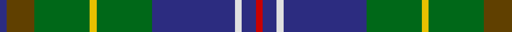

In pattern [BGGYGBWBR](/patterns/bggygbwbr/).

This was sourced from tartans-authority.  It is a [9 stripes tartan](/stripes/stripes9/).

Original link http://www.tartansauthority.com/tartan-ferret/display/7944/

## Attestations

This cloth appears in 2 source records; the oldest owns this page.

- Jun. 1956 — Connor (Personal) (tartans-authority, [record](http://www.tartansauthority.com/tartan-ferret/display/7944/))
- Apr. 1962 — Eldridge (Personal) (tartans-authority, [record](http://www.tartansauthority.com/tartan-ferret/display/7945/))

## Thread count
DB/4 T16 G32 Y4 G32 DB48 LN4 DB8 R/4

## Palette
Each colour and its ΔE from the base-6 reference it is a variant of.

| Colour | Shade | Base | ΔE (OKLab) |
|---|---|---|---|
| DB | <code style="background-color:#2C2C80;">#2C2C80</code> `#2C2C80` | B <code style="background-color:#2A418A;">#2A418A</code> | 0.06 |
| G | <code style="background-color:#006818;">#006818</code> `#006818` | G <code style="background-color:#006100;">#006100</code> | 0.02 |
| LN | <code style="background-color:#E0E0E0;">#E0E0E0</code> `#E0E0E0` | W <code style="background-color:#F7F7F7;">#F7F7F7</code> | 0.07 |
| R | <code style="background-color:#C80000;">#C80000</code> `#C80000` | R <code style="background-color:#CC0000;">#CC0000</code> | 0.01 |
| T | <code style="background-color:#604000;">#604000</code> `#604000` | G <code style="background-color:#006100;">#006100</code> | 0.14 |
| Y | <code style="background-color:#E8C000;">#E8C000</code> `#E8C000` | Y <code style="background-color:#F2BF00;">#F2BF00</code> | 0.02 |

## Nearest tartans

The nearest existing variants by ΔTartan distance.

1. [Ayrshire District Tartan Tartan Number: 436. Earliest known date: 1988 Dr Phil Smith, a Fellow of the Scottish Tartans Society, designed the Ayrshire district tartan at the suggestion of the Clan Boyd and Clan Cunningham Societies. In his book, 'District Tartans' (1992) co-authored with Dr G Teall, he says, the colours "..reflect the gold of the rising sun, the green of the land and brown of the coast, the blue of the sea and the red of the setting sun. The Ayrshire tartan is intended for those with connections in the districts of Kyle, Cunninghame and Inverclyde." See products available Copyright © Blair Urquhart, Comrie, 2015](/setts/s8/b2r1b10w1g4ga8y1ga2~b2c2c80-g604000-ga006818-rc80000-we0e0e0-ye8c000~x4/) — ΔT 0.59
1. [Ayrshire](/setts/s8/b2r1b10w1ra4g8y1g2~b304080-g008000-rc00000-ra806050-we0e0e0-yf0c000~x4/) — ΔT 0.75
1. [McComb (Personal)](/setts/s7/b3r2b18k6g18y2ga3~b2c2c80-g006818-ga408060-k101010-rc80000-ye8c000~x2/) — ΔT 0.89
1. [Halcrow Howell (Name)](/setts/s9/b4ba3b6k2bb12g2bb2g24w2~b2c2c80-ba2888c4-bb1c1c50-g006818-k101010-w98c8e8~x2/) — ΔT 0.89
1. [Big Rory (Corporate)](/setts/s10/b10w5b48k35g5k5g35r5g5ba5~b2c607c-ba780078-g006818-k101010-rc80000-we0e0e0/) — ΔT 0.92
1. [MacComb Family Tartan Tartan Number: 2340. Earliest known date: pre 1997 STS notes: Designed for a Mr McComb to play himself in as club captain of a golf club. It is the MacThomas with the over check changed to the clubs colours. Design by Donald Fraser (Oct 2002) of Berwick upon Tweed. See products available Copyright © Blair Urquhart, Comrie, 2015](/setts/s12/b3r2b18k6g18y2ga3y2g18k6b18r2~b2c2c80-g006818-ga408060-k101010-rc80000-ye8c000~x2/) — ΔT 0.93
1. [Wells (1970) (Name)](/setts/s11/r5w2g30b6g4b3g4b24g4ga5ra3~b1c1c50-g006818-ga604000-r888888-rac80000-we0e0e0~x2/) — ΔT 0.94
1. [East Lothian (Fashion) Fashion Tartan Tartan Number: 2561. Earliest known date: 1999 David McGill's company has designed quite a wide range of fashion tartans and in many cases, has given them names suggesting that they are tartans for cities, counties, states and even countries. See products available Copyright © Blair Urquhart, Comrie, 2015](/setts/s12/b17ba4b2k11g33y4g33k11b2ba4b17bb6~b2c2c80-ba780078-bb5c8ca8-g006818-k101010-ye8c000~x2/) — ΔT 0.95
1. [Schmidt (2014)](/setts/s10/k3b20ba8b4g20k2g2r2g3y3~b202060-ba2c2c80-g006818-k101010-rc80000-yfccc00~x2/) — ΔT 0.96
1. [Kleto, Susan (Personal)](/setts/s9/w1b16y1r3y1g6ga2g6w1~b003c64-g003c14-ga767e52-r8b0000-wffffff-ye0a126~x2/) — ΔT 0.99

## Neighbour map

Every grey dot is one of 15726 variants placed by the first two principal components of the ΔTartan feature space (44% of its variance). Red is this tartan; blue dots are its nearest — click one to open its page.

<svg viewBox="0 0 640 380" role="img" style="max-width:100%;height:auto;border:1px solid #e0e0e0;border-radius:4px;display:block" xmlns="http://www.w3.org/2000/svg"><image href="/nn/cloud.v1.png" width="640" height="380"/><a href="/setts/s8/b2r1b10w1g4ga8y1ga2~b2c2c80-g604000-ga006818-rc80000-we0e0e0-ye8c000~x4/"><circle cx="188.2" cy="168.1" r="4" fill="#3465a4"><title>Ayrshire District Tartan Tartan Number: 436. Earliest known date: 1988 Dr Phil Smith, a Fellow of the Scottish Tartans Society, designed the Ayrshire district tartan at the suggestion of the Clan Boyd and Clan Cunningham Societies. In his book, 'District Tartans' (1992) co-authored with Dr G Teall, he says, the colours &quot;..reflect the gold of the rising sun, the green of the land and brown of the coast, the blue of the sea and the red of the setting sun. The Ayrshire tartan is intended for those with connections in the districts of Kyle, Cunninghame and Inverclyde.&quot; See products available Copyright © Blair Urquhart, Comrie, 2015</title></circle></a><a href="/setts/s8/b2r1b10w1ra4g8y1g2~b304080-g008000-rc00000-ra806050-we0e0e0-yf0c000~x4/"><circle cx="189.2" cy="167.4" r="4" fill="#3465a4"><title>Ayrshire</title></circle></a><a href="/setts/s7/b3r2b18k6g18y2ga3~b2c2c80-g006818-ga408060-k101010-rc80000-ye8c000~x2/"><circle cx="181.7" cy="179.1" r="4" fill="#3465a4"><title>McComb (Personal)</title></circle></a><a href="/setts/s9/b4ba3b6k2bb12g2bb2g24w2~b2c2c80-ba2888c4-bb1c1c50-g006818-k101010-w98c8e8~x2/"><circle cx="225.0" cy="152.5" r="4" fill="#3465a4"><title>Halcrow Howell (Name)</title></circle></a><a href="/setts/s10/b10w5b48k35g5k5g35r5g5ba5~b2c607c-ba780078-g006818-k101010-rc80000-we0e0e0/"><circle cx="166.1" cy="155.5" r="4" fill="#3465a4"><title>Big Rory (Corporate)</title></circle></a><a href="/setts/s12/b3r2b18k6g18y2ga3y2g18k6b18r2~b2c2c80-g006818-ga408060-k101010-rc80000-ye8c000~x2/"><circle cx="167.4" cy="159.5" r="4" fill="#3465a4"><title>MacComb Family Tartan Tartan Number: 2340. Earliest known date: pre 1997 STS notes: Designed for a Mr McComb to play himself in as club captain of a golf club. It is the MacThomas with the over check changed to the clubs colours. Design by Donald Fraser (Oct 2002) of Berwick upon Tweed. See products available Copyright © Blair Urquhart, Comrie, 2015</title></circle></a><a href="/setts/s11/r5w2g30b6g4b3g4b24g4ga5ra3~b1c1c50-g006818-ga604000-r888888-rac80000-we0e0e0~x2/"><circle cx="251.3" cy="134.2" r="4" fill="#3465a4"><title>Wells (1970) (Name)</title></circle></a><a href="/setts/s12/b17ba4b2k11g33y4g33k11b2ba4b17bb6~b2c2c80-ba780078-bb5c8ca8-g006818-k101010-ye8c000~x2/"><circle cx="211.8" cy="139.2" r="4" fill="#3465a4"><title>East Lothian (Fashion) Fashion Tartan Tartan Number: 2561. Earliest known date: 1999 David McGill's company has designed quite a wide range of fashion tartans and in many cases, has given them names suggesting that they are tartans for cities, counties, states and even countries. See products available Copyright © Blair Urquhart, Comrie, 2015</title></circle></a><a href="/setts/s10/k3b20ba8b4g20k2g2r2g3y3~b202060-ba2c2c80-g006818-k101010-rc80000-yfccc00~x2/"><circle cx="171.5" cy="152.7" r="4" fill="#3465a4"><title>Schmidt (2014)</title></circle></a><a href="/setts/s9/w1b16y1r3y1g6ga2g6w1~b003c64-g003c14-ga767e52-r8b0000-wffffff-ye0a126~x2/"><circle cx="215.4" cy="130.3" r="4" fill="#3465a4"><title>Kleto, Susan (Personal)</title></circle></a><circle cx="214.0" cy="160.9" r="5" fill="#c00000"/></svg>

ID: /setts/s9/b1g4ga8y1ga8b12w1b2r1~b2c2c80-g604000-ga006818-rc80000-we0e0e0-ye8c000~x4/
