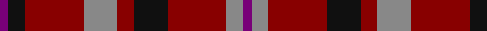

In pattern [BKRRRKRRB](/patterns/bkrrrkrrb/).

This was sourced from register-of-tartans.  It is a [9 stripes tartan](/stripes/stripes9/).

Original link https://www.tartanregister.gov.uk/tartanDetails.aspx?ref=663

## Attestations

This cloth appears in 2 source records; the oldest owns this page.

- 01/09/2000 — Clanton (Personal) (register-of-tartans, [record](https://www.tartanregister.gov.uk/tartanDetails.aspx?ref=663))
- pre 2002 — Clanton (Personal) (tartans-authority, [record](http://www.tartansauthority.com/tartan-ferret/display/4000/))

## Thread count
P/4 K8 DR28 N16 DR8 K16 DR28 N8 P/4

## Palette
Each colour and its ΔE from the base-6 reference it is a variant of.

| Colour | Shade | Base | ΔE (OKLab) |
|---|---|---|---|
| DR | <code style="background-color:#880000;">#880000</code> `#880000` | R <code style="background-color:#CC0000;">#CC0000</code> | 0.15 |
| K | <code style="background-color:#101010;">#101010</code> `#101010` | K <code style="background-color:#000000;">#000000</code> | 0.17 |
| N | <code style="background-color:#888888;">#888888</code> `#888888` | R <code style="background-color:#CC0000;">#CC0000</code> | 0.24 |
| P | <code style="background-color:#780078;">#780078</code> `#780078` | B <code style="background-color:#2A418A;">#2A418A</code> | 0.17 |

## Nearest tartans

The nearest existing variants by ΔTartan distance.

1. [Alexander Family Tartan Tartan Number: 1405. Earliest known date: 1984 The weaving and wearing of this tartan is 'Restricted'. This is not a legal definition and is applied by the Scottish Tartans Society irrespective of Design Patent or Copyright, in the spirit of a gentlemans agreement. Interested parties should contact the person listed under 'Source:' in this document. See products available Copyright © Blair Urquhart, Comrie, 2015](/setts/s9/r12b2r4b4k15g4r4g2r12x2~b2c2c80-g006818-k101010-rc80000/) — ΔT 0.96
1. [Cameron of Lochiel](/setts/s9/r6g3r6b1w1b1r2b8r4x2~b304080-g008000-rc00000-we0e0e0/) — ΔT 1.03
1. [Cameron of Locheil](/setts/s9/r6g3r6b1y1b1r2b8r4x2~b000052-g11450d-raa0000-yaaaaaa/) — ΔT 1.14
1. [Baronage](/setts/s9/g3r9b1g9r1g1r8ba9r1x4~b3c82af-ba141e46-g005020-rc80028/) — ΔT 1.16
1. [Alexander - 1985 (Name)](/setts/s9/r12b2r4b4k15g4r4g2r12x2~b2888c4-g006818-k101010-rc80000/) — ΔT 1.17
1. [Cameron of Lochiel (Smith) Clan Tartan Tartan Number: 1398. Earliest known date: 1764 According to I.B. Cameron Taylor from a portrait in Achnacarry of the Gentle Lochiel painted by George Chalmers in 1764. He wrote, "Of the unknown Cameron tartans in existence today, the Chief's personal tartan, the Cameron of Locheil, is undoubtably the oldest." See products available Copyright © Blair Urquhart, Comrie, 2015](/setts/s9/r6g3r6b1w1b1r2b8r4x2~b2c2c80-g006818-rc80000-we0e0e0/) — ΔT 1.18
1. [Wilson's No.199](/setts/s12/b11r3g15r3b11ga2b11r3g15r3b11ga2x2~b440044-g285800-ga789484-rc80000/) — ΔT 1.23
1. [Lumsden of Kintore Tartan Tartan Number: 418. Earliest known date: 1797 Made at Boghead of Kintore. See products available Copyright © Blair Urquhart, Comrie, 2015](/setts/s9/b1r5b4r1g1r1g4r5g1x20~b2c2c80-g006818-rc80000/) — ΔT 1.27
1. [MacQuarrie SM](/setts/s12/b1r1ba1r6g6r1g6r1ba3r6b1r1x2~b4367ae-ba000052-g11450d-raa0000/) — ΔT 1.29
1. [Convention of the Baronage (Corp)](/setts/s9/g3r9b1g9r1g1r9ba9r1x4~b2888c4-ba2c2c80-g006818-rc80000/) — ΔT 1.29

## Neighbour map

Every grey dot is one of 15726 variants placed by the first two principal components of the ΔTartan feature space (44% of its variance). Red is this tartan; blue dots are its nearest — click one to open its page.

<svg viewBox="0 0 640 380" role="img" style="max-width:100%;height:auto;border:1px solid #e0e0e0;border-radius:4px;display:block" xmlns="http://www.w3.org/2000/svg"><image href="/nn/cloud.v1.png" width="640" height="380"/><a href="/setts/s9/r12b2r4b4k15g4r4g2r12x2~b2c2c80-g006818-k101010-rc80000/"><circle cx="265.7" cy="206.4" r="4" fill="#3465a4"><title>Alexander Family Tartan Tartan Number: 1405. Earliest known date: 1984 The weaving and wearing of this tartan is 'Restricted'. This is not a legal definition and is applied by the Scottish Tartans Society irrespective of Design Patent or Copyright, in the spirit of a gentlemans agreement. Interested parties should contact the person listed under 'Source:' in this document. See products available Copyright © Blair Urquhart, Comrie, 2015</title></circle></a><a href="/setts/s9/r6g3r6b1w1b1r2b8r4x2~b304080-g008000-rc00000-we0e0e0/"><circle cx="300.6" cy="211.1" r="4" fill="#3465a4"><title>Cameron of Lochiel</title></circle></a><a href="/setts/s9/r6g3r6b1y1b1r2b8r4x2~b000052-g11450d-raa0000-yaaaaaa/"><circle cx="288.1" cy="212.8" r="4" fill="#3465a4"><title>Cameron of Locheil</title></circle></a><a href="/setts/s9/g3r9b1g9r1g1r8ba9r1x4~b3c82af-ba141e46-g005020-rc80028/"><circle cx="245.8" cy="199.2" r="4" fill="#3465a4"><title>Baronage</title></circle></a><a href="/setts/s9/r12b2r4b4k15g4r4g2r12x2~b2888c4-g006818-k101010-rc80000/"><circle cx="258.6" cy="203.6" r="4" fill="#3465a4"><title>Alexander - 1985 (Name)</title></circle></a><a href="/setts/s9/r6g3r6b1w1b1r2b8r4x2~b2c2c80-g006818-rc80000-we0e0e0/"><circle cx="292.7" cy="207.1" r="4" fill="#3465a4"><title>Cameron of Lochiel (Smith) Clan Tartan Tartan Number: 1398. Earliest known date: 1764 According to I.B. Cameron Taylor from a portrait in Achnacarry of the Gentle Lochiel painted by George Chalmers in 1764. He wrote, &quot;Of the unknown Cameron tartans in existence today, the Chief's personal tartan, the Cameron of Locheil, is undoubtably the oldest.&quot; See products available Copyright © Blair Urquhart, Comrie, 2015</title></circle></a><a href="/setts/s12/b11r3g15r3b11ga2b11r3g15r3b11ga2x2~b440044-g285800-ga789484-rc80000/"><circle cx="251.0" cy="215.1" r="4" fill="#3465a4"><title>Wilson's No.199</title></circle></a><a href="/setts/s9/b1r5b4r1g1r1g4r5g1x20~b2c2c80-g006818-rc80000/"><circle cx="271.9" cy="243.8" r="4" fill="#3465a4"><title>Lumsden of Kintore Tartan Tartan Number: 418. Earliest known date: 1797 Made at Boghead of Kintore. See products available Copyright © Blair Urquhart, Comrie, 2015</title></circle></a><a href="/setts/s12/b1r1ba1r6g6r1g6r1ba3r6b1r1x2~b4367ae-ba000052-g11450d-raa0000/"><circle cx="248.0" cy="206.9" r="4" fill="#3465a4"><title>MacQuarrie SM</title></circle></a><a href="/setts/s9/g3r9b1g9r1g1r9ba9r1x4~b2888c4-ba2c2c80-g006818-rc80000/"><circle cx="250.9" cy="197.0" r="4" fill="#3465a4"><title>Convention of the Baronage (Corp)</title></circle></a><circle cx="274.2" cy="225.0" r="5" fill="#c00000"/></svg>

ID: /setts/s9/b1k2r7ra4r2k4r7ra2b1x4~b780078-k101010-r880000-ra888888/
