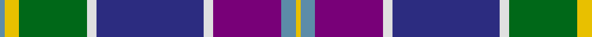

In pattern [BYGWBWBBY](/patterns/bygwbwbby/).

This was sourced from tartans-authority.  It is a [9 stripes tartan](/stripes/stripes9/).

Original link http://www.tartansauthority.com/tartan-ferret/display/3896/

## Attestations

This cloth appears in 3 source records; the oldest owns this page.

- pre 2002 — Yule (Name) (tartans-authority, [record](http://www.tartansauthority.com/tartan-ferret/display/3896/))
- undated — Yule (register-of-tartans, [record](https://www.tartanregister.gov.uk/tartanDetails.aspx?ref=5338))
- undated — Yule Name Tartan Tartan Number: 3896. Earliest known date: pre 2002 For the Yule families of Aberdeenshire, Lanarkshire and East Lothian not connected with Clan Buchanan. See products available Copyright © Blair Urquhart, Comrie, 2015 (house-of-tartan, [record](http://www.house-of-tartan.scotland.net/house/TartanViewjs.asp?colr=Def&tnam=3896))

## Thread count
B/2 Y6 G28 LN4 DB44 LN4 P28 B6 Y/2

## Palette
Each colour and its ΔE from the base-6 reference it is a variant of.

| Colour | Shade | Base | ΔE (OKLab) |
|---|---|---|---|
| B | <code style="background-color:#5C8CA8;">#5C8CA8</code> `#5C8CA8` | B <code style="background-color:#2A418A;">#2A418A</code> | 0.23 |
| DB | <code style="background-color:#2C2C80;">#2C2C80</code> `#2C2C80` | B <code style="background-color:#2A418A;">#2A418A</code> | 0.06 |
| G | <code style="background-color:#006818;">#006818</code> `#006818` | G <code style="background-color:#006100;">#006100</code> | 0.02 |
| LN | <code style="background-color:#E0E0E0;">#E0E0E0</code> `#E0E0E0` | W <code style="background-color:#F7F7F7;">#F7F7F7</code> | 0.07 |
| P | <code style="background-color:#780078;">#780078</code> `#780078` | B <code style="background-color:#2A418A;">#2A418A</code> | 0.17 |
| Y | <code style="background-color:#E8C000;">#E8C000</code> `#E8C000` | Y <code style="background-color:#F2BF00;">#F2BF00</code> | 0.02 |

## Nearest tartans

The nearest existing variants by ΔTartan distance.

1. [George Heriot's School](/setts/s7/w3k1b24ba10r24k1y3x2~b2c2c80-ba1c1c50-k101010-r888888-we0e0e0-ye8c000/) — ΔT 0.78
1. [Unidentified (Woven sample)](/setts/s8/k16w6k4b64r19k8g42y6~b3850c8-g006818-k101010-r981c70-wf8f8f8-ye8c000/) — ΔT 0.87
1. [Ancient Gathering](/setts/s8/b1ba12r6w1y3b14bb18w1x2~b1c1c50-ba5c8ca8-bb003c64-rb458ac-wffffff-ybc8c00/) — ΔT 0.92
1. [Alexander of Menstry](/setts/s8/g5r2g2r9k9y9b30w5x2~b2c2c80-g006818-k101010-r9c68a4-wf8f8f8-ya0a0a0/) — ΔT 0.97
1. [Scottish Association for N.S. (Corp)](/setts/s9/b46y4b4y4b6k16r66w11ra6~b2c2c80-k101010-r888888-rac80000-we0e0e0-ye8c000/) — ΔT 0.99
1. [Accenture](/setts/s10/b3r1ba4g2ra2g21r3b21ba25w3x2~b780078-ba2c2c80-g006818-r888888-rac80000-we0e0e0/) — ΔT 1.01
1. [Ohio District Tartan Tartan Number: 651. Earliest known date: 1984 Design is based on the colours of Ohio's flag and state seal. The widths of the stripes in each colour are based on the date Ohio was admitted to the Union. The tartan first went on display at the Ohio Scottish Games in June 1983. See products available Copyright © Blair Urquhart, Comrie, 2015](/setts/s9/b16w6r8b3y1g1ba3b1g9x2~b2c2c80-ba2888c4-g006818-rc80000-we0e0e0-ye8c000/) — ΔT 1.05
1. [Vinther, Niels Christian (Personal)](/setts/s8/w3r14wa1k2g2k16b20w1x2~b5c8ca8-g649848-k101010-ra00048-we8ccb8-waf0e0c8/) — ΔT 1.07
1. [Lang of Sherbrooke (Personal)](/setts/s11/g10y2b2g2b13g2b2g1k13ba24w2x2~b780078-ba2c2c80-g00643c-k101010-wfcfcfc-ye8c000/) — ΔT 1.07
1. [Lang of Sherbrooke (Personal)](/setts/s11/g10y2k2g2k13g2k2g1b13ba24w2x2~b780078-ba2c2c80-g00643c-k101010-wfcfcfc-ye8c000/) — ΔT 1.08

## Neighbour map

Every grey dot is one of 15726 variants placed by the first two principal components of the ΔTartan feature space (44% of its variance). Red is this tartan; blue dots are its nearest — click one to open its page.

<svg viewBox="0 0 640 380" role="img" style="max-width:100%;height:auto;border:1px solid #e0e0e0;border-radius:4px;display:block" xmlns="http://www.w3.org/2000/svg"><image href="/nn/cloud.v1.png" width="640" height="380"/><a href="/setts/s7/w3k1b24ba10r24k1y3x2~b2c2c80-ba1c1c50-k101010-r888888-we0e0e0-ye8c000/"><circle cx="193.5" cy="122.5" r="4" fill="#3465a4"><title>George Heriot's School</title></circle></a><a href="/setts/s8/k16w6k4b64r19k8g42y6~b3850c8-g006818-k101010-r981c70-wf8f8f8-ye8c000/"><circle cx="158.3" cy="132.7" r="4" fill="#3465a4"><title>Unidentified (Woven sample)</title></circle></a><a href="/setts/s8/b1ba12r6w1y3b14bb18w1x2~b1c1c50-ba5c8ca8-bb003c64-rb458ac-wffffff-ybc8c00/"><circle cx="144.7" cy="139.1" r="4" fill="#3465a4"><title>Ancient Gathering</title></circle></a><a href="/setts/s8/g5r2g2r9k9y9b30w5x2~b2c2c80-g006818-k101010-r9c68a4-wf8f8f8-ya0a0a0/"><circle cx="160.9" cy="133.0" r="4" fill="#3465a4"><title>Alexander of Menstry</title></circle></a><a href="/setts/s9/b46y4b4y4b6k16r66w11ra6~b2c2c80-k101010-r888888-rac80000-we0e0e0-ye8c000/"><circle cx="191.8" cy="109.6" r="4" fill="#3465a4"><title>Scottish Association for N.S. (Corp)</title></circle></a><a href="/setts/s10/b3r1ba4g2ra2g21r3b21ba25w3x2~b780078-ba2c2c80-g006818-r888888-rac80000-we0e0e0/"><circle cx="201.7" cy="110.6" r="4" fill="#3465a4"><title>Accenture</title></circle></a><a href="/setts/s9/b16w6r8b3y1g1ba3b1g9x2~b2c2c80-ba2888c4-g006818-rc80000-we0e0e0-ye8c000/"><circle cx="158.1" cy="127.2" r="4" fill="#3465a4"><title>Ohio District Tartan Tartan Number: 651. Earliest known date: 1984 Design is based on the colours of Ohio's flag and state seal. The widths of the stripes in each colour are based on the date Ohio was admitted to the Union. The tartan first went on display at the Ohio Scottish Games in June 1983. See products available Copyright © Blair Urquhart, Comrie, 2015</title></circle></a><a href="/setts/s8/w3r14wa1k2g2k16b20w1x2~b5c8ca8-g649848-k101010-ra00048-we8ccb8-waf0e0c8/"><circle cx="155.4" cy="114.1" r="4" fill="#3465a4"><title>Vinther, Niels Christian (Personal)</title></circle></a><a href="/setts/s11/g10y2b2g2b13g2b2g1k13ba24w2x2~b780078-ba2c2c80-g00643c-k101010-wfcfcfc-ye8c000/"><circle cx="173.0" cy="106.4" r="4" fill="#3465a4"><title>Lang of Sherbrooke (Personal)</title></circle></a><a href="/setts/s11/g10y2k2g2k13g2k2g1b13ba24w2x2~b780078-ba2c2c80-g00643c-k101010-wfcfcfc-ye8c000/"><circle cx="170.3" cy="107.0" r="4" fill="#3465a4"><title>Lang of Sherbrooke (Personal)</title></circle></a><circle cx="163.2" cy="108.6" r="5" fill="#c00000"/></svg>

ID: /setts/s9/b1y3g14w2ba22w2bb14b3y1x2~b5c8ca8-ba2c2c80-bb780078-g006818-we0e0e0-ye8c000/
