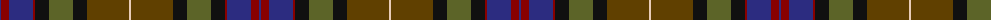

In pattern [BRBRKGKGW](/patterns/brbrkgkgw/).

This was sourced from tartans-authority.  It is a [9 stripes tartan](/stripes/stripes9/).

Original link http://www.tartansauthority.com/tartan-ferret/display/10776/

## Thread count
DB/2 DR8 DB24 DR2 K14 G24 K14 T42 LR/2

## Palette
Each colour and its ΔE from the base-6 reference it is a variant of.

| Colour | Shade | Base | ΔE (OKLab) |
|---|---|---|---|
| DB | <code style="background-color:#2C2C80;">#2C2C80</code> `#2C2C80` | B <code style="background-color:#2A418A;">#2A418A</code> | 0.06 |
| DR | <code style="background-color:#880000;">#880000</code> `#880000` | R <code style="background-color:#CC0000;">#CC0000</code> | 0.15 |
| G | <code style="background-color:#5C6428;">#5C6428</code> `#5C6428` | G <code style="background-color:#006100;">#006100</code> | 0.10 |
| K | <code style="background-color:#101010;">#101010</code> `#101010` | K <code style="background-color:#000000;">#000000</code> | 0.17 |
| LR | <code style="background-color:#E8CCB8;">#E8CCB8</code> `#E8CCB8` | W <code style="background-color:#F7F7F7;">#F7F7F7</code> | 0.12 |
| T | <code style="background-color:#604000;">#604000</code> `#604000` | G <code style="background-color:#006100;">#006100</code> | 0.14 |

## Nearest tartans

The nearest existing variants by ΔTartan distance.

1. [McCarter (2016)](/setts/s8/r8k4g30k4ga30b30k4ra2-b141e46-g603800-ga005020-k101010-re86000-rac8002c/) — ΔT 0.81
1. [Redgate (Connecticut) Hunting](/setts/s9/b2ba8b24ba2k14g24k14bb42w2-b788cb4-ba5d0f04-bb402a21-g334e3d-k120a01-wddd5af/) — ΔT 0.84
1. [Isle of Skye District Tartan Tartan Number: 2155. Earliest known date: 1993 The tartan was instigated and registered by Mrs Rosemary Nicolson Samios in 1992, an Australian of Skye descent, now living in Skye. It was selected through a worldwide competition won by Angus MacLeod from Lewis. Angus, a weaver by trade, produced the first commercial quantities in the traditional kilt weight in 1993 at Lochcarron Weavers in North Strome. The colours of the tartan depict those of the island, often called the 'Misty Isle'. Worn by the Torphican and Bathgate pipe band. (A patented design No. 0600930) See products available Copyright © Blair Urquhart, Comrie, 2015](/setts/s11/g40b4g4b4g6b16ga18gb16gc16ga2y4-b780078-g604000-ga003820-gb408060-gc5c6428-yb8b8b8/) — ΔT 1.07
1. [Batten of Argyll (Baddenach)](/setts/s8/b10k2g10ba30g30ga55k4r8-b780078-ba440044-g003820-ga285800-k101010-r880000/) — ΔT 1.17
1. [Aberuchill](/setts/s8/r8k2g10b30g30ga55k4y6-b440044-g603800-ga006818-k101010-rb468ac-yd87c00/) — ΔT 1.19
1. [Hay-Gray (Personal)](/setts/s14/b36k4b4k4b18g20y4g20ba22k18ba4k4ba2r6-b441800-ba780078-g285800-k101010-rc80000-ye8c000/) — ΔT 1.21
1. [Isle of Skye](/setts/s11/r40b4r4b4r6b16g18ga16gb16g2y4-b300030-g003000-ga008000-gb607030-r806050-yb0b0b0/) — ΔT 1.22
1. [Aberuchill District Tartan Tartan Number: 6814. Earliest known date: 2005 Aberuchill lends it name to the area south of Comrie where the river Ruchil meets the river Earn. The two rivers form the boundaries of the Aberuchill Estate for which this tartan was created. See products available Copyright © Blair Urquhart, Comrie, 2015](/setts/s8/r8k2g10b30g30ga55k4ra6-b440044-g58581c-ga006818-k101010-r9c68a4-rab84c00/) — ΔT 1.26
1. [Harding (Name)](/setts/s8/g60b4ba14r28ba14r14w2b28-b14283c-ba5c5c5c-g005448-rc80000-wf8f8f8/) — ΔT 1.30
1. [ENABLE Scotland](/setts/s13/g6b6ba4bb28g32b36ba4b6ba28bb8y6r2ba4-b440044-ba1c1c1c-bb003c64-g408060-re86000-y9c9c00/) — ΔT 1.31

## Neighbour map

Every grey dot is one of 15726 variants placed by the first two principal components of the ΔTartan feature space (44% of its variance). Red is this tartan; blue dots are its nearest — click one to open its page.

<svg viewBox="0 0 640 380" role="img" style="max-width:100%;height:auto;border:1px solid #e0e0e0;border-radius:4px;display:block" xmlns="http://www.w3.org/2000/svg"><image href="/nn/cloud.v1.png" width="640" height="380"/><a href="/setts/s8/r8k4g30k4ga30b30k4ra2-b141e46-g603800-ga005020-k101010-re86000-rac8002c/"><circle cx="167.2" cy="172.2" r="4" fill="#3465a4"><title>McCarter (2016)</title></circle></a><a href="/setts/s9/b2ba8b24ba2k14g24k14bb42w2-b788cb4-ba5d0f04-bb402a21-g334e3d-k120a01-wddd5af/"><circle cx="160.8" cy="142.9" r="4" fill="#3465a4"><title>Redgate (Connecticut) Hunting</title></circle></a><a href="/setts/s11/g40b4g4b4g6b16ga18gb16gc16ga2y4-b780078-g604000-ga003820-gb408060-gc5c6428-yb8b8b8/"><circle cx="222.6" cy="147.1" r="4" fill="#3465a4"><title>Isle of Skye District Tartan Tartan Number: 2155. Earliest known date: 1993 The tartan was instigated and registered by Mrs Rosemary Nicolson Samios in 1992, an Australian of Skye descent, now living in Skye. It was selected through a worldwide competition won by Angus MacLeod from Lewis. Angus, a weaver by trade, produced the first commercial quantities in the traditional kilt weight in 1993 at Lochcarron Weavers in North Strome. The colours of the tartan depict those of the island, often called the 'Misty Isle'. Worn by the Torphican and Bathgate pipe band. (A patented design No. 0600930) See products available Copyright © Blair Urquhart, Comrie, 2015</title></circle></a><a href="/setts/s8/b10k2g10ba30g30ga55k4r8-b780078-ba440044-g003820-ga285800-k101010-r880000/"><circle cx="250.1" cy="158.9" r="4" fill="#3465a4"><title>Batten of Argyll (Baddenach)</title></circle></a><a href="/setts/s8/r8k2g10b30g30ga55k4y6-b440044-g603800-ga006818-k101010-rb468ac-yd87c00/"><circle cx="227.4" cy="135.9" r="4" fill="#3465a4"><title>Aberuchill</title></circle></a><a href="/setts/s14/b36k4b4k4b18g20y4g20ba22k18ba4k4ba2r6-b441800-ba780078-g285800-k101010-rc80000-ye8c000/"><circle cx="177.4" cy="135.7" r="4" fill="#3465a4"><title>Hay-Gray (Personal)</title></circle></a><a href="/setts/s11/r40b4r4b4r6b16g18ga16gb16g2y4-b300030-g003000-ga008000-gb607030-r806050-yb0b0b0/"><circle cx="187.2" cy="133.0" r="4" fill="#3465a4"><title>Isle of Skye</title></circle></a><a href="/setts/s8/r8k2g10b30g30ga55k4ra6-b440044-g58581c-ga006818-k101010-r9c68a4-rab84c00/"><circle cx="238.1" cy="144.0" r="4" fill="#3465a4"><title>Aberuchill District Tartan Tartan Number: 6814. Earliest known date: 2005 Aberuchill lends it name to the area south of Comrie where the river Ruchil meets the river Earn. The two rivers form the boundaries of the Aberuchill Estate for which this tartan was created. See products available Copyright © Blair Urquhart, Comrie, 2015</title></circle></a><a href="/setts/s8/g60b4ba14r28ba14r14w2b28-b14283c-ba5c5c5c-g005448-rc80000-wf8f8f8/"><circle cx="240.5" cy="156.4" r="4" fill="#3465a4"><title>Harding (Name)</title></circle></a><a href="/setts/s13/g6b6ba4bb28g32b36ba4b6ba28bb8y6r2ba4-b440044-ba1c1c1c-bb003c64-g408060-re86000-y9c9c00/"><circle cx="153.4" cy="134.6" r="4" fill="#3465a4"><title>ENABLE Scotland</title></circle></a><circle cx="185.5" cy="152.7" r="5" fill="#c00000"/></svg>

ID: /setts/s9/b2r8b24r2k14g24k14ga42w2-b2c2c80-g5c6428-ga604000-k101010-r880000-we8ccb8/
