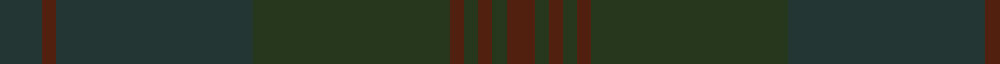

In pattern [BBBGBGBGB](/patterns/bbbgbgbgb/).

This was sourced from register-of-tartans.  It is a [9 stripes tartan](/stripes/stripes9/).

Original link https://www.tartanregister.gov.uk/tartanDetails.aspx?ref=10031

## Thread count
DN/12 T4 DN56 K56 T4 K4 T4 K4 T/8

## Palette
Each colour and its ΔE from the base-6 reference it is a variant of.

| Colour | Shade | Base | ΔE (OKLab) |
|---|---|---|---|
| DN | <code style="background-color:#233634;">#233634</code> `#233634` | B <code style="background-color:#2A418A;">#2A418A</code> | 0.15 |
| K | <code style="background-color:#27371D;">#27371D</code> `#27371D` | G <code style="background-color:#006100;">#006100</code> | 0.15 |
| T | <code style="background-color:#51200F;">#51200F</code> `#51200F` | B <code style="background-color:#2A418A;">#2A418A</code> | 0.21 |

## Nearest tartans

The nearest existing variants by ΔTartan distance.

1. [Unnamed Brown (Teddy Bear)](/setts/s5/r1ra7rb25ra7r1x2~rc00000-ra806050-rb906030/) — ΔT 3.29
1. [Dark Island Black Weavers Tartan Tartan Number: 5832. Earliest known date: May 2003 A Solid Sett* tartan and an innovative departure from conventional tartan design. An ecru (white) yarn has been woven on a Jacquard loom with the sett being formed by stitches other than 2/2 twill and then the finished fabric has been piece-dyed black. The sett is highlighted because of the differing light reflecting qualities of the stitches. Here they are shown in grey so as to be discernible. *This new category of tartan has been given the description of Solid Sett - a solid colour but with a sett still showing. See products available Copyright © Blair Urquhart, Comrie, 2015](/setts/s16/k4b2k43b20k4b2k2b4k2b2k4b20k43b2k4b2x2~b1c1c1c-k101010/) — ΔT 3.37
1. [Miyuki, House Check Tan, 1004A](/setts/s8/r3r8ra3r20ra20rb3ra8rb3x2~r806050-ra906030-rbc00000/) — ΔT 3.52
1. [ShadowHalls](/setts/s15/b1ba4k11ba1k1ba1k1b1k11bb4g1bb8k8ba8bb1x4~b084555-ba1a2b47-bb1e2025-g364e41-k1c1714/) — ΔT 3.59
1. [Dark Island Navy Fashion Tartan Tartan Number: 5833. Earliest known date: May 2003 An ecru (white) yarn has been woven on a Jacquard loom with the sett being formed by stitches other than 2/2 twill and then the finished fabric has been piece-dyed navy blue. The sett is highlighted because of the differing light reflecting qualities of the stitches. Here they are shown in grey blue so as to be discernible. This new category of tartan has been described as a Solid Sett - a solid colour but with a sett still showing. See products available Copyright © Blair Urquhart, Comrie, 2015](/setts/s16/b4ba2b43ba20b4ba2b2ba4b2ba2b4ba20b43ba2b4ba2x2~b1c1c50-ba243464/) — ΔT 4.06
1. [Bouncing Blackie (Personal)](/setts/s6/b13ba13g21b34ba55bb3~b14143c-ba1c1c1c-bb441800-g003820/) — ΔT 4.49
1. [Harmony 11 #2](/setts/s6/g6ga2g29ga29g2ga6x2~g005020-ga503c14/) — ΔT 4.52
1. [Wicklow Irish County Tartan Tartan Number: 2265. Earliest known date: 1995 One of a series of Irish District tartans designed by Polly Wittering of the House of Edgar, with colours reminiscent of the Country with soft warm colours dominating. See products available Copyright © Blair Urquhart, Comrie, 2015](/setts/s10/g2b2ga2b24ba2ga6b3g12b4ga2x2~b646c84-ba0070a4-g3c6060-ga644c40/) — ΔT 4.58
1. [Harmony, 12](/setts/s6/g6r2g29r29g2r6x2~g808080-r806050/) — ΔT 4.60
1. [STLTH](/setts/s7/b4k2b4k45ba2k3ba2x2~b1e2025-ba3f4441-k1c1714/) — ΔT 4.92

## Neighbour map

Every grey dot is one of 15726 variants placed by the first two principal components of the ΔTartan feature space (44% of its variance). Red is this tartan; blue dots are its nearest — click one to open its page.

<svg viewBox="0 0 640 380" role="img" style="max-width:100%;height:auto;border:1px solid #e0e0e0;border-radius:4px;display:block" xmlns="http://www.w3.org/2000/svg"><image href="/nn/cloud.v1.png" width="640" height="380"/><a href="/setts/s5/r1ra7rb25ra7r1x2~rc00000-ra806050-rb906030/"><circle cx="626.0" cy="323.6" r="4" fill="#3465a4"><title>Unnamed Brown (Teddy Bear)</title></circle></a><a href="/setts/s16/k4b2k43b20k4b2k2b4k2b2k4b20k43b2k4b2x2~b1c1c1c-k101010/"><circle cx="626.0" cy="330.0" r="4" fill="#3465a4"><title>Dark Island Black Weavers Tartan Tartan Number: 5832. Earliest known date: May 2003 A Solid Sett* tartan and an innovative departure from conventional tartan design. An ecru (white) yarn has been woven on a Jacquard loom with the sett being formed by stitches other than 2/2 twill and then the finished fabric has been piece-dyed black. The sett is highlighted because of the differing light reflecting qualities of the stitches. Here they are shown in grey so as to be discernible. *This new category of tartan has been given the description of Solid Sett - a solid colour but with a sett still showing. See products available Copyright © Blair Urquhart, Comrie, 2015</title></circle></a><a href="/setts/s8/r3r8ra3r20ra20rb3ra8rb3x2~r806050-ra906030-rbc00000/"><circle cx="556.0" cy="348.6" r="4" fill="#3465a4"><title>Miyuki, House Check Tan, 1004A</title></circle></a><a href="/setts/s15/b1ba4k11ba1k1ba1k1b1k11bb4g1bb8k8ba8bb1x4~b084555-ba1a2b47-bb1e2025-g364e41-k1c1714/"><circle cx="517.8" cy="277.9" r="4" fill="#3465a4"><title>ShadowHalls</title></circle></a><a href="/setts/s16/b4ba2b43ba20b4ba2b2ba4b2ba2b4ba20b43ba2b4ba2x2~b1c1c50-ba243464/"><circle cx="626.0" cy="294.3" r="4" fill="#3465a4"><title>Dark Island Navy Fashion Tartan Tartan Number: 5833. Earliest known date: May 2003 An ecru (white) yarn has been woven on a Jacquard loom with the sett being formed by stitches other than 2/2 twill and then the finished fabric has been piece-dyed navy blue. The sett is highlighted because of the differing light reflecting qualities of the stitches. Here they are shown in grey blue so as to be discernible. This new category of tartan has been described as a Solid Sett - a solid colour but with a sett still showing. See products available Copyright © Blair Urquhart, Comrie, 2015</title></circle></a><a href="/setts/s6/b13ba13g21b34ba55bb3~b14143c-ba1c1c1c-bb441800-g003820/"><circle cx="529.2" cy="320.3" r="4" fill="#3465a4"><title>Bouncing Blackie (Personal)</title></circle></a><a href="/setts/s6/g6ga2g29ga29g2ga6x2~g005020-ga503c14/"><circle cx="623.0" cy="342.6" r="4" fill="#3465a4"><title>Harmony 11 #2</title></circle></a><a href="/setts/s10/g2b2ga2b24ba2ga6b3g12b4ga2x2~b646c84-ba0070a4-g3c6060-ga644c40/"><circle cx="552.7" cy="268.1" r="4" fill="#3465a4"><title>Wicklow Irish County Tartan Tartan Number: 2265. Earliest known date: 1995 One of a series of Irish District tartans designed by Polly Wittering of the House of Edgar, with colours reminiscent of the Country with soft warm colours dominating. See products available Copyright © Blair Urquhart, Comrie, 2015</title></circle></a><a href="/setts/s6/g6r2g29r29g2r6x2~g808080-r806050/"><circle cx="626.0" cy="330.9" r="4" fill="#3465a4"><title>Harmony, 12</title></circle></a><a href="/setts/s7/b4k2b4k45ba2k3ba2x2~b1e2025-ba3f4441-k1c1714/"><circle cx="626.0" cy="296.6" r="4" fill="#3465a4"><title>STLTH</title></circle></a><circle cx="626.0" cy="327.5" r="5" fill="#c00000"/></svg>

ID: /setts/s9/b3ba1b14g14ba1g1ba1g1ba2x4~b233634-ba51200f-g27371d/
