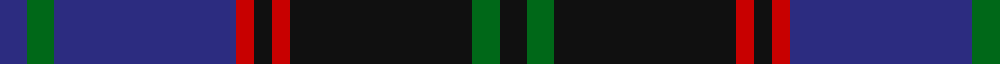

In pattern [BGBRKRKGK](/patterns/bgbrkrkgk/).

This was sourced from house-of-tartan.  It is a [9 stripes tartan](/stripes/stripes9/).

Original link http://www.house-of-tartan.scotland.net/house/TartanViewjs.asp?colr=Def&tnam=125

## Thread count
DB/6 G6 DB40 R4 K4 R4 K40 G6 K/6

## Palette
Each colour and its ΔE from the base-6 reference it is a variant of.

| Colour | Shade | Base | ΔE (OKLab) |
|---|---|---|---|
| DB | <code style="background-color:#2C2C80;">#2C2C80</code> `#2C2C80` | B <code style="background-color:#2A418A;">#2A418A</code> | 0.06 |
| G | <code style="background-color:#006818;">#006818</code> `#006818` | G <code style="background-color:#006100;">#006100</code> | 0.02 |
| K | <code style="background-color:#101010;">#101010</code> `#101010` | K <code style="background-color:#000000;">#000000</code> | 0.17 |
| R | <code style="background-color:#C80000;">#C80000</code> `#C80000` | R <code style="background-color:#CC0000;">#CC0000</code> | 0.01 |

## Nearest tartans

The nearest existing variants by ΔTartan distance.

1. [Hume or Home](/setts/s9/b3g3b20r2k2r2k20g3k3~b2c4084-g005020-k101010-rdc0000~x2/) — ΔT 0.19
1. [MacHarg, Iain](/setts/s9/g20k2g2k2g2k8b24ba3b3~b2c2c80-ba780078-g006818-k101010~x2/) — ΔT 1.02
1. [Slanj Dress (Corporate)](/setts/s8/k4b36k4b4k34ba3k3w4~b202060-ba3850c8-k101010-we0e0e0~x2/) — ΔT 1.08
1. [Chinzei Keiai Junior High School](/setts/s9/b3ba3k16b2r2b16k3b2r2~b5c5c5c-ba780078-k101010-r888888~x2/) — ΔT 1.09
1. [Durie](/setts/s9/k12r1k1r1k1r4g12y1g2~g003000-k000030-r800000-yf0c000~x4/) — ΔT 1.09
1. [Montgomerie of Eglinton Family Tartan Tartan Number: 1082. Earliest known date: 1893 D W Stewart, author of Old and Rare Scottish Tartans (1893), was of the opinion that this sett could be traced back to 1707 when it was adopted by the Montgomeries Earls of Eglinton. See Eglinton District. See products available Copyright © Blair Urquhart, Comrie, 2015](/setts/s7/k4g5k4b28k4r5k4~b2c2c80-g006818-k101010-rc80000~x2/) — ΔT 1.11
1. [Caledonian Hotel (Corporate)](/setts/s8/b9ba1b1ba1b1ba7k7r2~b5c5c5c-ba1c0070-k101010-r880000~x4/) — ΔT 1.11
1. [Chinzei Keiai Junior High School](/setts/s9/b3w3k16b2k2b16k3b2ba2~b505050-ba646464-k101010-wc49cd8~x2/) — ΔT 1.11
1. [Christian Dewar (Personal)](/setts/s9/b16k2b2k2b2k6g13y2g3~b00248c-g142814-k3c0000-ya08c28~x2/) — ΔT 1.13
1. [Gammell Family Tartan Tartan Number: 597. Earliest known date: 1965 Designed (probably by David Thomas and Arthur Mackie of Strathmore Woollen Co) for the Hill family of Angus as a personal tartan. Tommy Gemmell (6.3.05) said "The tartan was designed using the largest Government sett by Mrs Hill's mother - a Mrs Gammell - who was a handweaver." See products available Copyright © Blair Urquhart, Comrie, 2015](/setts/s8/b32ba3b3ba3b3ba10g24r3~b202060-ba441800-g006818-r901c38~x2/) — ΔT 1.17

## Neighbour map

Every grey dot is one of 15726 variants placed by the first two principal components of the ΔTartan feature space (44% of its variance). Red is this tartan; blue dots are its nearest — click one to open its page.

<svg viewBox="0 0 640 380" role="img" style="max-width:100%;height:auto;border:1px solid #e0e0e0;border-radius:4px;display:block" xmlns="http://www.w3.org/2000/svg"><image href="/nn/cloud.v1.png" width="640" height="380"/><a href="/setts/s9/b3g3b20r2k2r2k20g3k3~b2c4084-g005020-k101010-rdc0000~x2/"><circle cx="285.9" cy="194.4" r="4" fill="#3465a4"><title>Hume or Home</title></circle></a><a href="/setts/s9/g20k2g2k2g2k8b24ba3b3~b2c2c80-ba780078-g006818-k101010~x2/"><circle cx="270.2" cy="189.1" r="4" fill="#3465a4"><title>MacHarg, Iain</title></circle></a><a href="/setts/s8/k4b36k4b4k34ba3k3w4~b202060-ba3850c8-k101010-we0e0e0~x2/"><circle cx="345.5" cy="197.4" r="4" fill="#3465a4"><title>Slanj Dress (Corporate)</title></circle></a><a href="/setts/s9/b3ba3k16b2r2b16k3b2r2~b5c5c5c-ba780078-k101010-r888888~x2/"><circle cx="283.6" cy="200.5" r="4" fill="#3465a4"><title>Chinzei Keiai Junior High School</title></circle></a><a href="/setts/s9/k12r1k1r1k1r4g12y1g2~g003000-k000030-r800000-yf0c000~x4/"><circle cx="272.7" cy="187.1" r="4" fill="#3465a4"><title>Durie</title></circle></a><a href="/setts/s7/k4g5k4b28k4r5k4~b2c2c80-g006818-k101010-rc80000~x2/"><circle cx="306.7" cy="219.6" r="4" fill="#3465a4"><title>Montgomerie of Eglinton Family Tartan Tartan Number: 1082. Earliest known date: 1893 D W Stewart, author of Old and Rare Scottish Tartans (1893), was of the opinion that this sett could be traced back to 1707 when it was adopted by the Montgomeries Earls of Eglinton. See Eglinton District. See products available Copyright © Blair Urquhart, Comrie, 2015</title></circle></a><a href="/setts/s8/b9ba1b1ba1b1ba7k7r2~b5c5c5c-ba1c0070-k101010-r880000~x4/"><circle cx="237.1" cy="218.0" r="4" fill="#3465a4"><title>Caledonian Hotel (Corporate)</title></circle></a><a href="/setts/s9/b3w3k16b2k2b16k3b2ba2~b505050-ba646464-k101010-wc49cd8~x2/"><circle cx="294.7" cy="203.9" r="4" fill="#3465a4"><title>Chinzei Keiai Junior High School</title></circle></a><a href="/setts/s9/b16k2b2k2b2k6g13y2g3~b00248c-g142814-k3c0000-ya08c28~x2/"><circle cx="270.0" cy="223.3" r="4" fill="#3465a4"><title>Christian Dewar (Personal)</title></circle></a><a href="/setts/s8/b32ba3b3ba3b3ba10g24r3~b202060-ba441800-g006818-r901c38~x2/"><circle cx="313.0" cy="209.1" r="4" fill="#3465a4"><title>Gammell Family Tartan Tartan Number: 597. Earliest known date: 1965 Designed (probably by David Thomas and Arthur Mackie of Strathmore Woollen Co) for the Hill family of Angus as a personal tartan. Tommy Gemmell (6.3.05) said &quot;The tartan was designed using the largest Government sett by Mrs Hill's mother - a Mrs Gammell - who was a handweaver.&quot; See products available Copyright © Blair Urquhart, Comrie, 2015</title></circle></a><circle cx="286.0" cy="194.5" r="5" fill="#c00000"/></svg>

ID: /setts/s9/b3g3b20r2k2r2k20g3k3~b2c2c80-g006818-k101010-rc80000~x2/
