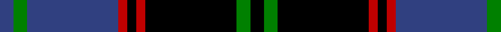

In pattern [BGBRKRKGK](/patterns/bgbrkrkgk/).

This was sourced from weddslist.  It is a [9 stripes tartan](/stripes/stripes9/).

Original link http://www.weddslist.com/cgi-bin/tartans/pg.pl?source=sts

## Thread count
B/6 G6 B40 R4 K4 R4 K40 G6 K/6

## Palette
Each colour and its ΔE from the base-6 reference it is a variant of.

| Colour | Shade | Base | ΔE (OKLab) |
|---|---|---|---|
| B | <code style="background-color:#304080;">#304080</code> `#304080` | B <code style="background-color:#2A418A;">#2A418A</code> | 0.02 |
| G | <code style="background-color:#008000;">#008000</code> `#008000` | G <code style="background-color:#006100;">#006100</code> | 0.10 |
| K | <code style="background-color:#000000;">#000000</code> `#000000` | K <code style="background-color:#000000;">#000000</code> | 0.00 |
| R | <code style="background-color:#C00000;">#C00000</code> `#C00000` | R <code style="background-color:#CC0000;">#CC0000</code> | 0.03 |

## Nearest tartans

The nearest existing variants by ΔTartan distance.

1. [Montgomerie of Eglinton](/setts/s7/k4g5k4b28k4r5k4~b304080-g008000-k000000-rc00000~x2/) — ΔT 1.17
1. [New Golf Club](/setts/s9/g4k4g23k11r2k2r2k20w4~g004010-k000030-rc00000-we0e0e0~x2/) — ΔT 1.20
1. [Gammell](/setts/s8/b32ba3b3ba3b3ba10g24r3~b000050-ba401000-g008000-r802040~x2/) — ΔT 1.22
1. [Lunar](/setts/s11/k10r1k3b7ba1b1ba1b1ba1b1ba7~b3c2010-ba646464-k000000-r8c0000~x4/) — ΔT 1.25
1. [Sonsub Corporate Tartan Tartan Number: 6984. Earliest known date: 2006 Corporate colours for Sonsub Ltd, Bridge of Don, Aberdeen. Sonsub is a well known provider of remote subsea systems technology, and provides services to the North Atlantic, Mediterranean, Africa, Caspian and Middle East. See products available Copyright © Blair Urquhart, Comrie, 2015](/setts/s10/k30ka5k19ka5k2b20y2b20ka5y4~b645858-k000000-ka101010-yc4bc68~x2/) — ΔT 1.26
1. [Grady, Highlands](/setts/s9/k36r3b3r3k8b23r18g3r3~b304080-g008000-k000000-rc00000~x2/) — ΔT 1.26
1. [Guthrie](/setts/s9/k1g8k9r1k1r1k9b8r1~b304080-g008000-k000000-rc00000~x6/) — ΔT 1.27
1. [Forbes](/setts/s9/b28k3b6k3b6k20r28k3w6~b304080-k000000-r806050-we0e0e0~x2/) — ΔT 1.29
1. [Louise](/setts/s11/b1k1b9k6g1k1g1k1g6r1k1~b304080-g008000-k000000-rc00000~x2/) — ΔT 1.29
1. [Meoni (Personal)](/setts/s7/b1g1b18g12k18r1k1~b2c2c80-g006818-k000000-rc80000~x2/) — ΔT 1.29

## Neighbour map

Every grey dot is one of 15726 variants placed by the first two principal components of the ΔTartan feature space (44% of its variance). Red is this tartan; blue dots are its nearest — click one to open its page.

<svg viewBox="0 0 640 380" role="img" style="max-width:100%;height:auto;border:1px solid #e0e0e0;border-radius:4px;display:block" xmlns="http://www.w3.org/2000/svg"><image href="/nn/cloud.v1.png" width="640" height="380"/><a href="/setts/s7/k4g5k4b28k4r5k4~b304080-g008000-k000000-rc00000~x2/"><circle cx="260.5" cy="203.1" r="4" fill="#3465a4"><title>Montgomerie of Eglinton</title></circle></a><a href="/setts/s9/g4k4g23k11r2k2r2k20w4~g004010-k000030-rc00000-we0e0e0~x2/"><circle cx="284.7" cy="192.4" r="4" fill="#3465a4"><title>New Golf Club</title></circle></a><a href="/setts/s8/b32ba3b3ba3b3ba10g24r3~b000050-ba401000-g008000-r802040~x2/"><circle cx="258.9" cy="191.4" r="4" fill="#3465a4"><title>Gammell</title></circle></a><a href="/setts/s11/k10r1k3b7ba1b1ba1b1ba1b1ba7~b3c2010-ba646464-k000000-r8c0000~x4/"><circle cx="212.0" cy="177.0" r="4" fill="#3465a4"><title>Lunar</title></circle></a><a href="/setts/s10/k30ka5k19ka5k2b20y2b20ka5y4~b645858-k000000-ka101010-yc4bc68~x2/"><circle cx="234.8" cy="176.5" r="4" fill="#3465a4"><title>Sonsub Corporate Tartan Tartan Number: 6984. Earliest known date: 2006 Corporate colours for Sonsub Ltd, Bridge of Don, Aberdeen. Sonsub is a well known provider of remote subsea systems technology, and provides services to the North Atlantic, Mediterranean, Africa, Caspian and Middle East. See products available Copyright © Blair Urquhart, Comrie, 2015</title></circle></a><a href="/setts/s9/k36r3b3r3k8b23r18g3r3~b304080-g008000-k000000-rc00000~x2/"><circle cx="229.9" cy="168.5" r="4" fill="#3465a4"><title>Grady, Highlands</title></circle></a><a href="/setts/s9/k1g8k9r1k1r1k9b8r1~b304080-g008000-k000000-rc00000~x6/"><circle cx="229.7" cy="198.4" r="4" fill="#3465a4"><title>Guthrie</title></circle></a><a href="/setts/s9/b28k3b6k3b6k20r28k3w6~b304080-k000000-r806050-we0e0e0~x2/"><circle cx="176.3" cy="185.7" r="4" fill="#3465a4"><title>Forbes</title></circle></a><a href="/setts/s11/b1k1b9k6g1k1g1k1g6r1k1~b304080-g008000-k000000-rc00000~x2/"><circle cx="169.4" cy="172.9" r="4" fill="#3465a4"><title>Louise</title></circle></a><a href="/setts/s7/b1g1b18g12k18r1k1~b2c2c80-g006818-k000000-rc80000~x2/"><circle cx="228.1" cy="176.4" r="4" fill="#3465a4"><title>Meoni (Personal)</title></circle></a><circle cx="234.7" cy="176.9" r="5" fill="#c00000"/></svg>

ID: /setts/s9/b3g3b20r2k2r2k20g3k3~b304080-g008000-k000000-rc00000~x2/
