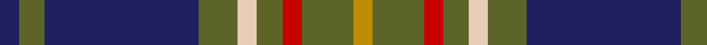

In pattern [BGBGWGRGY](/patterns/bgbgwgrgy/).

This was sourced from tartans-authority.  It is a [9 stripes tartan](/stripes/stripes9/).

Original link http://www.tartansauthority.com/tartan-ferret/display/4040/

## Thread count
DB/6 G8 DB48 G12 LR6 G8 R6 G16 DY/6

## Palette
Each colour and its ΔE from the base-6 reference it is a variant of.

| Colour | Shade | Base | ΔE (OKLab) |
|---|---|---|---|
| DB | <code style="background-color:#202060;">#202060</code> `#202060` | B <code style="background-color:#2A418A;">#2A418A</code> | 0.11 |
| DY | <code style="background-color:#BC8C00;">#BC8C00</code> `#BC8C00` | Y <code style="background-color:#F2BF00;">#F2BF00</code> | 0.16 |
| G | <code style="background-color:#5C6428;">#5C6428</code> `#5C6428` | G <code style="background-color:#006100;">#006100</code> | 0.10 |
| LR | <code style="background-color:#E8CCB8;">#E8CCB8</code> `#E8CCB8` | W <code style="background-color:#F7F7F7;">#F7F7F7</code> | 0.12 |
| R | <code style="background-color:#C80000;">#C80000</code> `#C80000` | R <code style="background-color:#CC0000;">#CC0000</code> | 0.01 |

## Nearest tartans

The nearest existing variants by ΔTartan distance.

1. [Tennessee](/setts/s10/r2b10w1ra1g1r1g6ra1g10w1x2~b2c4084-g005020-rdc0000-ra781c38-we0e0e0/) — ΔT 0.90
1. [American Society of Travel Agents, The (2001)](/setts/s11/b4g32b4g4b32r6b32ga4b3ga32w4~b141e46-g808080-ga003c14-rfa6496-we0e0e0/) — ΔT 0.93
1. [MacCainsh Family Tartan Tartan Number: 1379. Earliest known date: pre 1992 From the Lumsden Collection ( Alec Lumsden of Toronto). See products available Copyright © Blair Urquhart, Comrie, 2015](/setts/s11/r2b8k1g2k1g4k1g2k1b8y2x2~b2c2c80-g006818-k101010-rc80000-ye8c000/) — ΔT 0.93
1. [Dama Resort](/setts/s11/b3k2ba6k2ba2k18g13w2g2k6b2x2~b7a378b-ba2f4f4f-g777733-k101010-w88ace0/) — ΔT 0.97
1. [Sverker](/setts/s10/w2b8ba16g3b20g3b3g3ba4wa2x2~b14283c-ba496f81-g503c14-w82cffd-waf8f8f8/) — ΔT 1.01
1. [Jones Htg (Name)](/setts/s10/b4ba2b2ba8k3b8g3b4g24ga2x2~b780078-ba2888c4-g006818-ga289c18-k101010/) — ΔT 1.01
1. [Boyle Family, Susan (Personal)](/setts/s11/g9r6g40b6g6b6k6b36y4b8y4~b440044-g006818-k101010-rc80000-yfccc00/) — ΔT 1.01
1. [Scottish Chamber Orchestra](/setts/s9/w3b20k3b2k5b2k3g15r2x2~b202060-g5c6428-k101010-rc80000-w98c8e8/) — ΔT 1.03
1. [Snodgrass Family Tartan Tartan Number: 1216. Earliest known date: 1978 Designed for the Snodgrass Clan Association. It is based on the Cunningham tartan, and the colours chosen were, Black, Green and Gold - of the Snodgrass Coat of Arms, Green - for the 'grasy place' (sic) alluded to in the name, and Blue - representing the traditional Highland 'Blue Bonnet'. See products available Copyright © Blair Urquhart, Comrie, 2015](/setts/s8/k3r1y1b11g13b5r1y1x2~b2c2c80-g006818-k101010-rc80000-ye8c000/) — ΔT 1.06
1. [Donegal Irish County Tartan Tartan Number: 2247. Earliest known date: 1996 One of a series of Irish District tartans designed by Polly Wittering of the House of Edgar, with colours reminiscent of the Country with soft warm colours dominating. See products available Copyright © Blair Urquhart, Comrie, 2015](/setts/s10/y3g17b3g3b3k5b18r2b8r2x2~b406088-g508c60-k000000-r8c0020-yd09000/) — ΔT 1.06

## Neighbour map

Every grey dot is one of 15726 variants placed by the first two principal components of the ΔTartan feature space (44% of its variance). Red is this tartan; blue dots are its nearest — click one to open its page.

<svg viewBox="0 0 640 380" role="img" style="max-width:100%;height:auto;border:1px solid #e0e0e0;border-radius:4px;display:block" xmlns="http://www.w3.org/2000/svg"><image href="/nn/cloud.v1.png" width="640" height="380"/><a href="/setts/s10/r2b10w1ra1g1r1g6ra1g10w1x2~b2c4084-g005020-rdc0000-ra781c38-we0e0e0/"><circle cx="259.6" cy="166.6" r="4" fill="#3465a4"><title>Tennessee</title></circle></a><a href="/setts/s11/b4g32b4g4b32r6b32ga4b3ga32w4~b141e46-g808080-ga003c14-rfa6496-we0e0e0/"><circle cx="231.4" cy="166.8" r="4" fill="#3465a4"><title>American Society of Travel Agents, The (2001)</title></circle></a><a href="/setts/s11/r2b8k1g2k1g4k1g2k1b8y2x2~b2c2c80-g006818-k101010-rc80000-ye8c000/"><circle cx="217.4" cy="179.2" r="4" fill="#3465a4"><title>MacCainsh Family Tartan Tartan Number: 1379. Earliest known date: pre 1992 From the Lumsden Collection ( Alec Lumsden of Toronto). See products available Copyright © Blair Urquhart, Comrie, 2015</title></circle></a><a href="/setts/s11/b3k2ba6k2ba2k18g13w2g2k6b2x2~b7a378b-ba2f4f4f-g777733-k101010-w88ace0/"><circle cx="227.5" cy="168.6" r="4" fill="#3465a4"><title>Dama Resort</title></circle></a><a href="/setts/s10/w2b8ba16g3b20g3b3g3ba4wa2x2~b14283c-ba496f81-g503c14-w82cffd-waf8f8f8/"><circle cx="252.8" cy="178.7" r="4" fill="#3465a4"><title>Sverker</title></circle></a><a href="/setts/s10/b4ba2b2ba8k3b8g3b4g24ga2x2~b780078-ba2888c4-g006818-ga289c18-k101010/"><circle cx="235.6" cy="155.8" r="4" fill="#3465a4"><title>Jones Htg (Name)</title></circle></a><a href="/setts/s11/g9r6g40b6g6b6k6b36y4b8y4~b440044-g006818-k101010-rc80000-yfccc00/"><circle cx="223.3" cy="154.3" r="4" fill="#3465a4"><title>Boyle Family, Susan (Personal)</title></circle></a><a href="/setts/s9/w3b20k3b2k5b2k3g15r2x2~b202060-g5c6428-k101010-rc80000-w98c8e8/"><circle cx="223.6" cy="172.6" r="4" fill="#3465a4"><title>Scottish Chamber Orchestra</title></circle></a><a href="/setts/s8/k3r1y1b11g13b5r1y1x2~b2c2c80-g006818-k101010-rc80000-ye8c000/"><circle cx="237.9" cy="167.3" r="4" fill="#3465a4"><title>Snodgrass Family Tartan Tartan Number: 1216. Earliest known date: 1978 Designed for the Snodgrass Clan Association. It is based on the Cunningham tartan, and the colours chosen were, Black, Green and Gold - of the Snodgrass Coat of Arms, Green - for the 'grasy place' (sic) alluded to in the name, and Blue - representing the traditional Highland 'Blue Bonnet'. See products available Copyright © Blair Urquhart, Comrie, 2015</title></circle></a><a href="/setts/s10/y3g17b3g3b3k5b18r2b8r2x2~b406088-g508c60-k000000-r8c0020-yd09000/"><circle cx="246.5" cy="180.4" r="4" fill="#3465a4"><title>Donegal Irish County Tartan Tartan Number: 2247. Earliest known date: 1996 One of a series of Irish District tartans designed by Polly Wittering of the House of Edgar, with colours reminiscent of the Country with soft warm colours dominating. See products available Copyright © Blair Urquhart, Comrie, 2015</title></circle></a><circle cx="238.2" cy="177.9" r="5" fill="#c00000"/></svg>

ID: /setts/s9/b3g4b24g6w3g4r3g8y3x2~b202060-g5c6428-rc80000-we8ccb8-ybc8c00/
