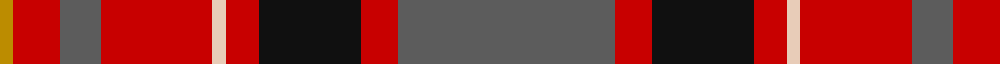

In pattern [BRKRWRBRY](/patterns/brkrwrbry/).

This was sourced from tartans-authority.  It is a [9 stripes tartan](/stripes/stripes9/).

Original link http://www.tartansauthority.com/tartan-ferret/display/10800/

## Thread count
DY/6 R20 N18 R48 LR6 R14 K44 R16 N/94

## Palette
Each colour and its ΔE from the base-6 reference it is a variant of.

| Colour | Shade | Base | ΔE (OKLab) |
|---|---|---|---|
| DY | <code style="background-color:#BC8C00;">#BC8C00</code> `#BC8C00` | Y <code style="background-color:#F2BF00;">#F2BF00</code> | 0.16 |
| K | <code style="background-color:#101010;">#101010</code> `#101010` | K <code style="background-color:#000000;">#000000</code> | 0.17 |
| LR | <code style="background-color:#E8CCB8;">#E8CCB8</code> `#E8CCB8` | W <code style="background-color:#F7F7F7;">#F7F7F7</code> | 0.12 |
| N | <code style="background-color:#5C5C5C;">#5C5C5C</code> `#5C5C5C` | B <code style="background-color:#2A418A;">#2A418A</code> | 0.15 |
| R | <code style="background-color:#C80000;">#C80000</code> `#C80000` | R <code style="background-color:#CC0000;">#CC0000</code> | 0.01 |

## Nearest tartans

The nearest existing variants by ΔTartan distance.

1. [Caledon (Corporate)](/setts/s9/b8w3b25k3b4k8r31y2r5x2~b345c74-k101010-rc80000-we0e0e0-ye8c000/) — ΔT 0.76
1. [Australia Dress](/setts/s9/y11r4g2k4g2r4g12r20b2x2~b2888c4-g8c7038-k101010-ra00000-yb8b8b8/) — ΔT 1.03
1. [Sinclair](/setts/s10/r30g12k5w2b6r30b12w2k5g12x2~b2c2c80-g006818-k101010-rc80000-we0e0e0/) — ΔT 1.10
1. [Ulster Ancestry](/setts/s9/b47r8k22r7w3r24b9r10y3x2~b332c2c-k101010-re41010-wffffff-yf5c70d/) — ΔT 1.10
1. [Wellmont Foundation (Corporate)](/setts/s7/b12w2b13g3ga2r24ga3x2~b14283c-g003820-ga006818-ra40000-wfcfcfc/) — ΔT 1.11
1. [Spragg, Andrew](/setts/s7/r2g16ra1r2ra12y1ga1x2~g165041-ga547c73-ra62a2a-racc1100-yffe600/) — ΔT 1.11
1. [MacKillop (Clan)](/setts/s10/g3r2b2r14ba1b4r2g12r2b2x8~b2c2c80-ba2474e8-g006818-rc80000/) — ΔT 1.12
1. [Shaw of Tordarroch Clan Tartan Tartan Number: 352. Earliest known date: 1969 When Major C.J. Shaw of Tordarroch, matriculated and became the first chief of the Clan for some 400 years, he had a new tartan designed, which reflects the Clan's Mackintosh ancestry. He specifically states that the old design is still perfectly acceptable and approves its continued use by all members of the Clan. Donald Stewart, who designed the new sett, is the author of 'The Setts of the Scottish Tartans', the first comprehensive record of tartan patterns, published in 1950. See products available Copyright © Blair Urquhart, Comrie, 2015](/setts/s8/b5k1r30ba15r8g30r8ba2~b5c8ca8-ba780078-g006818-k101010-rc80000/) — ΔT 1.13
1. [Robbie (Commemorative)](/setts/s13/w1y2r15b2r2b15r2g15r2b2r15y2w1x2~b2c2c80-g288028-r880000-we0e0e0-ybc8c00/) — ΔT 1.13
1. [Indiana "Cardinal"](/setts/s8/b8y1g12r10ra2r6ra2r4x4~b2c4084-g005020-rdc0000-rabe7832-ye8c000/) — ΔT 1.14

## Neighbour map

Every grey dot is one of 15726 variants placed by the first two principal components of the ΔTartan feature space (44% of its variance). Red is this tartan; blue dots are its nearest — click one to open its page.

<svg viewBox="0 0 640 380" role="img" style="max-width:100%;height:auto;border:1px solid #e0e0e0;border-radius:4px;display:block" xmlns="http://www.w3.org/2000/svg"><image href="/nn/cloud.v1.png" width="640" height="380"/><a href="/setts/s9/b8w3b25k3b4k8r31y2r5x2~b345c74-k101010-rc80000-we0e0e0-ye8c000/"><circle cx="245.4" cy="141.4" r="4" fill="#3465a4"><title>Caledon (Corporate)</title></circle></a><a href="/setts/s9/y11r4g2k4g2r4g12r20b2x2~b2888c4-g8c7038-k101010-ra00000-yb8b8b8/"><circle cx="232.3" cy="166.1" r="4" fill="#3465a4"><title>Australia Dress</title></circle></a><a href="/setts/s10/r30g12k5w2b6r30b12w2k5g12x2~b2c2c80-g006818-k101010-rc80000-we0e0e0/"><circle cx="257.1" cy="146.1" r="4" fill="#3465a4"><title>Sinclair</title></circle></a><a href="/setts/s9/b47r8k22r7w3r24b9r10y3x2~b332c2c-k101010-re41010-wffffff-yf5c70d/"><circle cx="227.1" cy="143.9" r="4" fill="#3465a4"><title>Ulster Ancestry</title></circle></a><a href="/setts/s7/b12w2b13g3ga2r24ga3x2~b14283c-g003820-ga006818-ra40000-wfcfcfc/"><circle cx="246.9" cy="178.3" r="4" fill="#3465a4"><title>Wellmont Foundation (Corporate)</title></circle></a><a href="/setts/s7/r2g16ra1r2ra12y1ga1x2~g165041-ga547c73-ra62a2a-racc1100-yffe600/"><circle cx="301.8" cy="151.9" r="4" fill="#3465a4"><title>Spragg, Andrew</title></circle></a><a href="/setts/s10/g3r2b2r14ba1b4r2g12r2b2x8~b2c2c80-ba2474e8-g006818-rc80000/"><circle cx="277.4" cy="162.2" r="4" fill="#3465a4"><title>MacKillop (Clan)</title></circle></a><a href="/setts/s8/b5k1r30ba15r8g30r8ba2~b5c8ca8-ba780078-g006818-k101010-rc80000/"><circle cx="294.1" cy="136.5" r="4" fill="#3465a4"><title>Shaw of Tordarroch Clan Tartan Tartan Number: 352. Earliest known date: 1969 When Major C.J. Shaw of Tordarroch, matriculated and became the first chief of the Clan for some 400 years, he had a new tartan designed, which reflects the Clan's Mackintosh ancestry. He specifically states that the old design is still perfectly acceptable and approves its continued use by all members of the Clan. Donald Stewart, who designed the new sett, is the author of 'The Setts of the Scottish Tartans', the first comprehensive record of tartan patterns, published in 1950. See products available Copyright © Blair Urquhart, Comrie, 2015</title></circle></a><a href="/setts/s13/w1y2r15b2r2b15r2g15r2b2r15y2w1x2~b2c2c80-g288028-r880000-we0e0e0-ybc8c00/"><circle cx="258.0" cy="131.0" r="4" fill="#3465a4"><title>Robbie (Commemorative)</title></circle></a><a href="/setts/s8/b8y1g12r10ra2r6ra2r4x4~b2c4084-g005020-rdc0000-rabe7832-ye8c000/"><circle cx="211.6" cy="181.3" r="4" fill="#3465a4"><title>Indiana &quot;Cardinal&quot;</title></circle></a><circle cx="253.1" cy="154.0" r="5" fill="#c00000"/></svg>

ID: /setts/s9/b47r8k22r7w3r24b9r10y3x2~b5c5c5c-k101010-rc80000-we8ccb8-ybc8c00/
